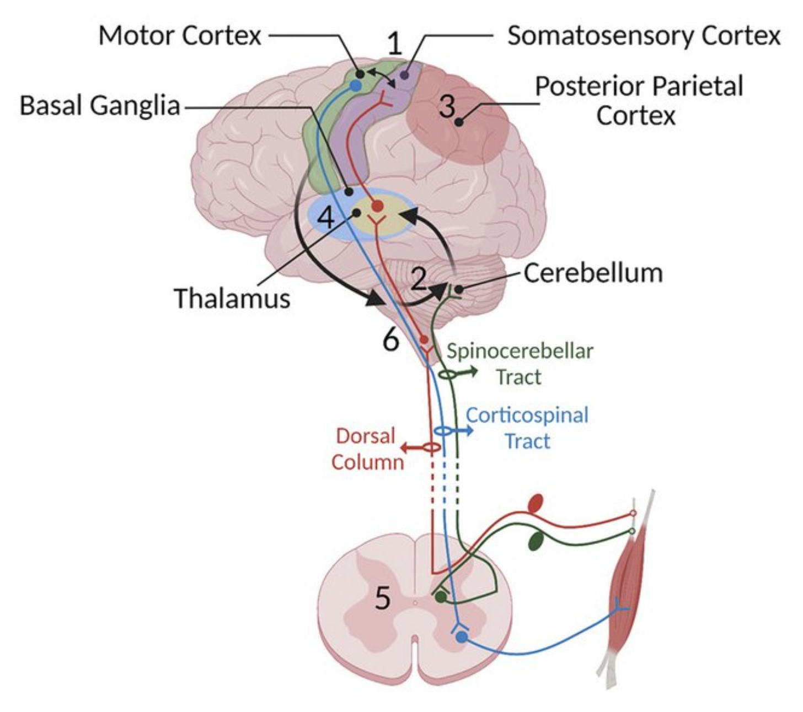
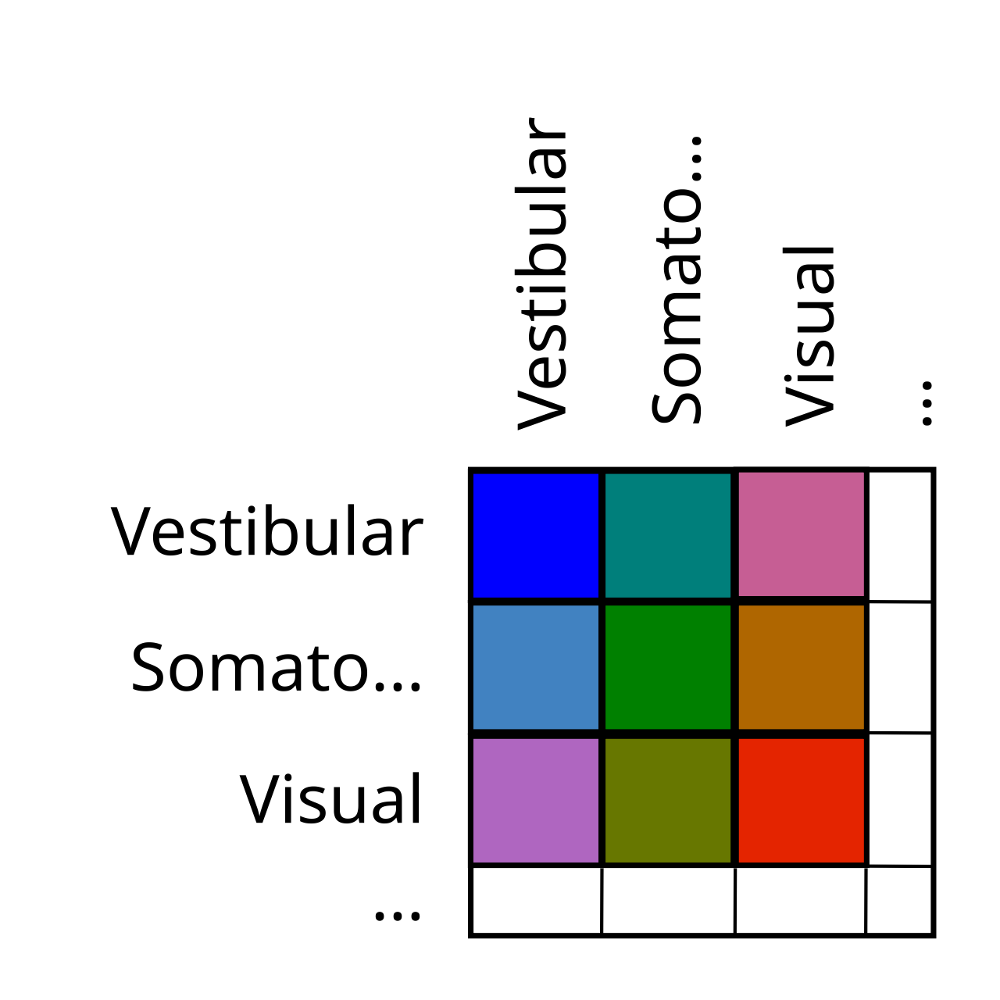
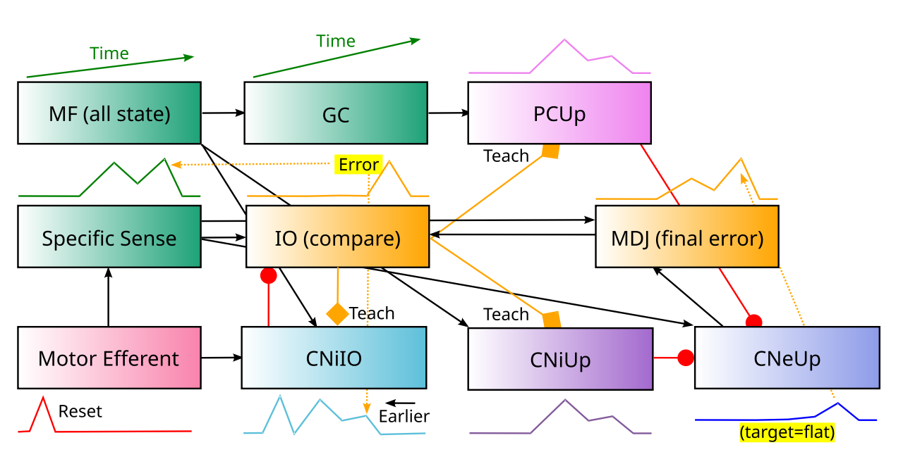
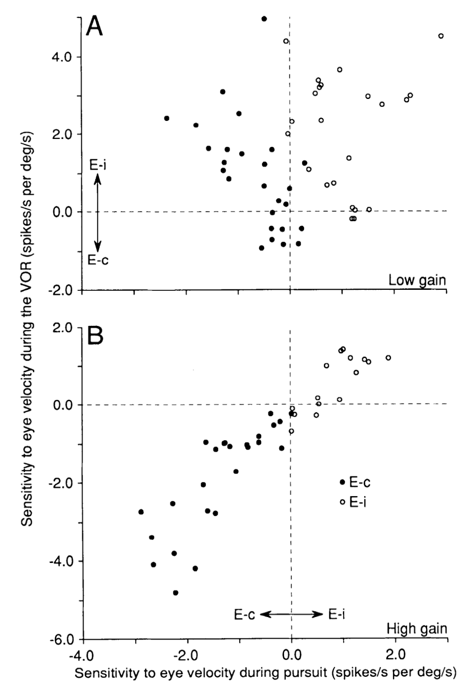

+++
Categories = ["Neuroscience", "Cognition"]
bibfile = "ccnlab.json"
+++

The **cerebellum** is a system of highly specialized neural elements many of which are unlike those found in any other part of the brain. The precise function of all this specialized machinery, which is replicated across many parallel channels and connects with most of the sensory and motor pathways in the brain, has been tantalizingly elusive since the seminal publication of many of its unique features ([[@EcclesItoSzentagothai67]]).

Although it is widely considered to be a motor control system, the cerebellum is anatomically and [[evolution|evolutionarily]] a sensory system, albeit one that is tightly interconnected with the motor system. It is clearly involved in learning, but exactly what and how it learns remains a topic of active debate.

We adopt a specific implementation of the **adaptive filter** model ([[@Fujita82a]]; [[@DeanPorrillEkerotEtAl10]]; [[@Cullen23]]), which filters out the predicted sensory signals generated by one's own motor actions (i.e., **sensory reafferance**) to provide a more stable and useful basis for motor behavior. These sensory predictions are also be used as a **forward model** ([[@MiallWolpert96]]; [[@Bastian06]]; [[@ShadmehrSmithKrakauer10]]; [[@TanakaIshikawaLeeEtAl20]]), to anticipate the sensory consequences of motor actions, in driving further actions that are therefore more coordinated. These are consistent with, but significantly more specific than, the more general [[error-driven learning]] models originally proposed by [[@^Marr69]], [[@^Albus71]], and [[@^Ito72]], which remain the most widely discussed ([[@RaymondMedina18]]; [[@Shadmehr20]]).

{id="figure_motor" style="height:25em"}

The cerebellum is located at the base of the brain, forming a kind of outgrowth of the midbrain ([[#figure_motor]]). It receives inputs from all of the major [[motor]]-associated areas of the brain, including the sensory-motor areas of the spinal cord and midbrain, the [[basal ganglia]], and, via the **pons** or **pontine nuclei**, motor-associated cortical areas including primary motor and somatosensory cortical areas (M1 and S1). It also receives a wide range of other sensory signals, including a major projection from the [[vestibular]] system.

The cerebellar outputs, from the **deep cerebellar nuclei** (DCN or just **CN** in more recent terminology), project widely to many areas of the brain, including a major driving projection to the VL [[thalamus]] from the more lateral CN areas, which can provide a training signal to primary motor cortex. The possibility that the cerebellum is critical for early learning, but can then transfer this learning by training other structures including the cortex, is supported by the differential severity of early developmental cerebellar lesions ([[@BeuriatCristoforiRichardEtAl20]]).

{id="figure_outer_prod" style="height:15em"}

Unlike the basal ganglia, neocortex, and thalamus, the cerebellum does not have a simple topographic organization that can be easily labeled in a figure. Instead, the primary function of the cerebellum is to integrate and compare signals across different modalities, so it is organized somewhat like an _outer product_ across its various inputs, with each region comparing one sensory input against another in all manner of combinations ([[#figure_outer_prod]]).

{id="figure_fastigial" style="height:45em"}
![The different output pathways of the fastigial cerebellar nucleus, which integrate a range of different sensory signals to provide useful signals for essentially all major subcortical brain systems, consistent with this nucleus being the most evolutionarily ancient in the cerebellum. Much of the cerebellar cortex that it interconnects with is in the vermis, which is the midline portion of the cerebellum. **7N**: facial nucleus; **CL**: centrolateral thalamic nucleus; **INC**: interstitial nucleus of Cajal; **IRt**: intermediate reticular nucleus; **IVN**: inferior vestibular nucleus; **KF**: Kölliker-Fuse nucleus; **LDTg**: laterodorsal tegmental nucleus; **LPAG**: lateral periaqueductal gray; **LPGi**: lateral paragigantocellular nucleus; **LVN**: lateral vestibular nucleus; **MD**: mediodorsal thalamic nucleus; **MDJ**: mesodiencephalic junction; **MdV**: medullary reticular nucleus, ventral; **mRt**: mesencephalic reticular formation; **MVN**: medial vestibular nucleus; **NPH**: nucleus prepositus hypoglossi; **NI**: nucleus incertus; **NRG**: nucleus reticularis gigantocellularis; **PCRt**: parvocellular reticular nucleus; **PF**: parafascicular thalamic nucleus; **PMn**: paramedian reticular nucleus; **PnC**: pontine reticular nucleus, caudal; **PPRF**: paramedian pontine reticular formation; **PTg**: pedunculotegmental nucleus; **Sim**: simplex lobule; **SC**: superior colliculus; **SNc**: substantia nigra, pars compacta; **SubC**: subcoeruleus nucleus; **SuM**: supramammillary region; **VL**: ventrolateral thalamic nucleus; **vlPAG**: ventrolateral periaqueductal gray; **VM**: ventromedial thalamic nucleus; **ZI**: zona incerta. From Fujita et al (2020).](media/fig_cerebellum_fastigial_fujita_etal_20.png)

[[#figure_fastigial]] shows an example of this outer-product like organization ([[@FujitaKodamaduLac20]]), associated with the _fastigial nucleus_ (FN), which is the evolutionarily most ancient of the cerebellar nuclei ([[@ZhangWangZhu16]]). The FN is interconnected mostly with the medial _vermis_ region of the **cerebellar cortex**, which integrates different signals including [[vestibular]], somatosensory and interoceptive signals of relevance to different core survival-relevant systems.

{id="figure_mossy-prjn" style="height:20em"}

Another representation of the thorough mixing of sensory signals in the cerebellum is shown in [[#figure_mossy-prjn]], plotting the terminal zones of the axon of a single **mossy fiber** from a neuron in the pons ([[@BiswasLuoSarpongEtAl19]]). This one sensory signal is distributed across many areas of the cerebellar cortex, and many such neurons also project down to the cerebellar nuclei as well. There are around 43 million total neurons in the cerebellum of the adult mouse ([[@SurchevNazwarWeisheitEtAl07]]), reflecting the huge combinatorial explosion of the outer-product organization, along with a major additional multiplier by the numerous granule cells in the cerebellar cortex.

{id="figure_cortex" style="height:25em"}
![Terminology for the anatomy of the cerebellar cortex in the rat and human. The general evolutionary progression is from the medial vermis outward to the more lateral areas. Although the lobes have all been labeled, they are not very functionally relevant; the most relevant organization is the medial to lateral organization. The appendage-like flocculus (FL) and parafloculus (PF) are specialized areas that process the combination of vestibular, visual, and visuomotor signals. From Apps & Hawkes (2009).](media/fig_cerebellum_cortex_rat_human.png)

[[#figure_cortex]] shows the terminology for all of the different regions of the cerebellar cortex, progressing outward along the medial-lateral axis from the original vermis to the _paravermis_ and lateral _hemispheres_, which are involved in more fine-grained skeletal motor control. There are also unique areas known as the _flocculus_ (FL) and _paraflocculus_ (PF) which process the convergence of vestibular, visual, and visuomotor signals.

The stripe-like structure shown in [[#figure_mossy-prjn]] is due in part to a protein called _zebrin II_ (i.e., aldolase C or ALDOC) that reflects an organizing structure for the long stripes along the length of the cerebellum ([[@SugiharaShinoda04]], [[@HawkesLeclerc87]]). Although the flattened version of the cerebellum is convenient for visualization, it is actually a massively folded structure, with folds going perpendicular to the long axis of the zebrin stripes. 

{id="figure_cortex-nuclei" style="height:30em"}

[[#figure_cortex-nuclei]] shows the relationship between the cerebellar cortex and the different nuclei and areas of the **inferior olivary nuclei (IO)** (from [[@AppsHawkes09]]). There is different terminology for the nuclei names, with the names in the rodent going from _medial_ (i.e., the fastigial) to the _lateral_, with the _interposed_ or _interpositus_ and _interstitial_ nuclei in between. The lateral is the most evolutionarily modern nucleus (called the _dentate_ in primates), interconnecting with the lateral hemispheres, which are the areas most enlarged in humans. This is where fine motor control associated with highly dexterous hand movements is supported. The intermediate nuclei are involved in major skeletal muscle control of the limbs, which evolved in land-dwelling animals.

{id="figure_somatotopy" style="height:15em"}
![Distributed topographic projections for different skeletal motor areas in the macaque monkey, consistent with the cross product connectivity pattern, where each area is represented in multiple distributed locations. The areas of the lateral cerebellum interconnected with the interposed nucleus, which are associated with the various skeletal muscles, are the only part of the cerebellum with significant topography, where the limb projections are in the same ordering on the medial-lateral axis. From Lu et al., 2007.](media/fig_cerebellum_somatotopy_rat_lu_etal_07.png)

[[#figure_somatotopy]] shows an example of the somatotopic (topographic) organization of the parts of the cerebellum interconnected with the skeletal muscles, which are those interconnected with the interposed / interpositus (IP) nuclei. Whereas the primary somatosensory (S1) and motor (M1) cortex have a fully somatotopic _homunculus_ ("little man") organization, the cerebellum retains a more cross-product like structure with more widely distributed projections, but some measure of medial-lateral topography ([[@LuMiyachiItoEtAl07]]).

{id="figure_anatomy" style="height:30em"}
![The major anatomical features of the cerebellar cortex. The Purkinje cells (PC) send inhibition to the CN, which is the only output of the cortex. The inputs come via the mossy fibers which then synapse onto tiny granule cells, which send distinctive axons known as parallel fibers to the PCs. Each PC can receive 150,000 or more parallel fiber inputs, via its extremely large dendritic arbor. Each PC receives exactly one climbing fiber from a neuron in the IO, which has been shown to drive synaptic changes (LTD = long term depression) in the parallel fiber synapses. From Ramnani (2006).](media/fig_cerebellum_anatomy_ramnani06.png)

Figure [[#figure_anatomy]] from [[@^Ramnani06]] shows the major anatomical features of the cerebellum, many of which are distinctive relative to other brain areas. We will review each of these features in detail in the context of the functional model developed below. The basic circuitry in the cerebellar cortex starts with _mossy fiber_ inputs conveying the different sensory-motor inputs (e.g., from the _pontine nuclei_) onto millions of tiny _granule cells_, which then send a huge number of _parallel fibers_ to the only output neurons from the cortex: the _Purkinje cells_. 

The Purkinje cells are tonically active at relatively high rates (~50 hz) and send inhibition to the excitatory cerebellar nuclei output neurons (not shown), which are also similarly tonically active. They receive _climbing fiber_ input from exactly one _inferior olivary (IO)_ neuron, which is known to drive learning in the Purkinje cells, consistent with the original computational models of [[@^Marr69]], [[@^Albus71]], and [[@^Ito72]].

Critically, this circuit supports largely _parallel_ processing across all the loops that are replicated across the entire cerebellum, with very little interaction among the different loops. The granule cell parallel fibers distribute the same sensory input signals efficiently across these loops, but each Purkinje cell output channel is largely independent. This means that other brain areas, principally the [[basal ganglia]] and especially the [[neocortex]], are responsible for integration and comparison across these channels in order to support decision making and the hierarchical organization of motor actions. The cerebellum is thus not well-suited for choosing or shaping actions per se, but rather is critical for providing a high-dimensional, coordinated sensory basis for guiding the actions selected elsewhere. 

There is one interesting and often neglected direct feedback projection within the cerebellum, which goes from the excitatory output neurons in the cerebellar nuclei back up to the granule cells and golgi cells in the cortex ([[@HouckPerson14]]; [[@HouckPerson15]]; [[@AnkriHussonPietrajtisEtAl15]]). This can provide a quick broadcast of the current output of the cerebellum, for other cerebellar pathways to learn about. This feedback loop also provides input to the same modules that send Purkinje projections to these cerebellar nuclei neurons, so it provides _closed loop_ as well as _open loop_ feedback.

The starting point for the model we adopt is that the cerebellum provides a stable, effective basis for motor control by learning to predict the sensory effects of motor actions, and to _subtract_ these predicted sensory signals from the ongoing stream of sensory inputs ([[@Fujita82a]]; [[@DeanPorrillEkerotEtAl10]]; [[@Cullen23]]). This _adaptive filtering_ function can be directly supported by the massive inhibitory projections from the Purkinje cells onto the cerebellar nuclei, which represent the sole output of the cerebellar cortex. The net effect is that any residual sensory signals that have not been canceled therefore represent something beyond the consequences of one's own actions, and are thus the relevant basis for driving further actions.

The same type of predictive learning mechanism that supports the cancellation of sensory signals generated by one set of motor actions is also useful for driving subsequent motor actions based on the anticipated sensory outcomes of those initial actions. A classic example of this is the widely-studied [[#vestibulo-ocular reflex]] (VOR) where the predicted vestibular signals generated by head movements can then drive corrective eye movements in the opposite direction, to maintain a stable visual stimulus on the retina ([[@ZeeuwHanselBianEtAl98]]; [[@KimpoRinaldiKimEtAl14]]). To effectively stabilize the retinal image, it is essential that the eye movements _anticipate_ the effects of the head movements, not just react to them after the fact. This function is consistent with the widely-discussed _forward model_ theory of cerebellar function ([[@MiallWolpert96]]; [[@Bastian06]]; [[@TanakaIshikawaLeeEtAl20]]). 

Many theorists have discussed these functions for the cerebellum over the years, but the precise neural mechanisms by which they are accomplished have remained somewhat underspecified in a few important respects. Furthermore, many other functional frameworks have been proposed that are either more generic (e.g., basic error-driven learning as in the Marr-Albus-Ito models, or feedforward motor control based on the widely-studied delayed eyeblink conditioning paradigm; [[@Thompson86]]; [[@RaymondLisbergerMauk96]]; [[@OhyamaMedinaNoresEtAl03]]; [[@NguyenPerson25]]) or more complex (e.g., [[@Kawato99]]; [[@Llinas09]]).

Further complicating matters is the relationship between processing and learning in the cerebellar cortex and that taking place in the cerebellar nuclei, which have been comparatively neglected in the literature ([[@KebschullCasoniConsalezEtAl24]]; [[@HerzfeldHallTringidesEtAl20]]). There has long been evidence that the cerebellar nuclei are the final long-term locus of _consolidated_ cerebellar learning, with the cerebellar cortex therefore playing a more transient role ([[@KassardjianTanChungEtAl05]]; [[@ShutohOhkiKitazawaEtAl06]]; [[@KimpoRinaldiKimEtAl14]]; [[@RaymondMedina18]]). Thus, a complete account of the underlying neural mechanisms must explain how the circuitry within the cerebellar nuclei can independently support the full predictive learning functionality, and how learning within the nuclei relates to that taking place in the cerebellar cortex.

The cerebellar cortex certainly provides a much higher-resolution representation of the sensory-motor space, due to the huge number of granule cells, but also due to a large expansion factor in the number of Purkinje cells (PC) relative to the number of neurons in the cerebellar nuclei (CN). [[@^BengtssonEkerotJorntell11]] estimate that between 600-1,200 PC's converge onto an individual CN output neuron, with estimates of ~8,500 total CN excitatory output neurons per hemisphere in a mouse ([[@Heckroth94]]), versus nearly 200,000 PC's ([[@Woodruff-Pak06]]).

The _Nuclear_ model described below focuses first on the computations in the cerebellar nuclei (CN), showing how connectivity and plasticity among the CN neurons can directly support both adaptive filtering and forward model functionality, building off of a predictive learning mechanism driven by one specific type of inhibitory CN neuron. We hypothesize that these inhibitory CN neurons learn to predict and anticipate a specific sensory input channel, and they project into the inferior olive (IO), which also receives a precisely-paired excitatory projection from the same sensory input. This provides an explicit neural mechanism by which the IO can directly compute the sensory prediction error as the difference between these paired excitatory and inhibitory inputs.

The paired IO inputs are typically integrated within an elaborate _glomerulus_ structure on the IO dendrites, which has complex neural properties that appear ideally configured to perform a _temporally-offset_ error computation ([[@DeZeeuwSimpsonHoogenraadEtAl98]]; [[@LoyolaHooglandHoedemakerEtAl23]]). The IO neurons project this critical error signal to both the CN and the Purkinje cells in the cerebellar cortex, driving learning throughout the cerebellum.

Although the properties of this error signal have been widely discussed as strangely impoverished ([[@NajafiMedina13]]; [[@ZangDeSchutter19]]), we argue [[#properties-of-the-io-error-signal|below]] that it actually makes good sense for driving precisely-timed learning, at the cost of communicating more graded information, which would compromise the temporal precision.

Thus, the neural mechanisms in the Nuclear model provide a complete account of coordinated learning within the cerebellar nuclei and the much larger cerebellar cortex. The cortical learning mechanisms are faster than those in the nucleus, and they are also subject to decay ([[@HerzfeldHallTringidesEtAl20]]; [[@KimpoRinaldiKimEtAl14]]; [[@KassardjianTanChungEtAl05]]). By contrast, the nuclear learning is slow and persistent. In short, the CN slowly learns the enduring _rules_, while the cerebellar cortex can quickly learn the _exceptions_, just as in the complementary learning systems framework for the hippocampus vs neocortex ([[@McClellandMcNaughtonOReilly95]]; [[@OReillyRudy01]]; [[@NormanOReilly03]]). If the exceptions persist, and especially during initial developmental learning, then they are consolidated into the CN.

After presenting the Nuclear model, we compare it against other models in the literature, with the goal of understanding how the specific contributions of the cerebellum fit into the broader [[motor]] system, to support flexible, adaptive, and capable motor behavior.

## The Nuclear model

### Adaptive filtering

The predictive cancellation function performed by the cerebellum is known as an **adaptive filter** ([[@Fujita82a]]; [[@WidrowStearns85]]), which is a form of [[predictive learning]] that filters out what is expected or predicted based on other sensory signals, so that the _residual_ signal represents a "pure" sensory signal that clearly represents anything that is otherwise unexpected.

When you move any part of your body, especially the head or eyes, you create massive changes in incoming signals across all of your senses (i.e., _sensory reafferance_). If you did not somehow subtract these _self-motion_ sensory signals in your perceptual system, you would never be able to act sensibly in the world ([[@Cullen23]]). Everything would be in a constant state of turbulent motion, and you would never be able to coordinate a proper motor action based on all of these moving targets.

The evolutionary history of the cerebellum is consistent with this adaptive filter function, based on proto-cerebellar circuits and cerebellar analogs in other animals ([[@BodznickMontgomeryCarey99]]; [[@MontgomeryPerks19]]; [[@BellHanSawtell08]]; [[@Cisek21]]). The most ancient part of the mammalian cerebellum is essentially an integral component of the primary brainstem [[vestibular]] sensory nucleus, where it learns to subtract the effects of self-generated motion signals at all levels of the body, to produce a _pure_ vestibular signal that represents any remaining discrepancy from what would be expected based on the self-motion generated signals.

This pure vestibular signal is then something that can be acted upon effectively. If there is an additional sense of motion after all of your own actions have been accounted for, you know that you are slipping or falling or being pushed around in some way. Furthermore, this pure signal tells you exactly which way you should act in order to counteract the residual motion. When combined with other sensory inputs from vision, touch and proprioception, you can also figure out what the likely cause of the disturbance is, and thus condition your motor response accordingly.

{id="figure_env" style="height:20em"}

As this example makes clear, the adaptive filtering by the cerebellum provides an essential basis to enable sensible motor actions to be generated. A major challenge that the cerebellum must overcome is managing the many different **temporal delays** associated with the effects of motor actions and the sensory transduction thereof. When you decide to move your head, the **efferent copy** of that **descending motor command** provides the earliest signal about what is going to happen, setting off a complex cascade of subsequent signals that all need to be accounted for ([[#figure_env]]).

Your spinal cord and skeletal muscles do a lot of further work to actually implement the motor command in an efficient way, so you need to also get the actual **ascending motor signals** back up from the lower-level spinal motor pathways and the associated **proprioceptive** signals about the current levels of muscle stretching from the muscle _spindle fibers_. These signals unfold over time as the motor action takes place, even if the descending motor command was relatively ballistic.

Then, as your head starts to move, you will start getting signals from your vestibular system reflecting the motion. The specific spatiotemporal pattern of these signals will depend on the exact motor parameters, so this is a further challenging prediction problem. As shown in [[#figure_env]], the adaptive filtering job performed by the cerebellum can be organized around the entire _temporal envelope_ defined by the initial descending motor command.

{id="figure_cancel" style="height:20em"}

The core computation performed by the adaptive filter is to subtract the learned prediction of the sensory consequences of a motor action from the actual sensory inputs ([[#figure_cancel]]). If the actual sensory inputs match the learned prediction, then the result is _cancellation_ of the sensory signal. However, if there is a perturbation of the sensory signal from something else unexpectedly going on (a slip, a push, etc), then this will show up clearly as a _residual_ signal that has not been canceled by the prediction.

<!--- TODO: cites from Verduzco -->

### Forward models

In addition to the inhibitory cancellation process, the learned sensory prediction signals themselves are directly valuable in supporting motor control, because they provide anticipatory information about the sensory outcomes of motor actions. This anticipatory prediction of sensory outcomes for use in motor control is known as a **forward model** ([[@JordanRumelhart92]]; [[@ShadmehrSmithKrakauer10]]), which has long been hypothesized as a critical aspect of cerebellar processing ([[@MiallWolpert96]]; [[@Bastian06]]; [[@TanakaIshikawaLeeEtAl20]]).

The distinction between a forward model and the adaptive filter is often not clear in the literature, because both involve the same core computation of predictive learning of sensory signals. In the terminology adopted here, we define a forward model as using these predictive signals to directly drive motor actions based on anticipated states, whereas an adaptive filter _removes_ these predicted signals from the sensory states.

The adaptive filter requires increased inhibition in proportion to the predicted sensory signal to drive the cancellation, whereas the forward model signal should go in the opposite direction, to be proportional to the sensory prediction. Both should be driven by a predictive learning mechanism triggered by the efferent copy of a motor action, so that they are "about" the action, and not just always learning to cancel everything.

One clear example of these two functions operating on the same vestibular signal is the adaptive filtering of head motion to subtract from the vestibular signal ([[@Cullen23]]), versus the [[#vestibulo-ocular reflex]] (VOR) where eye movements are generated to correct for head motion, to keep a visual stimulus stable on the retina ([[@ZeeuwHanselBianEtAl98]]; [[@KimpoRinaldiKimEtAl14]]; see [[VOR simulation]]). The VOR requires ocular motor actions to be generated in anticipation of the effects of head motion actions, which requires the forward model predictions.

To be able to anticipate sensory signals and respond as quickly as possible, the cerebellar circuits all operate in parallel. Thus, the adaptive filtering and forward model functions, though logically related, operate via parallel loops. It would be too slow for the VOR ocular actions to be generated by sequentially feeding a signal from the adaptive filtering circuit back into another cerebellar circuit for the VOR.

The cerebellum is organized to support the specific demands of adaptive filtering and forward models, in parallel. The cerebellar nuclei directly implement the common predictive learning aspect, and also send a prediction error signal to the cerebellar cortex via their inputs into the inferior olivary nuclei. Critically, this IO error signal can drive different directions of plasticity in different microzones, known as **upbound** (zebrin II positive) and **downbound** (zebrin II negative; [[@DeZeeuw21]]). These different microzones can then support the adaptive filtering and forward model functions, respectively.

Given the considerable evidence that cerebellar learning is consolidated into the circuits of the cerebellar nuclei ([[@KassardjianTanChungEtAl05]]; [[@ShutohOhkiKitazawaEtAl06]]; [[@KimpoRinaldiKimEtAl14]]; [[@RaymondMedina18]]; [[@HerzfeldHallTringidesEtAl20]]; [[@KebschullCasoniConsalezEtAl24]]), these circuits need to be able to directly implement the adaptive filtering and forward model functionality. Understanding how this could work provides clear, novel functional explanations for many features of the cerebellar system.

<!--- [[@TeunederBurgRuigrok95]] show no long-range collateral projections from CNi neurons. -->

### Nuclear circuitry

{id="figure_nuclear-forward" style="height:25em"}
![Cerebellar components that implement the _Nuclear_ model of forward model functionality in _downbound_ (**Dn**) microzones. The target output for the **CNeDn** excitatory CN (_cerebellar nucleus_) output is to _anticipate_ the sensory consequences of motor actions for a given _Specific Sense_ input, as early as possible, as indicated by the temporal activity trace schematized under each neuron type. The _Motor Efferent_ copy signal provides the initial predictive trigger, so that the prediction is about a specific action. This trigger arrives before (e.g., 50-100 ms) the sensory effects it causes, so the **IO** (inferior olive) computes an offset comparison of later sensory inputs vs. the anticipatory **CNiIO** inhibitory IO prediction, with the motor trigger resetting IO dynamics. When excitatory sensory input arrives without a prior CNiIO inhibitory prediction, the IO fires a "learn now" teaching spike, to correct the error. IO spikes drive learning in the CNeDn neurons to modify inputs from **MF** (mossy fiber) time-varying state inputs, which can then drive earlier anticipatory firing of these CNeDn neurons. CNeDn also contributes back to the MF inputs for rapid sharing with other cerebellar pathways. The **PCDn** (_Purkinje cell_) neurons use high-dimensional, rapidly time-varying _granule cell_ (**GC**) representations of MF state to generate more precise, rapidly-adapting predictions to disinhibit the CNeDn anticipatory output, trained by IO climbing fiber complex spikes that result in LTD.](media/fig_cerebellum_as_forward_model.png)

{id="figure_nuclear-adapt" style="height:25em"}
![The _Nuclear_ model of adaptive filtering in the _upbound_ (**Up**) microzones. See prior figure for shared elements, with key differences noted here. The target output in the **CNeUp** excitatory CN output neurons is flat tonic activity, with deviations reflecting unexpected signals from the _Specific Sense_ input. Unlike the forward model case, the local inhibitory neurons (**CNiUp**) must learn to inhibit the CNeUP output at the time when subsequent sensory input actually arrives, which is generally delayed by up to 50-100ms from the motor efferent trigger and the anticipatory CNiIO activity. Therefore, the CNiUp neurons learn from the IO error signals to modify their MF inputs to cancel the predicted sensory input that is directly exciting CNeUp. The **PCUp** Purkinje cell neurons learn to increase firing (LTP) in response to IO climbing fiber complex spikes, to increase inhibitory cancellation of the CNeUp output.](media/fig_cerebellum_as_adaptive_filter.png)

[[#figure_nuclear-forward]] shows the key elements of the cerebellar circuitry that can implement the forward model process according to the _Nuclear_ model, while [[#figure_nuclear-adapt]] shows the adaptive filtering case. Even though each major element in this model has been documented and discussed in the literature, the specific details have not otherwise all been combined into one coherent framework. The points of comparison relative to [[#Standard models]] are discussed below, after providing an overview of the Nuclear framework.

Each specific sensory channel (e.g., one particular canal in the vestibular system) has an anatomically organized collection of coordinated **cerebellar nucleus (CN)**, **inferior olive (IO)**, and cerebellar cortex pathways that specifically learns to predict it, based on the **microzone** organization ([[@Oscarsson79]]; [[@SugiharaShinoda04]]; [[@HawkesLeclerc87]]; [[@DeZeeuw21]]). A key additional hypothesis is that the same specific sensory inputs that project to the IO for a given microzone also project to the corresponding CN neurons for the upbound microzones, where they are necessary for driving output activity reflecting the sensory signal that is not otherwise expected from motor actions.

The IO projections provide a "learn now" teaching signal to both the CN neurons ([[@vanderWantVoogd87]]; [[@DeZeeuwVanAlphenHawkinsEtAl97]]; [[@RuigrokVoogd00]]; [[@BaumelJacobsonCohen09]]; [[@RowlandJaeger05]]) and the PC neurons via the well-documented climbing fiber and complex spike mechanisms. This IO signal reflects a discrepancy between the _CNiIO_ inhibitory prediction and the specific sensory input. Because the CNiIO prediction is triggered by the early motor efferent signal, it arises roughly 50-100ms in advance of the consequent sensory signals, so the IO requires specialized time-offset mechanisms to allow the earlier prediction to be compared against the later sensory input.

The forward model case in downbound microzones operates entirely on the early timescale, to provide maximally anticipatory predictions of the effects of motor actions. By contrast, the adaptive filtering case in upbound microzones needs to drive cancelling inhibition synchronized with the later sensory input signals. This key distinction is consistent with latency differences between upbound and downbound pathways ([[@tenBrinkeBoeleSpankeEtAl15]]), and it requires different connectivity and learning logic within the CN. Data on this level of microzone-specific connectivity does not yet exist (with a few notable exceptions discussed below), so the Nuclear model therefore generates several testable predictions.

<!--- TODO: As elaborated below, this IO teaching signal only provides a coarse "learn now" signal, with other inputs providing the more quantitative learning signal, which differs for different neuron types. -->

The CN circuitry described first provides a complete implementation of the adaptive filtering and forward model functionality, consistent with the data showing that this is the locus of consolidated, long-term cerebellar learning ([[@KassardjianTanChungEtAl05]]; [[@ShutohOhkiKitazawaEtAl06]]; [[@HerzfeldHallTringidesEtAl20]]; [[@KimpoRinaldiKimEtAl14]]). There is evidence for plasticity in the CN neurons in the intact brain ([[@MedinaLisberger08]]; [[@KimpoRinaldiKimEtAl14]]; [[@YangLisberger14a]]; [[@HerzfeldHallTringidesEtAl20]]) along with direct tests of CN plasticity in slices ([[@AizenmanHuangManisEtAl00]]; [[@PughRaman08]]; [[@PughRaman06]]; [[@ZhangLinden06]]; [[@McElvainBagnallSakatosEtAl10]]).

The CNiIO neurons also drive learning in the cerebellar cortex via their impact on the IO climbing fiber complex spikes. The cortex can provide a more rapid and temporally precise version of the forward model and adaptive filtering functions, across the upbound and downbound microzones. After presenting the specific components of the _Nuclear_ model, a more detailed consideration of the learning functions for each element of the system is presented, including the actual equations used in the model.

#### Specific sensory and motor inputs

A critical element of the Nuclear model is that each microzone is organized around the processing of a specific sensory input signal, for example a vestibular canal, which is either anticipated (in the forward model case) or canceled (in the adaptive filtering case). Furthermore, these functions are contingent on a specific action (e.g., head rotation), which occurs significantly prior to its sensory sequelae.

{id="table_inputs" title="Anatomical inputs to CN, Cerebellar Cortex (Kebschull et al., 2024) (Med = medial, PIN = posterior interposed, AIN = anterior interposed, Lat = lateral)"}
| Input                       | Modality              | Med | PIN | AIN | Lat | Cortex |
|-----------------------------|-----------------------|-----|-----|-----|-----|--------|
| **Spinal cord**             |                       |     |     |     |     |        |
| Cervical                    | Neck, arm, hand       | ++  | ++  | ++  | --  | +++    |
| Thoracic                    | Trunk                 | ++  | ++  | ++  | --  | +++    |
| Upper lumbar                | Hip, legs             | ++  | ++  | ++  | +   | +++    |
| Sacral, lower lumbar        | Foot, toes            | ++  | +   | +++ | --  | +++    |
| Column of Clarke            | Spindle fibers        | +   | --  | +   | --  | +++    |
| **Medulla oblongata**       |                       |     |     |     |     |        |
| Cuneate, gracile            | Somatosensory         | --  | --  | --  | --  | ++     |
| Spinal trigeminal           | Face somatosensory    | ++  | ++  | ++  | ++  | +++    |
| Vestibular ganglion         | Primary vestibular    | --  | --  | --  | --  | ++     |
| Medial Vestibular (MVN)     | Secondary vestibular  | ++  | --  | --  | --  | ++     |
| **Reticular formation**     |                       |     |     |     |     |        |
| Paramedian (PPRF)           | Gaze (SC, vestibular) | ++  | ++  | ++  | ++  | +++    |
| Giganto, magnocellular      | Posture, trunk, tone  | ++  | ++  | ++  | ++  | ++     |
| Lateral (LRN)               | Reflexes              | ++  | ++  | +++ | +   | +++    |
| Red nucleus (magnocellular) | Gait, grasping        | --  | +   | ++  | +   | --     |

The specific sensory input signals originate from various spinal and midbrain nuclei, including the vestibular nuclei, trigeminal nuclei, dorsal column nuclei, medulla oblongata, and reticular nuclei, as shown in [[#table_inputs]] (adapted from [[@KebschullCasoniConsalezEtAl24]], which is not exhaustive). These are generally consistent with the inputs to the IO ([[@SwensonCastro83]]; [[@BrownChan-PalayPalay77]]), although the IO receives from the cuneate and gracile nuclei ([[@BerkleyHand78]]), whereas the CN do not ([[@DietrichsWalberg87]]; [[@QuyFujitaSakamotoEtAl11]]).

The specific sensory inputs (and the MDJ pathway as discussed below) are particularly critical for the upbound adaptive filtering function in the CN, as shown in [[#figure_nuclear-adapt]]. Specifically, the sensory input must drive the CNeUp output neurons so that they correctly reflect any unpredicted sensory signals that are not canceled by the CNiUp and PCUp inhibition.

There are several lines of evidence that are consistent with the upbound areas receiving specific sensory inputs. At a broad level, while many cerebellar inputs that form the mossy fiber pathway in the cerebellar cortex also project to the CN, there are also exceptions ([[#table_inputs]]), which are generally consistent with the CN projections being more from lower-level "basic" sensory pathways, versus higher-level integrated areas. For example, only about 1/5th of pontine nuclei neurons (which convey neocortical inputs) had branches into the CN ([[@ShinodaSugiuchiFutamiEtAl92]]), whereas neurons in the lower-level lateral reticular nucleus (LRN) all had CN projections ([[@WuSugiharaShinoda99]]).

Furthermore, the CN projections are generally more focal than those to the cerebellar cortex ([[@Sugihara11]]; [[@AndoUedaLuoEtAl20]]; [[@ShinodaSugiuchiFutamiEtAl92]]; [[@WuSugiharaShinoda99]]). In addition, the CN areas that project strongly to the MDJ are zebrin II positive, i.e., upbound ([[@Sugihara11]]; see also [[@WangNovelloGaoEtAl22]]).

{id="table_groups" title="Functional groups (Sugihara, 2011). (v = ventral, d = dorsal, m = medial, l = lateral, c = caudal, r = rostral; FN = fastigial, ICG = interstitial cell group, PIN = posterior interposed, DN = dentate, DLP = dorsolateral protuberance, LVN = lateral vestibular nucleus, DMC = dorsomedial crest, AIN = anterior interposed; MD = Mesodiencephalic)"}
| Group  | Zebrin II | Inputs           | CN          | Cortex     | Zone   | IO        |
|--------|-----------|------------------|-------------|------------|--------|-----------|
| I      | + Up      | Mesodiencephalic | FN v m      | 1+//1+     | A      | c-MAO c   |
|        |           |                  | FN v l      | 2+//3+ m   | AX     |           |
|        |           |                  | ICG v       | 2+//3+ l   | AX     | c-MAO r   |
|        |           |                  | PIN dl      | 4+//5+     | C2     | r-MAO     |
|        |           |                  | DN c        | 5+//6+     | D1     | v-PO      |
|        |           |                  | DN rl       | 6+//7+     | D2     | d-PO      |
| IIa    | + Up      | Vestibular       | FN vc m     | a+//2+ m   | A      | Beta c    |
|        |           |                  | FN vc l     | a+//2+ l   | A      | Beta c-r  |
|        |           |                  | PIN v       | 2b+//4+    | X-CX   | DMCC, DM c, v-PO cm |
| IIb    | + Up      | Collicular       | FN mid-c m  | a+//2+     | Lat A  | c-MAO m   |
|        |           |                  | FN mid-c dl | c+//4b+    | Lat A  | c-MAO l c |
|        |           |                  | FN mid-c l  | d+//5a+    | X-CX   | c-MAO r   |
| III    | -- Dn     | Soma, Vest, MD   | FN rd m     | 1-m//1-    | A      | c-MAO l c |
|        |           |                  | FN rd l     | 1-l/a-//2- | A1     | c-MAO int |
|        |           |                  | ICG d       | 2a-//3-    | X      | c-MAO r   |
|        |           |                  | DLP r       | 2b-//4a-   | Lat A  | c-MAO m cl |
|        |           |                  | DLP d       | c-//4b-    | Lat A  | c-MAO cm  |
|        |           |                  | DLP c       | d-//5a-    | Lat A  | c-MAO int |
|        |           |                  | PIN dm      | 3b-//e2-   | CX     | c-MAO r   |
| IV     | -- Dn     | Somatosensory    | LVN, AICG   | 2-//4-     | B      | d-DAO m c |
|        |           |                  | LVN, AICG   | b+//f+     | B      | d-DAO l pole |
|        |           |                  | DMC (cm AIN) | 3+//el+   | C1     | v-DAO cl  |
|        |           |                  | AIN rm      | b-//f-     | C1     | v-DAO l   |
|        |           |                  | AIN c       | 3-//el-    | C1     | v-DAO c   |
|        |           |                  | AIN l       | 4-//5-     | C3     | v-DAO rm  |
| V      | + Up      | Visual           | v-DN, d-Y   | floc, nod  | D0     | DC, VLO   |

[[#table_groups]] adapted from [[@^Sugihara11]] (see [[#figure_cortex]] and [[#figure_cortex-nuclei]] for locations, in the rat) provides an attempt to organize the different upbound and downbound microzones into groups based on their inputs. From this, it seems that the downbound (forward model) areas are more diverse in their inputs, and overall much more focused on somatosensory inputs. By contrast, upbound (adaptive filtering) is focused more on vestibular and visual, auditory localization signals (collicular), while somatosensory signals are not significantly filtered.

These differences in sensory inputs make sense in terms of the sensory signals that are used to drive motor actions, which require upbound adaptive filtering so that the sensory signal properly compensates for other actions. These sensory inputs are largely visual and auditory localization inputs, which provide a distal guide to where you want to reach or navigate to. Indeed, a range of evidence shows that most motor areas in cortex use visually-grounded spatial reference frames for planning (e.g., [[@BatistaBuneoSnyderEtAl99]]). Because these sensory inputs (eyes and ears) are located on the head, they also require knowing about the orientation of the head, as provided by vestibular inputs.

By contrast, somatosensory inputs provide feedback signals that result from motor actions, but do not represent the target or goal of actions. Therefore, they are important to anticipate for coordinating actions in the downbound forward model areas, but not for adaptive filtering.

The connectivity with the mesodiencephalic system listed in [[#table_groups]] is based on the projections from the mesodiencephalic junction (MDJ) into the relevant areas of IO, which in turn are known to be associated with corresponding projections from CN output neurons into the same MDJ areas ([[@DeZeeuwSimpsonHoogenraadEtAl98]]; [[@WangNovelloGaoEtAl22]]; [[@DeZeeuwRuigrok94]]; [[@DeZeeuwSimpsonHoogenraadEtAl98]]; [[@RutherfordZuk-HarperGwyn89]]). However, this does _not_ mean that the MDJ areas also send specific sensory inputs into these CN areas. Instead, the CN areas receive from the other areas that the MDJ neurons also receive from, which are generally quite widespread ([[@KhalilMansvelderWitter22]]; [[@OnoderaHicks95]]).

For example, one of the MDJ nuclei, the _nucleus of Darkschewitsch_, serves as an integrator and coordinator of many different occulomotor-related areas, including eye-related motor cortical areas, SNr and GPe ([[basal ganglia]] output), the [[superior colliculus]], and other mesodiencephalic structures such as the _zona incerta_ (ZI) and _posterior pretectal nucleus_ ([[@OnoderaHicks95]]). These other inputs can be either excitatory or inhibitory. Perhaps the IO signal is driven by the more integrative MDJ neurons because that provides a more behaviorally-relevant level of error signal, whereas the CN adaptive filtering is more effective to apply to more elemental sensory signals.

Other MDJ nuclei include the red nucleus, nucleus interstitialis of Cajal, nucleus of Bechterew, tegmental field of Forel, zona incerta, subparafascicularis nucleus, and the prerubral reticular formation ([[@DeZeeuwSimpsonHoogenraadEtAl98]]). The magnocellular red nucleus (mRN) is interesting in [[#table_inputs]], because it shows the opposite pattern of most other inputs, projecting to (and receiving from) the interposed CN but not the cerebellar cortex ([[@BeitzelHouckLewisEtAl17]]). It is critical to distinguish the mRN pathway, which drives the _rubrospinal_ motor projections into the spinal cord ([[@BasileQuartuBertinoEtAl21]]), from the parvocellular pRN, which is a component of the MDJ areas, and interconnects with the IO and corresponding CN areas as noted above.

The distinction between these two aspects of the red nucleus is anatomically clear in primates, but not in other species, where they are more intermixed ([[@LiangPaxinosWatson12]]; [[@BasileQuartuBertinoEtAl21]]). Whereas the function of the pRN remains mysterious in the literature, the mRN has been clearly demonstrated to provide coordinated motor control of distal limbs for quadrupedal locomotion and grasping. It is likely that discussions of the red nucleus in the literature often confuse the functions of these distinct pathways (e.g., [[@WangNovelloGaoEtAl22]]).

#### CNiIO prediction learning

The inhibitory (GABAergic) **CNiIO** neurons learn to predict the specific sensory channel activity, based on learning driven by the excitatory sensory inputs. The IO "learn now" input can trigger learning in the **mossy fiber (MF)** inputs, to support error-driven learning that predicts the sensory inputs. The sample of time-varying inputs in the MF allows the CNiIO neurons to generate a prediction of the time-varying specific sensory input.

Because [[synaptic plasticity]] mechanisms reflect the integration of earlier synaptic input activity, these MF-to-CNiIO connections learn to _anticipate_ the subsequent sensory signal ([[@RaymondLisberger98]]; [[@WangDenkHausser00]]). This anticipation is consistent with an initial activation by the motor efferent signal that precedes the sensory sequelae of the action, so the CNiIO predictive activity remains anticipatory, which is necessary for the forward model functionality.

The CNiIO neurons are significantly less active at rest than the other CN neuron types ([[@KebschullCasoniConsalezEtAl24]]; [[@UusisaariKnopfel11]]; [[@OzcanWangBindaEtAl20]]), consistent with the idea that they are predicting the specific sensory input signal and not exerting tonic inhibitory control over sensory and motor systems, as the principal output CN neurons are thought to do.

The learning in CNiIO neurons has been hypothesized to be influenced by PC input ([[@PughRaman08]]; [[@YangLisberger14]]; [[@HerzfeldHallTringidesEtAl20]]). However, unlike the CNe neurons, it is important that the CNiIO neurons not receive too much inhibition from the PC neurons, as this would then reduce their prediction signal, creating more of a prediction error. This requirement is consistent with evidence showing that PC inhibitory inputs onto CNiIO neurons are relatively weak and synapse on distal dendrites, while PC to CNe projections are strong and synapse near the soma ([[@UusisaariKnopfel08]]; [[@UusisaariKnopfel11]]; [[@DeZeeuwBerrebi95]]).

#### IO temporally-offset error signal

The CNiIO inhibitory neurons send their learned inhibitory projections into the **inferior olive (IO)** neurons in the associated microzone. These inhibitory inputs converge with excitatory input from the specific sensory input, often in _glomeruli_, which are relatively large anatomical structures on IO dendrites, where multiple axons and dendrites converge. By detecting the temporally-offset correspondence of excitatory and inhibitory inputs within a narrow time window, the IO glomerulus can compute the _prediction error_ ([[@Ito13]]; [[@DeZeeuwSimpsonHoogenraadEtAl98]]; [[@DeGruijlBosmanDeZeeuwEtAl13]]).

In rats, each IO neuron has about 50 such glomeruli, each of which receives 2 excitatory and 2 inhibitory inputs ([[@DeZeeuwSimpsonHoogenraadEtAl98]]). Each glomerulus connects about 5-6 different nearby IO neurons together, with gap junctions that cause them to be synchronized. Thus, there are about 5-6 IO neurons processing each specific sensory input projection, with likely redundancy in sampling the same specific sensory channel across cerebellar microzones. For example, about 30 Purkinje cell axons converge onto a single CNe neuron, and one Purkinje cell can innervate at least 20-50 CN cells ([[@AizenmanHuangManisEtAl00]]).
    
The error detection logic in the IO glomeruli operates by virtue of inhibitory inputs resetting intrinsic dendritic conductances, such that excitatory inputs are ineffective within a ~50-100 ms window, but are strongly amplified outside of that window ([[@LoyolaHooglandHoedemakerEtAl23]]). Thus, even a few spikes outside of the window can drive supra-threshold burst activity in the IO neuron. This time window offset within the IO is essential to allow the CNiIO neurons to exhibit an anticipatory predictive signal. If inhibitory input occurs without a corresponding excitatory input, the neuron remains inhibited for a corresponding time window. The potential mechanisms for correcting excessive predictions in such a case are discussed below.
    
The complex combination of intrinsic currents in the IO neuron result in a baseline activity level of about 1 Hz, with the relative balance and timing of inhibitory and excitatory inputs determining the probability, timing, and intensity of its spiking ([[@TitleyKislinSimmonsEtAl19]]; [[@ZangDeSchutter19]]; [[@GuoUusisaari25]]; [[@YangLisberger14]]). At a minimum, these IO spikes can provide a coarse signal that activates plasticity in both the CN and PC neurons that it projects to, with the quantitative details of the learning determined by other inputs.

Furthermore, there is at least some evidence that the IO signal can provide a meaningful bidirectional error signal for learning in PC neurons, with the consistent presence or absence of IO firing associated with sensory inputs driving opposite directions of synaptic plasticity, at least in some well-documented cases ([[@OhmaeMedina15]]; [[@YangLisberger14a]]).
    
It is also likely that the gap-junction driven synchronization of multiple IO neurons is an essential component of the error signal efficacy, with synchronized activity or inhibition across a population providing more of a graded, bidirectional error signal ([[@HoangTsutsumiMatsuzakiEtAl23]]; [[@GiessenKoekkoekDorpEtAl08]]). This gap junction connectivity could provide a mechanism for organizing a group of related neurons around a common initial motor action signal that defines the temporal envelope ([[#figure_env]]).

There is direct evidence showing that the CNiIO projection is responsible for reducing IO firing and complex spikes in PC neurons as learning proceeds ([[@KimKrupaThompson98]]; [[@Ito01]]). Furthermore, this pathway was shown to be responsible for a _blocking_ effect in conditioned learning, which is a signature of the elimination of prediction error signals in a delta-rule like mechanism ([[@Fanselow98]]; [[@KimKrupaThompson98]]).

Relative to the well-documented effects of IO spiking on PC neurons ([[@Ito01]]; [[@CoesmansWeberDeZeeuwEtAl04]]; [[@GaovanBeugenDeZeeuw12]]; [[@SilvaRamirez-BuriticaPritchettEtAl24]]), there is comparatively little known about how the IO inputs could drive learning on CN neurons. The relevant studies of CN plasticity in slices ([[@AizenmanHuangManisEtAl00]]; [[@PughRaman08]]; [[@PughRaman06]]; [[@ZhangLinden06]]; [[@McElvainBagnallSakatosEtAl10]]) focused on post-inhibitory rebound bursting that is not robustly present in awake behaving animals (i.e., [[in activo]]; [[@HoebeekWitterRuigrokEtAl10]]; [[@BengtssonEkerotJorntell11]]). For example, [[@^BengtssonEkerotJorntell11]] recorded spontaneous IO background spiking impacts on CN neurons, which generated "giant" IPSPs, but found no sign of rebound firing.

Furthermore, the existing studies are likely to sample the large, tonically-active CNe neurons, rather than the smaller, more quiescent CNi neurons that are the critical sites of plasticity according to the Nuclear model. These CNi neurons receive only distal, weak PC input, so they are not as strongly inhibited, and are therefore even less likely to exhibit strong rebound activity.

Despite the limited data, there are multiple lines of evidence that IO activity has significant impacts on CN neurons ([[@HoebeekWitterRuigrokEtAl10]]; [[@BlenkinsopLang11]]; [[@BaumelJacobsonCohen09]]; [[@RowlandJaeger05]]), and at least one report of evidence of short-term plasticity effects from IO inputs onto CN neurons in awake animals ([[@GruartBlazquezPastorEtAl94]]).

#### CNeDn forward model anticipatory firing

The _forward model_ functionality happens in the the downbound microzones ([[#figure_nuclear-forward]]), where the sensory prediction error in the IO neurons drives learning on the **CNeDn** CN excitatory output neurons. Because the CNeDn neurons do not need to precisely cancel the later-arriving specific sensory input, they can fire as early as possible, to give more time for subsequent motor actions to be shaped in anticipation of the predicted effects of earlier actions. This is the primary hypothesized computational benefit of the downbound forward-model pathway.

The IO climbing fibers project to the CN, and can drive learning from the MF inputs to the CNeDn neurons, producing the requisite excitatory activity, which can anticipate due to the interaction of the synaptic integration process and learning as discussed earlier ([[@RaymondLisberger98]]; [[@WangDenkHausser00]]). This is consistent with various theories ([[@PughRaman08]]; [[@YangLisberger14]]; [[@HerzfeldHallTringidesEtAl20]]).

Interestingly, there are also some direct projections from CNiIO neurons into the pontine nuclei and midbrain / brainstem motor areas ([[@JuddLewisPerson21]]), which could thereby send inhibitory anticipatory signals, to complement the excitatory CNeDn ones.

#### CNeUp adaptive filtering 

Although the initial evolutionary function of the cerebellum is thought to be adaptive filtering, it requires some additional mechanisms to deal with the temporal offset between the motor action and the subsequent sensory inputs (which was likely much shorter in simpler brains and smaller animals). As shown in [[#figure_nuclear-adapt]], the **CNiUp** inhibitory interneurons must learn a later sensory prediction that is precisely aligned with the incoming sensory signal, so that the **CNeUp** excitatory output neurons will only communicate unexpected sensory signals.

Thus, the CNiUp local inhibitory neurons in the Nuclear model receive mossy fiber inputs and adapt these synapses using the IO teaching signal, to precisely cancel the specific sensory input via their direct inhibitory projections to the CNeUp output neurons.

{id="figure_adapt-mdj" style="height:25em"}

Interestingly, the excitatory projections from upbound CNe neurons to the MDJ (mesodiencephalic junction) neurons, which in turn project to the IO neurons that project into corresponding CN microzones ([[#figure_adapt-mdj]]; [[@DeZeeuwSimpsonHoogenraadEtAl98]]; [[@WangNovelloGaoEtAl22]]), provide a mechanism for direct error feedback learning based on the final CNeUp signal. Any residual perturbation in this signal can drive IO spiking, which should then drive further learning in the CNiUp neurons to better cancel the excitatory sensory inputs. This provides an important function for these otherwise rather mysterious MDJ areas.

#### Purkinje cells

The IO prediction error signal drives learning in the **Purkinje cells (PC)**, which send a constant stream of GABA inhibitory simple spikes to the CNe output neurons. Thus, from the Nuclear perspective, these PC neurons have the same function as the CNi neurons, and the upbound vs. downbound learning dynamics in the PC neurons are consistent with the within-CN learning mechanisms described above.

{id="figure_up-down" style="height:45em"}
![Plasticity in upbound vs downbound microzones, according to the framework of De Zeeuw (2021). In upbound microzones (which stain positive for zebrin II, also known as ALDOC), complex spikes driven by IO climbing fiber inputs drive learning that increases the rate of simple spike output (normal PC spiking activity). This is consistent with adaptive filtering, which needs to cancel out the predicted sensory signals, with increased PC inhibition. In downbound microzones, these complex spikes drive decreases in PC simple spiking, consistent with forward models that use anticipatory predictive signals to drive motor actions. The molecular layer interneurons (MLI; previously called stellate or basket cells) contribute to these patterns of plasticity. There are also differences in baseline firing rates associated with these different microzones (upbound have lower and downbound have higher).](media/fig_cerebellum_up_down_microzones_dezeeuw_21.png)

Each IO neuron sends _climbing fiber (CF)_ axonal output that goes up to the PCs (in addition to the CN pathway). Each IO neuron sends CF output to about 10 PC neurons, but each PC neuron only receives from one IO neuron, with about 300 synapses per PC neuron ([[@Ito84]]). The IO spikes drive powerful _complex spike_ activity patterns in the PC neurons that trigger learning in these neurons ([[@ItoKano82]]; [[@CoesmansWeberDeZeeuwEtAl04]]; [[@GaovanBeugenDeZeeuw12]]; [[@SilvaRamirez-BuriticaPritchettEtAl24]]), with the direction of learning determined by the microzone as shown in [[#figure_up-down]]. 

In the adaptive filtering context (i.e., for _upbound_ microzones), an IO-driven complex spike reflecting unpredicted sensory excitation should drive LTP (long-term potentiation) in the **PCUp** neurons, which would then increase the amount of inhibition they send to the CNeUp neurons, thereby balancing out the additional excitatory drive from the sensory input and canceling the sensory signal.

For the forward model case in the downbound microzones, the IO prediction error signal drives the opposite sign of synaptic plasticity in the **PCDn** neurons, resulting in a net disinhibitory effect on CNeDn neurons, which can then drive anticipatory motor actions. This opposite sign of PC plasticity corresponds to LTD occuring when there is an IO-driven complex spike, which is the pattern of plasticity predicted by the [[@^Albus71]] and [[@^Ito72]] motor learning theories.

This form of PC LTD has been extensively demonstrated and analyzed ([[@Ito01]]; [[@CoesmansWeberDeZeeuwEtAl04]]; [[@GaovanBeugenDeZeeuw12]]; [[@YangLisberger14a]]; [[@SilvaRamirez-BuriticaPritchettEtAl24]]). It is notable that this downbound direction, needed for forward model learning, is the the most widely studied direction of plasticity, presumably because the motor actions that it supports are much easier to study than the adaptive filtering supported by upbound learning.

The fact that the cerebellar cortex has dedicated microzones for each direction of plasticity ([[@DeZeeuw21]]) is consistent with the differential connectivity demands for adaptive filtering vs. forward model functionality. Furthermore, the fact that one direction of plasticity is dominant in each microzone reflects the somewhat unusual nature of the IO climbing fiber training signal, which is naturally asymmetric, firing complex spikes only when the sensory input exceeds the CNiIO inhibitory prediction. Thus, the system appears to be organized to quickly respond to positive prediction errors (occurrences of unexpected sensory outcomes).

Thus, there remains a question as to what happens when expected predictions no longer occur, or the sensory prediction intensity exceeds the actual level. Empirically, there is evidence at multiple levels that PC and CN plasticity is bidirectional ([[@BrooksCarriotCullen15]]; [[@BrooksCullen13]]), although it is generally slower in the "negative" direction (i.e., LTP for downbound, and LTD for upbound).
    
Indeed, the complementary direction is difficult to distinguish from a slow decay mechanism that is also necessary to accommodate the slower acquisition process taking place within the cerebellar nuclei. This is consistent with a systems-consolidation of learning from the rapid acquisition by the cerebellar cortex to the slower consolidation in the cerebellar nuclei.
    
#### Mossy fiber inputs

The **mossy fiber (MF)** inputs provide the "source" information for driving the predictive firing in the cerebellum. As such, they must provide information that is _reliably predictive_ of the subsequent sensory and motor outcomes of actions. The most obvious source is the actual motor commands that are driving the  behavior in the first place. These descending motor commands arise primarily from three major brain structures: the motor frontal [[neocortex|cortex]], the [[superior colliculus]] (SC), and the [[basal ganglia]] (BG), each of which project extensively into the pontine nuclei (PN) that provide the source of many of the mossy fibers. While the motor cortical projections are primarily via the PN, the SC and BG each have multiple routes for driving MF inputs.

The SC projects directly to the PN ([[@BenavidezBienkowskiZhuEtAl21]]), and also to most of the other midbrain motor structures that also project into the CN, e.g., as discussed above in the context of the MDJ. As the primary source of evolutionarily-shaped sensory-motor behavior, the SC inputs provide a critical early predictive signal about the motor commands driving behavior.

The projections from the basal ganglia originate from the subthalamic nucleus (STN) ([[@BostanDumStrick10]]) and the parafascicular nucleus of the thalamus (PF) ([[@MariniPiancaTredici99]]), which provides a major representation of the BG output. These two areas represent the main excitatory areas that can communicate a positive representation of BG activity, with the STN having very early activity at the very start of the BG processing cycle (driven by neocortical and SC inputs; [[@CoizetGrahamMossEtAl09]]). By contrast, the PF reflects the output of the BG, which is also communicated directly via inhibitory projections from the SNr and GPi onto a wide range of subcortical targets, including the SC and midbrain motor areas.

    
#### Granule cells
    
The cerebellar cortex also contains a very large number of tiny **granule cells (GC)**, that receive MF inputs and send excitation to the PCs, via distinctive _parallel fiber_ axons, with each PC receiving 150,000 or more parallel fiber inputs. The large number of these GCs result in the cerebellum having about 70% of the total number of neurons in the human brain. These GCs, along with inhibitory _Golgi_ cells and other specialized cell types in some areas, are thought to provide a very high-dimensional time-varying representation that is particularly useful for rapidly learning novel temporal firing patterns in the PC neurons ([[@Marr69]]; [[@BuonomanoMauk94]]; [[@MaukBuonomano04]]).

#### Summary

In summary, the _Nuclear_ model shows how the elaborate and specialized nature of the cerebellar circuitry seems ideal for performing the adaptive filter and forward model functionality, consistent with major longstanding hypotheses ([[@Fujita82a]]; [[@MiallWolpert96]]; [[@Bastian06]]; [[@DeanPorrillEkerotEtAl10]]; [[@TanakaIshikawaLeeEtAl20]]; [[@Cullen23]]).

The presence of two distinct pathways for canceling the sensory signal, a direct pathway within the CN and an indirect pathway through the cerebellar cortex, raises the question as to why two separate pathways would be useful, and how they might perform complementary functions? Taking inspiration from the seminal ideas of David Marr for both the [[hippocampus]] ([[@Marr71]]) and the cerebellum ([[@Marr69]]), one hypothesis is that the use of a very high-dimensional representational space in the cerebellar cortex (via the GCs) allows the system to rapidly learn new spatiotemporal firing patterns without suffering from extensive interference with prior learning.

Furthermore, the CN system can slowly learn the most reliable and stable forms of sensory predictions, while the cerebellar cortex can rapidly learn more context-dependent, idiosyncratic predictions, which may then decay away over time ([[@HerzfeldHallTringidesEtAl20]]; [[@KimpoRinaldiKimEtAl14]]; [[@KassardjianTanChungEtAl05]]). In short, the CN slowly learns the _rules_, while the cerebellar cortex can quickly learn the _exceptions_, just as in the complementary learning systems framework for the hippocampus vs neocortex ([[@McClellandMcNaughtonOReilly95]]; [[@OReillyRudy01]]; [[@NormanOReilly03]]).

There is evidence that the CN pathway does not have as accurate of timing relative to the cortical pathway ([[@GarciaSteeleMauk99]]), which is consistent with the high-dimensional representation formed in the cerebellar cortex. Because each PC integrates input from roughly 150,000 granule cell inputs, it can form novel, arbitrary associations across many more diverse stimulus inputs than the more limited dendritic arbors of CNiIO neurons. Thus, the CN likely learns coarser timing while the cerebellar cortex learns fine-grained timing. Where this fine-grained timing remains persistently relevant, continued error signals could sustain the cortical pathway contributions, with a stabilization process over time making these connections permanent over the longer term. 

A number of studies are consistent with rapid one-trial learning in the cerebellar cortex ([[@MedinaLisberger08]]; [[@KimpoRinaldiKimEtAl14]]; [[@YangLisberger14a]]; [[@HerzfeldHallTringidesEtAl20]]). These studies also demonstrate the rapid decay of the strongest synaptic changes that occur on a single trial, but are also consistent with considerable evidence of long-lasting changes in the cerebellar cortex synapses as well ([[@SilvaRamirez-BuriticaPritchettEtAl24]]; [[@Ito01]]; [[@WangNakadateMasugi-TokitaEtAl14]]).

There is a significant mismatch between the stimulation paradigms used in most synaptic plasticity studies conducted in slices ([[@Ito01]]; [[@Ito13]]) and those demonstrating rapid but transient changes in awake behaving animals ([[@MedinaLisberger08]]; [[@KimpoRinaldiKimEtAl14]]), which could account for the lack of focus on these dynamics in the broader cerebellar synaptic plasticity literature.

## Learning rules

There is biological evidence for [[synaptic plasticity]] in just about every synapse in the cerebellar system ([[@HanselLindenDAngelo01]]; [[@Carey11]]; [[@GaovanBeugenDeZeeuw12]]). The most important synapses for this plasticity based on the logic of [[#figure_nuclear-forward]] and [[#figure_nuclear-adapt]] are the MF mossy fiber inputs to the CNiIO, CNiUp, and PC neurons, which each need to learn a phasic, anticipatory pattern of activity. 

There is a general consensus in the field that initial faster learning in the PC neurons is necessary for the _systems consolidation_ of slower learning in the CN ([[@RaymondMedina18]]; [[@HerzfeldHallTringidesEtAl20]]). However, each of the relevant studies supporting this conclusion has issues that leave this point in doubt, suggesting that learning in the CN can proceed independently from the PC inputs, but that these PC inputs may also facilitate learning when present.

Perhaps the strongest-seeming data comes from [[@^GarciaSteeleMauk99]], who lesioned the cerebral cortex post-learning in an [[eyeblink simulation|conditioning]] paradigm, and found that this lesion prevented subsequent acquisition to a new CS. However, this is could actually have been due to a blocking effect from the prior CS-US conditioning, as was found by [[@^KimKrupaThompson98]].

Another study by [[@^ZeeuwHanselBianEtAl98]] used a genetic knockout to disable a critical protein kinase involved in [[synaptic plasticity]], selectively in the PC neurons. Although they found that this blocked adaptation of the [[#vestibulo-ocular reflex]] (VOR) in both the PCs and the CN, they only used a short amount of training (1 hr) which was shown in another study to only affect learning in the cerebral cortex ([[@KassardjianTanChungEtAl05]]).

Consistent with the fast vs. slow dissociation, [[@^KassardjianTanChungEtAl05]] only found cortically-independent learning in the CN after 3 days of training. Furthermore, [[@^ZeeuwHanselBianEtAl98]] noted that the standard VOR, and considerable motor behavior, was intact in their knockout mice, providing strong evidence that plasticity in the PC is _not_ important for the slow learning over developmental time in the CN.

Another study by [[@^ShutohOhkiKitazawaEtAl06]] used a range of manipulations and found that the inactivation of the IO significantly impaired longer-term VOR adaptation, consistent with the idea that IO is critical for learning in the CN neurons. Inactivations and pharmacological manipulations of the cerebellar cortex consistently had less of an effect than those of the IO, but still had significant effects, consistent with an additional role of PC to CN projections in learning within the CN. This is potentially inconsistent with the [[@^ZeeuwHanselBianEtAl98]] study, and further research is needed to resolve these discrepancies (see also [[@Ito13]]). Nevertheless, it seems reasonable to assume that CN neurons can learn independently in conjunction with IO input, and that the PC inputs provide additional learning signals based on their own rapid learning.

### Predictive delta rule

At a computational level, the simple [[error-backpropagation#delta-rule]] function is optimal from a mathematical perspective for learning to predict a sensory input signal _s_ in the activity of a receiving neuron _y_ (as in the CNiIO neurons):

{id="eq_delta-w" title="Delta rule"}
$$
\Delta w = (s - y) x
$$

where _x_ is the sending activity (from mossy fiber inputs). 

This equation requires bidirectional learning based on the mismatch between the sensory value and prediction: if the prediction is too low, then the synaptic weights need to be increased (LTP), and decreased (LTD) in the opposite case. There is direct evidence for bidirectional synaptic plasticity in CN neurons generally ([[@AizenmanHuangManisEtAl00]]; [[@PughRaman08]]; [[@PughRaman06]]; [[@ZhangLinden06]]; [[@McElvainBagnallSakatosEtAl10]]).

However, the _predictive_ nature of the cerebellum introduces a further challenge, which becomes apparent when we add time to the learning rule, with $\epsilon$ representing the number of ms in advance that the prediction $y$ anticipates (e.g., 80 ms):

{id="eq_delta-w-t" title="Time-based delta rule"}
$$
\Delta w_t = (s_t - y_{t-\epsilon}) x_{t-\epsilon}
$$

(equivalently, you can add $\epsilon$ to all of the time indexes in [[#eq_delta-w-t]]).

Thus, the error term ($s_t - y_{t-\epsilon}$) needs to be sensitive to the predictive temporal offset, so that the prediction activity at time $t$ is _about_ the sensory input that will arrive e.g., 80 ms later (i.e., anticipating the later input). The natural trace-like integration process in the inputs can handle the $x_{t-\epsilon}$ factor for the sending inputs ([[@RaymondLisberger98]]; [[@WangDenkHausser00]]), but computing an error term that is offset across time actually requires some kind of delayed comparator process.

As discussed above, the IO neurons have specialized neural machinery that can perform exactly this kind of temporally-offset comparison function, where earlier inhibitory predictive inputs from the CNiIO neurons are needed to block the impact of excitatory sensory inputs that arrive roughly 50-100 ms later. This suggests that learning in the CNiIO and other CN neurons should be dependent on error signals coming from the IO neurons, just like the PC neurons are, which is consistent with the presence of collateral projections from the IO into the CN ([[@vanderWantVoogd87]]; [[@DeZeeuwVanAlphenHawkinsEtAl97]]). Thus, we need to understand the computational properties of this IO signal.

### Properties of the IO error signal

The widely-accepted computational-level idea that the IO provides an error signal that drives learning in the cerebellum has been difficult to reconcile with the actual properties of neural firing in IO neurons ([[@NajafiMedina13]]; [[@ZangDeSchutter19]]). They fire regularly at low rates, roughly 1 hz, which is a seemingly impractical baseline level: it is too low to provide much of a dynamic range for reductions in firing rate to be meaningful, and yet it is high enough to reduce the signal-to-noise ratio of IO activity for representing errors ([[@LlinasLangWelsh97]]). If IO activity means an error occurred, then there is a false alarm every second! But the absence of this once-a-second IO firing could only provide an unhelpfully wide timing window to interpret this absence as a meaningful signal.

As a potential mitigation of the issues with tonic background spikes, there is evidence that the firing pattern associated with an actual IO error signal is distinct from the baseline 1 hz firing. One set of studies showed a relationship between oscillatory phase in IO neurons and the number of small bursts triggered by a single initial IO action potential ([[@MathyHoDavieEtAl09]]), which could potentially discriminate signal from the background. More recently, a stimulus input was shown to drive a pair of IO spikes within around 100 ms of each other, which results in more robust synaptic plasticity in PC neurons compared to a solitary spike typically generated by the background rate ([[@TitleyKislinSimmonsEtAl19]]). 

However, these paired IO spikes were not observed in a recent _in vivo_ calcium imaging study, which instead showed more synchronous population activity across multiple IO neurons for stimulus-driven IO activity relative to the 1 hz baseline ([[@GuoUusisaari25]]). In any case, given the strong _in vivo_ neural recording evidence that PC activity is bidirectionally modulated ([[@CoesmansWeberDeZeeuwEtAl04]]; [[@GaovanBeugenDeZeeuw12]]; [[@KimpoRinaldiKimEtAl14]]; [[@YangLisberger17]]), it seems likely that there is some way in which the true error signal has distinct effects from the background spikes.

Two key considerations can help understand why the IO error signal has the properties it does. First, the precise _timing_ of the learning signal is of paramount importance, and timing precision is directly conflicting with gradedness for biochemical processes that unfold over time. If there is a single spike, then learning processes can proceed immediately at the point at which that spike arrives, reflecting the state at that time. However, to communicate graded quantities, multiple spikes need to be sent over time, meaning that by the time the graded quantity is established, a potentially variable amount of time has passed, and the state of the rest of the system will have thus moved on.

This single precisely-timed spike case also then requires that the error signal be asymmetric, given that this one spike has only a single bit of information, which can either signal when the target value has not been sufficiently predicted, or when the prediction exceeds the target value. Of these two, signaling the onset of an unexpected sensory input is definitely more important.

Second, learning in both the CN and the PC neurons does not actually require bidirectional or graded error signals, for different reasons in each case. For CN neurons, they learn very slowly, so single small increments on each learning trial are sufficient, and the additional value of a graded signal on each trial is minimal. For PC neurons, they learn quickly, and, critically, do not actually alter the CNiIO prediction that controls IO firing. Therefore, they need to saturate automatically, and the graded value of the error is not actually meaningful.

For both neuron types, a bidirectional signal is not necessary because they can each use decay (slowly for CN, more rapidly for PC) instead of bidirectional error signals. Decay in the CNiIo prediction neurons will result in occasional error spikes that bump the synaptic strengths back up as the lower limit is tested, while decay in the PC neurons allows the system to more quickly fall back on the slower CN learning, which is important to do in any case. It is likely that the background 1 hz spiking provides an opportunity to drive a slow decay process.

Thus, in light of these considerations, the IO error signal starts to make more sense. Furthermore, even the 1 hz background firing rate makes sense in terms of the full time window over which the temporally-offset comparison process operates. Specifically, because the earlier prediction signal needs to be compared against a sensory signal arriving around 50-100 ms later, and the window for relevant sensory signals around a given motor action could spread out for 500 ms or more, the entire temporal envelope of an ongoing comparison process ([[#figure_env]]) could stretch to upwards of a second in total. Thus, perhaps the 1 hz baseline firing rate reflects this action envelope for the comparison process, which is reset every second, and is synchronized by the initial descending action signal and the gap junction connections within the IO glomeruli.

### IO-driven learning rule

The final step to define the cerebellar learning rules is to translate [[#eq_delta-w-t]] into equations that operate when there is an IO error signal, and when there is a baseline spike that drives synaptic decay:

{id="eq_delta-w-io" title="IO-driven learning"}
$$
\Delta w = \lambda_e x_{t-\epsilon} \; \; \rm{error} 
$$

$$
\Delta w = -\lambda_d x_{t-\epsilon} \; \; \rm{decay} 
$$

where $\lambda_e$ is the learning rate for error trials, and $\lambda_b$ is the decay learning rate. Note that the decay learning operates on whatever inputs are active at the time of the baseline 1 hz spike that triggers decay learning, instead of generically decaying everything. For the PCDn learning, the signs are reversed.

In support of the asymmetrical directionality of this learning rule, there are well-documented cases across multiple paradigms that show strong such asymmetries. For example, in a very thorough study of the VOR ([[#vestibulo-ocular reflex]]) paradigm, only increases in VOR gain exhibited rapid trial-by-trial adjustments, that were consistent with LTD of the PC climbing fiber synapses ([[@KimpoRinaldiKimEtAl14]]). Nevertheless long-term changes in behavior and PC firing were appropriately bidirectional, suggesting that the asymmetry was restricted to rapid, transient changes. There may be general functional benefits to this asymmetry that can be investigated with computational models.

A directional saccade task also showed the same kind of asymmetry in rapid learning, which was also dissociated from the bidirectional plasticity in longer-term learning ([[@YangLisberger14a]]). The widely-studied eyeblink conditioning task has shown more ambiguous results on the directionality of learning ([[@McCormickThompson84a]]; [[@BerthierMoore86]]; [[@JirenhedBengtssonHesslow07]]; [[@GreenSteinmetz05]]), perhaps consistent with a mix of both forward model and adaptive filter modes of learning.

Also, there are a number of additional factors that have been identified in driving plasticity in the overall PC simple spike responses, including changes in the nature of the mossy-fiber inputs, and plasticity in the molecular layer interneurons that inhibit PC neurons ([[@BonnanZhangGaffieldEtAl23]]; [[@ZhangYangGaffieldEtAl23]]). Some of these factors likely modulate PC learning so it only occurs in response to meaningful IO spikes and not to the regular 1 Hz background spiking ([[@ZangDeSchutter19]]; [[@GuoUusisaari25]]). 

## Standard models

There have been a large number of different theoretical accounts of cerebellar function over the years (see [[@NguyenPerson25]]; [[@Shadmehr20]]; [[@RaymondMedina18]] for recent reviews). Most of these models have focused on the circuits in the cerebellar cortex, with relatively little attention paid to those in the CN ([[@KebschullCasoniConsalezEtAl24]]; [[@HerzfeldHallTringidesEtAl20]]). In this section, we review some key points of divergence among the various theories, in relation to the Nuclear framework presented above.

At a broad level, the adaptive filtering and forward model functionality supported by the Nuclear model is consistent with longstanding and widely-discussed principles of cerebellar function ([[@Fujita82a]]; [[@MiallWolpert96]]; [[@Bastian06]]; [[@DeanPorrillEkerotEtAl10]]; [[@TanakaIshikawaLeeEtAl20]]; [[@Cullen23]]). Nevertheless, the Nuclear model provides a biologically-specific, mechanistic account for the origin and nature of the predictive error signal in the IO, and for the roles of the different neurons within the cerebellar nuclei, that have not been fully integrated in prior accounts.

[[@^DeZeeuw21]] provides examples of upbound and downbound learning in various well-studied domains, and argues that the number of inhibitory synapses involved determines the directionality (odd number = upbound, even number = downbound). However, he does not directly connect this distinction to the adaptive filtering vs. forward model frameworks. In addition, the detailed CN circuitry that is needed to allow consolidation of initial PC-based upbound and downbound learning was not specifically addressed in the [[@^DeZeeuw21]] proposal. This machinery, along with the unique role of the MDJ (mesodiencephalic junction) in the upbound microzones, goes well beyond the difference in output polarity that is emphasized by [[@^DeZeeuw21]].

Interestingly, recent research shows that the strong spatial organization of the upbound vs. downbound microzones might be specific to rodents, with primates showing a more intermixed structure ([[@HaoZhuHuangEtAl24]]), which could explain various differences across these species (e.g., compare [[@KimpoRinaldiKimEtAl14]] in monkeys vs. [[@VogesWuPostEtAl17]] in mice).

Perhaps the greatest source of remaining uncertainty and overall confusion in the literature concerns the role of the cerebellum in more flexible, open-ended motor control. Many have assumed that the cerebellum can manage core aspects of this functionality all on its own, which then requires considerably more complex and difficult computational problems to be solved (e.g., [[@Kawato99]], [[@Llinas09]]). However, many lines of evidence strongly suggest that such abilities require the coordinated interactions among multiple brain areas including the [[basal ganglia]] and the [[prefrontal cortex]], as reviewed in the [[motor]] page. Thus, by putting the cerebellum into a broader context of different neural systems, each specialized for one well-defined type of neural computation and learning, we can perhaps arrive at a more satisfying overall understanding.

### Nature of the IO error signal

It is interesting that although most discussions of cerebellar function depict the IO as performing an error computation, and a number of papers discuss both the prediction error coding and these detailed biological properties (e.g., [[@LoyolaHooglandHoedemakerEtAl23]]; [[@DeZeeuwSimpsonHoogenraadEtAl98]]), none have articulated the direct and explicit connection between the unique biological properties of the IO neurons and this error computation.

The summary of the IO error signals and learning across the many eyeblink conditioning studies provided by [[@^OhmaeMedina15]] has been highlighted as demonstrating a novel form of error computation in the IO ([[@Hull20]]; [[@NguyenPerson25]]). However, these properties are all consistent with the delta rule learning algorithm hypothesized for the CNiIO prediction learning pathway ([[#eq_delta-w]]). This equation is otherwise known as the Rescorla-Wagner learning rule ([[@RescorlaWagner72]]), originally used to explain a wide range of conditioning phenomena associated with phasic dopamine firing (see [[PVLV]] for further discussion). The only aspect of this learning that is potentially challenging is the CS-based responding, but this is consistent with the anticipatory bias of cerebellar predictive learning.

{id="figure_raymond-medina" style="height:25em"}

In contrast to the well-defined, biologically-explicit mechanism in the Nuclear model for computing a sensory prediction error, most other treatments of this essential aspect of cerebellar function are notably vague, as illustrated in [[#figure_raymond-medina]] from [[@^RaymondMedina18]]. How and where does the brain compute something as omniscient as a "desired response"? And if such a thing is available, why not just use it directly, instead of making undesired responses in the first place?

Indeed, a necessary step for making the error signal directly computable is to define it in terms of sensory outcomes, because these are the concrete outcome signals that project into the cerebellum. However, because the cerebellum is involved in motor control, people naturally want to think in terms of motor errors, not sensory errors. This is where the problems arise: it is really unclear how to define a "motor error", as discussed next.

### Motor space is messy, sensory is clean

The fundamental problem with motor control, and thinking in terms of representations in motor control space, is that it is a very messy place. Specifically, there is a massive one-to-many relationship between the desired outcome of a motor action and the actual muscle movements necessary to accomplish that outcome, depending on a huge number of variables that are generally different for each such action. Consider reaching for a cup on the table. The precise motor actions needed to successfully accomplish this simple action depend on the initial position of each joint in your arm, the postural configuration of the rest of your body (e.g., standing or sitting, and exactly how in relation to factors such as balance), the physical properties of the cup, the fatigue state of your muscles, etc. Each of these factors interact, creating a massive [[curse of dimensionality|combinatorial explosion]] problem.

For this reason, it is much simpler to drive motor control in sensory space ([[@Powers73]]), where both the targets of motor actions and their outcomes are all encoded in a much lower-dimensional, more systematic representational space. Thus, when you reach for the cup, the visual, somatosensory, and proprioceptive signals tell you whether the action was successful, and in what direction it was off, etc.

Furthermore, the adaptive filtering process can systematically clean up the sensory space, so that all of the factors mentioned above (starting joint angles, posture, balance, etc) have already been subtracted from the relevant sensory signals. Therefore, the motor planning based on this filtered sensory space is much more systematic and lower-dimensional.

This sensory-based framework contrasts with the attempt to invert a forward model to obtain an _inverse model_ ([[@JordanRumelhart92]]; [[@Kawato99]]), which in principle tells you what motor commands are needed to obtain a given sensory outcome (recall that the forward model goes the other way, predicting the sensory outcome of a motor command). For all the reasons discussed above, it is quite difficult to create an inverse model in complex, real-world cases, because there are often many possible action sequences that could result in the same or similar outcomes ([[@JordanRumelhart92]]; [[@GibsonFichmanPlaut97]]).

Further insight into problems with motor-based frameworks comes from a consideration of the predictive error signals computed by the IO, which have been proposed to be based on efferent copy inputs ([[@Oscasson80]]; [[@KawatoGomi92]]). [[@^SimpsonWylieZeeuw96]] note that the inputs tend to be dominated by somatosensory and proprioceptive signals, and not efferent copy inputs, and that there is a timing issue for motor error computation, where the temporal separation between the initial motor command efferent copy and the subsequent motor outcome can be relatively long (more than 100 ms, as shown in [[#figure_env]]). Furthermore, there is an anatomical mismatch between descending and ascending motor pathways as they map into the cerebellum ([[@DeZeeuwSimpsonHoogenraadEtAl98]]).

## Pathways not included in model

The following pathways have been documented but are not included in the present model (and generally these are not widely discussed).

* [[@^UusisaariKnopfel10]] demonstrated a projection from glycinergic (inhibitory), _not_ tonically active neurons in the CN that project into the cerebellar cortex. These were relatively sparse and late-maturing.

## Summary

In summary, sensory predictive learning (forward models) and adaptive filtering provide a fully computationally well-defined framework that is consistent with known cerebellar properties, as captured in the Nuclear model. _If_ it is possible to implement functional motor control using just this adaptive filtering functionality to provide high-quality sensory signals upon which motor actions can be based, then many otherwise challenging difficulties disappear. The broader framework provided in the [[motor]] page, and implemented computational models that include the function of the [[basal ganglia]] and [[prefrontal cortex]], demonstrate that this is indeed possible.

Furthermore, the [[Rubicon]] goal-driven control framework provides a critical outer-loop infrastructure for motor action selection to accomplish desired goal outcomes. This system uses a sensory-based goal selection mechanism, informed by multiple levels of predictive learning systems and shaped by [[constraint satisfaction]] processing across learned [[distributed representations]], to select a desired outcome and an overall plan of action. This goal-selection process can be informed by cerebellar predictive learning mechanisms, but does not require inverting forward models to obtain the inverse model.

<!--- TODO: * show data from [[@TanakaIshikawaKakei19]], [[@IshikawaTomatsuIzawaEtAl16]], 2014, [[@ZobeiriCullen24]] on actual firing data in CN, PC neurons etc. DC neurons do not go silent!  every neuron learns what the firing of every other neuron means, so the cancelation is all relative. Weird result from [[@ZobeiriCullen24]] along these lines.
-->

## Vestibulo-ocular reflex

{id="figure_vor-anatomy" style="height:30em"}
![Anatomy of the VOR reflex, which is driven by vestibular signals from the semicircular canals, which project into the vestibular nuclear complex (VNC), and from there into optical motor areas. All primary inputs are _ipsilateral_ (e.g., the right ear projects to the right hemisphere), and the VOR involves the subset of VNC neurons that project _contralaterally_ to drive the _nucleus abducens_ optical motor interneurons that cause eye movents in the compensatory, opposite direction. There are also ipsilateral pathways, which are inhibited by the contralateral ones, as well as cross-hemisphere inhibitory competition. The cerebellar modulation of the gain on this reflex arises from changes in the tonic neural activity onto the VNC neurons from Purkinje neurons (e.g., disinhibiting increases gain), and in synaptic inputs to these VNC neurons, which are effectively the CN output neurons in the context of the evolutionarily ancient vestibular system.](media/fig_cerebellum_vor_anatomy.png)

{id="figure_vor" style="height:30em"}
![Central elements of VOR gain modulation in the cerebellum. The violet colored boxes at the top reflect brainstem control areas where descending cortical and basal ganglia motor inputs drive coordinated motor behavior. The `Head Ctrl` area drives neck rotation, but also by default provides inputs into the `VOReflex` motor reflex area that then drives compensatory eye movements, by default, in proportion to the neck rotation signals. The `Eye Ctrl` area supports direct saccadic control over eye position, which automatically suppresses the VOR, by inhibiting the VOReflex. The CNiIO (predictive inhibition) and visual motion (specific sensory input) drive error spiking in the associated IO neurons, which then drive learning in the FTNc (flocculous target neurons, contralateral) in the VNC (vestibular nuclear complex). Floccular Purkinje neurons also learn from the IO and disinhibit these FTNc neurons.](media/fig_cerebellum_vor.png)

The vestibulo-ocular reflex (VOR) is a thoroughly studied aspect of cerebellar function (see [[@Cullen23]]; [[@KheradmandZee11]] for reviews, and [[@ZeeuwHanselBianEtAl98]]; [[@KimpoRinaldiKimEtAl14]] for important results). The VOR is directly mediated by brainstem circuits outside of the cerebellum driven by the [[vestibular]] sensory inputs ([[#figure_vor-anatomy]]). This reflexive circuit is typical of many in different parts of the brainstem, where sensory signals directly drive associated motor behavior, via secondary neurons that can be modulated to enable or disable the reflex, and to tune its gain in relation to visual motion signals (i.e., slip).

The ability to tune the VOR in response to perturbations in the visual input (e.g., by wearing glasses) is critically dependent on the cerebellum. Thus, consistent with the known properties of cerebellar output pathway neurons, they serve to _modulate_ or _tune_ the activity of other sensory-motor circuits.

This contribution of the cerebellum is summarized by its contributions to the _VOR gain_ factor: the ratio of head motion to compensatory eye motion in the opposite direction. For the normal, baseline case, this gain factor is 1. But experimental manipulations including changing the magnification in the eyes or stimulating the vestibular nerves causes the gain to change, in a cerebellum-dependent manner.

[[@InagakiHirata17]] provide a detailed computational model.

Some of the relevant phenomena that a biologically-based model should account for includes:

* The asymmetry in VOR gain increases vs. decreases, in terms of rate of learning and duration of retention ([[@BoydenKatohRaymond04]]; [[@KukiHirataBlazquezEtAl04]]; [[@KimpoRinaldiKimEtAl14]]). We can understand these differences in terms of the rapid contribution of cerebellar LTD learning for gain increases, which decays relatively rapidly, versus slower, longer-lasting changes in the cerebellar nuclei, and even a consolidation process out in the brainstem circuits directly, eventually ([[@LisbergerPavelkoBroussard94]])

* [[@BlazquezHirataHeineyEtAl03]] document a number of different changes in the responses of Purkinje cells to various input parameters, which together can account for the VOR gain changes. [[@HirataHighstein01]].

### Existing computational models

#### Lisberger 1994

{id="figure_vor_ftn" style="height:40em"}

One of the earliest models, features the **HGVP** (horizontal gaze-velocity Purkinje) cells, which project inhibition onto the **FTN** (flocculus target neurons, in the vestibular nucleus), that then project to the ocular motor system, and are the functional equivalent of cerebellar nucleus neurons for the vestibular system. These neurons have a high tonic level of activity, are excitatory ([[@MatsunoKudohWatakabeEtAl16]]) and have two different subtypes respond in opposite directions: E_i = ipsilateral, E_c = contralateral eye movement-related activity ([[@LisbergerPavelkoBroussard94]]).

Under normal conditions, the ipsilateral neurons increase firing in response to head movements in the ipsilateral direction, while the contralateral ones exhibit the opposite pattern, providing a classic opponent-organized system. With VOR training, increases in VOR gain were associated mostly with large decreases in velocity sensitivity for the E_c opponent, and smaller increases in sensitivity for the E_i ipsilateral direction (i.e., reducing the inhibition a lot and increasing the excitation a bit). By contrast, reductions in VOR gain were associated with increases in E_c opponent activity _and_ E_i activity.

* E_i -> Ipsi = head rotating ipsi, *eye* rotating contra!!
* E_c -> contra = head rotating contra, *eye* rotating ipsi

GAIN = balance between these two! not either one alone. More gain -> E_i+, E_c-; Less gain -> E_i-, E_c+

Overall most of the HGVP Purkinje cells respond too late to drive the earliest modified component of the VOR, which must be driven by changes in the brain stem vestibular inputs to FTNs: the HGVP may contribute to plasticity but the FTN neurons are clearly the locus of most of the critical learning.
