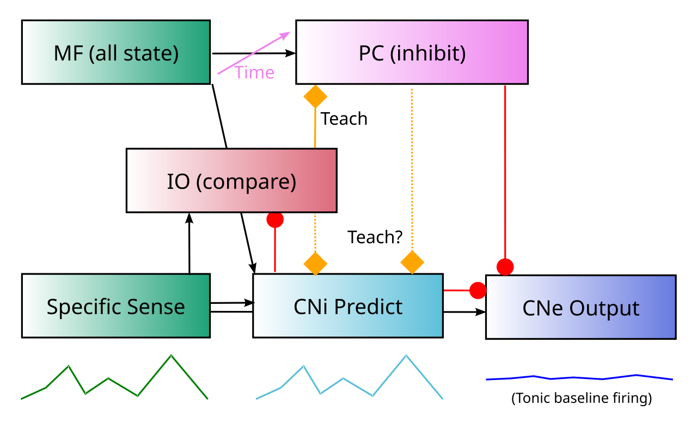

+++
Categories = ["Neuroscience", "Cognition"]
bibfile = "ccnlab.json"
+++

The **cerebellum** is a system of highly specialized neural elements unlike those found in any other part of the brain, the precise function of which has been tantalizingly elusive since the seminal publication of many of its unique features ([[@EcclesItoSzentagothai67]]). Although it is widely considered to be a motor control system, it is anatomically and evolutionarily a sensory system, which untangles intertwined sensory signals to provide a kind of [[linear algebra|orthogonalized basis space]] upon which to drive motor actions.

This untangling function is known as an **adaptive filter** ([[@Fujita82a]]; [[@WidrowStearns85]]), which is a form of [[predictive learning]] that filters out what is expected or predicted based on other sensory signals, so that the _residual_ signal represents a "pure" and otherwise unexplained sensory signal.

When you move any part of your body, especially the head or eyes, you create massive changes across all of your senses. If you did not somehow subtract these **self-motion** sensory signals in your perceptual system, you would never be able to act sensibly in the world ([[@Cullen23]]). Everything would be in a constant state of turbulent motion, and you would never be able to coordinate a proper motor action based on all of these moving targets.

The evolutionary history of the cerebellum is consistent with this adaptive filter function, based on proto-cerebellar circuits and cerebellar analogs in other animals ([[@BodznickMontgomeryCarey99]]; [[@MontgomeryPerks19]]; [[@BellHanSawtell08]]; [[@Cisek21]]). The most ancient part of the mammalian cerebellum is essentially an integral component of the primary brainstem [[vestibular]] sensory nucleus, where it learns to subtract the effects of self-generated motion signals at all levels of the body, to produce a _pure_ vestibular signal that represents any remaining discrepancy from what would be expected based on the self-motion generated signals.

This pure vestibular signal is then something that can be acted upon effectively. If there is an additional sense of motion after all of your own actions have been accounted for, you know that you are slipping or falling or being pushed around in some way. Furthermore, this pure signal tells you exactly which way you should act in order to counteract the residual motion. When combined with other sensory inputs from vision, touch and proprioception, you can also figure out what the likely cause of the disturbance is, and thus condition your motor response accordingly.

{id="figure_env" style="height:15em"}

As this example makes clear, the adaptive filtering by the cerebellum provides an  essential basis to enable sensible motor actions to be generated. A major challenge that the cerebellum must overcome is managing the many different **temporal delays** associated with the effects of motor actions and the sensory transduction thereof. When you decide to move your head, the **efferent copy** of that **descending motor command** provides the earliest signal about what is going to happen, setting off a complex cascade of subsequent signals that all need to be accounted for ([[#figure_env]]).

Your spinal cord and skeletal muscles do a lot of further work to actually implement the motor command in an efficient way, so you need to also get the actual **ascending motor signals** back up from the lower-level spinal motor pathways and the associated **proprioceptive** signals about the current levels of muscle stretching from the muscle _spindle fibers_. These signals unfold over time as the motor action takes place, even if the descending motor command was relatively ballistic.

Then, as your head starts to move, you will start getting signals from your vestibular system reflecting the motion. The specific spatiotemporal pattern of these signals will depend on the exact motor parameters, so this is a further challenging prediction problem. As shown in [[#figure_env]], the adaptive filtering job performed by the cerebellum can be organized around the entire _temporal envelope_ defined by the initial descending motor command.

{id="figure_cancel" style="height:15em"}

The core computation performed by the adaptive filter is to subtract the learned prediction of the sensory consequences of a motor action from the actual sensory inputs ([[#figure_cancel]]). If the actual sensory inputs match the learned prediction, then the result is _cancellation_ of the sensory signal. However, if there is a perturbation of the sensory signal from something else unexpectedly going on (a slip, a push, etc), then this will show up clearly as a _residual_ signal that has not been canceled by the prediction.

{id="figure_cereb" style="height:25em"}

The key elements of the cerebellar circuitry that implement this adaptive filter process are shown in [[#figure_cereb]].

* Each specific sensory channel (e.g., one particular canal in the vestibular system) has an anatomically organized pathway that specifically learns to predict it. The specific sensory input drives excitatory input into glomeruli on **inferior olive (IO)** neurons.

    Each IO neuron has about 50 such glomeruli, each of which receives 2 excitatory and 2 inhibitory inputs ([[@ZeeuwHoogenraadKoekkoekEtAl98]]). Each glomerlus connects about 5-6 different nearby IO neurons together, with gap junctions that cause them to be synchronized. Thus, there are about 5-6 IO neurons processing each specific sensory input projection, with likely redundancy in sampling the same specific sensory channel.

* An associated **cerebellar nucleus (CN)** inhibitory (GABAergic) neuron (CN_i) projects inhibition into the same IO glomerulus, representing the prediction of the specific sensory channel. By detecting the coincidence of excitatory and inhibitory inputs within a narrow time window, the IO glomerulus can compute the _prediction error_ ([[@Ito13]]; [[@DeZeeuwSimpsonHoogenraadEtAl98]]).

* The IO prediction error signal drives learning in the **Purkinje cells (PC)**, which are the primary output neurons of the _cerebellar cortex_.  Each IO neuron sends _climbing fiber (CF)_ axonal output that goes up to the PCs and back down to the CN, powerfully driving learning in these areas. Each IO neuron sends CF output to about 10 PC neurons. The PC neurons send GABA inhibition to the excitatory neurons in the CN (CN_e), providing the cancellation of the sensory signal that also drives excitation into this CN_e neuron. There is also direct inhibition from the CN_i prediction to the CN_e, supporting two different pathways for predictive cancellation, as we discuss below.

* The inputs for driving the PC (and other neurons in the cortex) and the CN inhibitory neurons are conveyed by the **mossy fiber (MF)** pathway originating in the **pontine nuclei (PN)** and other sensory / motor sources. This broad sample of time-varying inputs allows the CN_i prediction neurons to generate a prediction of the time-varying specific sensory input, and the PC neurons to learn to generate their inhibitory cancellation signal.

    The cerebellar cortex also contains a very large number of tiny **granule cells (GC)**, that receive MF inputs and send excitation to the PCs. The large number of these GCs result in the cerebellum having about 70% of the total number of neurons in the human brain. These GCs, along with inhibitory Golgi cells and other specialized cell types in some areas, are thought to provide a very high-dimensional time-varying representation that is particularly useful for rapidly learning novel temporal firing patterns in the PC neurons ([[@Marr69]]; [[@BuonomanoMauk94]]; [[@MaukBuonomano04]]).

Thus, the elaborate and specialized nature of the cerebellar circuitry seems ideal for performing the adaptive filter function ([[@Fujita82a]]; [[@MiallWolpert96]]; [[@DeanPorrillEkerotEtAl10]]; [[@TanakaIshikawaLeeEtAl20]]). Nevertheless, there are many other ideas in the literature about what the cerebellum might be doing, which share elements in common with the above, as discussed below.

In general, much more attention has been paid to the circuits in the cerebellar cortex vs. those in the CN ([[@KebschullCasoniConsalezEtAl24]]; [[@HerzfeldHallTringidesEtAl20]]), and the specific way in which the CN and IO can work together to drive the critical prediction error signal has perhaps been under-appreciated, given how uniquely well-suited its highly unusual biological properties are for this function ([[@DeZeeuwSimpsonHoogenraadEtAl98]]).

The presence of two distinct pathways for cancelling the sensory signal, a direct pathway within the CN and an indirect pathway through the cerebellar cortex, raises the question as to why two separate pathways would be required. Taking inspiration from the seminal ideas of David Marr for both the [[hippocampus]] ([[@Marr71]]) and the cerebellum ([[@Marr69]]), one hypothesis is that the use of a very high-dimensional representational space in the cerebellar cortex (via the GCs) allows the system to rapidly learn new spatiotemporal firing patterns without suffering from extensive interference with prior learning.

It is now very well established that this rapid episodic learning is a major function of the hippocampal circuitry, and [[@^HerzfeldHallTringidesEtAl20]] provide consistent evidence for this idea in the cerebellum. They showed extensive data on the timecourse of learning in monkeys that fits much better with a model having two learning systems, one fast and one slow, versus a single learning system. Interestingly, their analysis suggests that the fast learning system (through the cerebellar cortex) should also serve to train the slower system, which is possible via PC inputs onto the CN_i prediction neurons.

## Biological details

If there is a mismatch between the excitatory and inhibitory inputs, then the IO neurons will fire a burst of spikes via the **climbing fibers** that wrap around a corresponding **Purkinje cell** (PC) in the cerebellar cortex. This then causes the PC to fire a **complex spike** which drives rapid learning throughout the cerebellar cortex and in the DCN and IO neurons themselves. The only output of the PC, and thus the entire complex circuitry of the cerebellar cortex, is directly onto the DCN neurons, in the form of strong inhibition.

* key data from [[@DeZeeuwBerrebi95]] on PC inputs to CN, and likely independence of CN_i vs. CN_e -- key prediction and alternative models.

* show data from [[@TanakaIshikawaKakei19]], [[@IshikawaTomatsuIzawaEtAl16]], 2014, [[@ZobeiriCullen24]] on actual firing data in CN, PC neurons etc. DC neurons do not go silent!  every neuron learns what the firing of every other neuron means, so the cancelation is all relative. Weird result from [[@ZobeiriCullen24]] along these lines.

## Other theories of cerebellar function

Brief..

## Hierarchical cascades of predictive controllers

The residual signals provide control knobs for higher levels of control! Key example of VOR vs. saccades etc!  Saccade is an error signal from perspective of VOR. Subsumption / override and neural mechanisms supporting that.

Actual motor control signals come from BG and cortex, using sensory signals from cerebellum.

Key Powers et al point: you can do all of motor control in sensory space!

What does cerebellum need to handle this?

