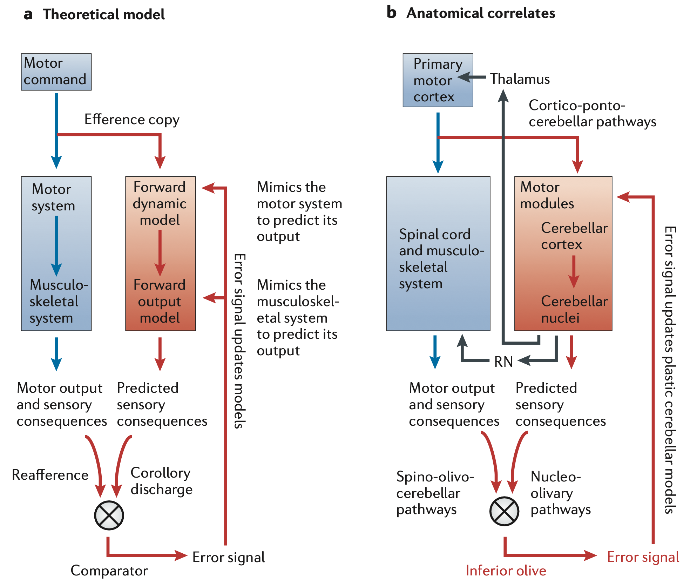

+++
Categories = ["Neuroscience", "Cognition"]
bibfile = "ccnlab.json"
+++

The **cerebellum** is a system of highly specialized neural elements unlike those found in any other part of the brain, the precise function of which has been tantalizingly elusive since the seminal publication of many of its unique features ([[@EcclesItoSzentagothai67]]). Although it is widely considered to be a motor control system, it is anatomically and evolutionarily a sensory system, which untangles intertwined sensory signals to provide a kind of [[linear algebra|orthogonalized basis space]] upon which to drive motor actions.

{id="figure_motor" style="height:20em"}

The cerebellum is located at the base of the brain, forming a kind of outgrowth of the midbrain ([[#figure_motor]]). It receives inputs (via the **pons** or **pontine nuclei**) from all of the major [[motor]]-associated areas of the brain, including the [[basal ganglia]] and the sensory-motor areas of the midbrain, and motor-associated cortical areas including primary motor and somatosensory cortical areas (M1 and S1). It also receives a wide range of other sensory signals, including a major projection from the [[vestibular]] system.

The outputs, from the **deep cerebellar nuclei** (just **CN** in more recent terminology), project very widely to many areas of the brain, including a major driving projection to the VL [[thalamus]] from the lateral CN, which can provide a training signal to primary motor cortex.

{id="figure_outer_prod" style="height:15em"}

Unlike the basal ganglia, neocortex, and thalamus, the cerebellum does not have a simple topographic organization that can be easily labeled in a figure. Instead, the primary function of the cerebellum is to integrate and compare signals across different modalities, so it works somewhat like an _outer product_ across its various inputs, with each region comparing one sensory input against another ([[#figure_outer_prod]]).

{id="figure_fastigial" style="height:35em"}

[[#figure_fastigial]] shows an example of this outer-product like organization ([[@FujitaKodamaduLac20]]), associated with the _fastigial nucleus_ (FN), which is the evolutionarily most ancient of the cerebellar nuclei ([[@ZhangWangZhu16]]). Different regions of the **cerebellar cortex** (specifically the _vermis_, which is the medial portion) integrate different signals including [[vestibular]] and various somatosensory signals of relevance to different core survival-relevant systems.

{id="figure_mossy-prjn" style="height:20em"}

Another representation of the thorough mixing of sensory signals in the cerebellum is shown in [[#figure_mossy-prjn]], plotting the terminal zones of the axon of a single **mossy fiber** neuron from the pons ([[@BiswasLuoSarpongEtAl19]]). This one sensory signal is distributed across many areas of the cerebellar cortex, and many such neurons also project down to the cerebellar nuclei as well.

{id="figure_cortex" style="height:25em"}

[[#figure_cortex]] shows the terminology for all of the different regions of the cerebellar cortex, progressing outward from the original vermis to the paravermis and lateral hemispheres, which are involved in more fine-grained skeletal motor control. The stripe-like structure shown is due in part to a protein called _zebrin_ that provides an organizing structure for the long stripes along the length of the cerebellum, which provides the folded lobular structure in the 3D anatomical structure, but which is shown in flattened form so it can all be visualized. 

{id="figure_cortex-nuclei" style="height:25em"}

[[#figure_cortex-nuclei]] shows the relationship between the cerebellar cortex and the different nuclei (from [[@SugiharaShinoda07]]). 

<!--- TODO: Names of nuclei, brief discussion etc. -->

<!--- TODO: good figure of homunculus mapping. -->

{id="figure_anatomy" style="height:35em"}

Figure [[#figure_anatomy]] from [[@^Ramnani06]] shows the major anatomical features  of the cerebellum, many of which are distinctive relative to other brain areas. We start with a model of how these unique features support the specific sensory untangling function, called the _Nuclear_ model (because it focuses first on the computations in the cerebellar nucleus, and provides a clear and simple computational function). This is then compared against other models in the literature, followed by a more detailed discussion of the underlying biology, and then a brief overview of how all of this fits into the broader [[motor]] system.

## The Nuclear model

The untangling function performed by the cerebellum is known as an **adaptive filter** ([[@Fujita82a]]; [[@WidrowStearns85]]), which is a form of [[predictive learning]] which filters out what is expected or predicted based on other sensory signals, so that the _residual_ signal represents a "pure" and otherwise unexplained sensory signal.

When you move any part of your body, especially the head or eyes, you create massive changes across all of your senses. If you did not somehow subtract these **self-motion** sensory signals in your perceptual system, you would never be able to act sensibly in the world ([[@Cullen23]]). Everything would be in a constant state of turbulent motion, and you would never be able to coordinate a proper motor action based on all of these moving targets.

The evolutionary history of the cerebellum is consistent with this adaptive filter function, based on proto-cerebellar circuits and cerebellar analogs in other animals ([[@BodznickMontgomeryCarey99]]; [[@MontgomeryPerks19]]; [[@BellHanSawtell08]]; [[@Cisek21]]). The most ancient part of the mammalian cerebellum is essentially an integral component of the primary brainstem [[vestibular]] sensory nucleus, where it learns to subtract the effects of self-generated motion signals at all levels of the body, to produce a _pure_ vestibular signal that represents any remaining discrepancy from what would be expected based on the self-motion generated signals.

This pure vestibular signal is then something that can be acted upon effectively. If there is an additional sense of motion after all of your own actions have been accounted for, you know that you are slipping or falling or being pushed around in some way. Furthermore, this pure signal tells you exactly which way you should act in order to counteract the residual motion. When combined with other sensory inputs from vision, touch and proprioception, you can also figure out what the likely cause of the disturbance is, and thus condition your motor response accordingly.

{id="figure_env" style="height:20em"}

As this example makes clear, the adaptive filtering by the cerebellum provides an  essential basis to enable sensible motor actions to be generated. A major challenge that the cerebellum must overcome is managing the many different **temporal delays** associated with the effects of motor actions and the sensory transduction thereof. When you decide to move your head, the **efferent copy** of that **descending motor command** provides the earliest signal about what is going to happen, setting off a complex cascade of subsequent signals that all need to be accounted for ([[#figure_env]]).

Your spinal cord and skeletal muscles do a lot of further work to actually implement the motor command in an efficient way, so you need to also get the actual **ascending motor signals** back up from the lower-level spinal motor pathways and the associated **proprioceptive** signals about the current levels of muscle stretching from the muscle _spindle fibers_. These signals unfold over time as the motor action takes place, even if the descending motor command was relatively ballistic.

Then, as your head starts to move, you will start getting signals from your vestibular system reflecting the motion. The specific spatiotemporal pattern of these signals will depend on the exact motor parameters, so this is a further challenging prediction problem. As shown in [[#figure_env]], the adaptive filtering job performed by the cerebellum can be organized around the entire _temporal envelope_ defined by the initial descending motor command.

{id="figure_cancel" style="height:20em"}

The core computation performed by the adaptive filter is to subtract the learned prediction of the sensory consequences of a motor action from the actual sensory inputs ([[#figure_cancel]]). If the actual sensory inputs match the learned prediction, then the result is _cancellation_ of the sensory signal. However, if there is a perturbation of the sensory signal from something else unexpectedly going on (a slip, a push, etc), then this will show up clearly as a _residual_ signal that has not been canceled by the prediction.

A further wrinkle with this cancellation process is that it must slightly anticipate the sensory signal in order to account for the synaptic delays in the cancellation signal itself. There is extensive evidence of a roughly 50 ms anticipatory firing of various predictive signals in the vestibular and other pathways ([[@Cullen23]]).

<!--- TODO: better anticipation refs -->

<!--- The sensory cancellation function of the cerebellum appears to have been the initial driver of its evolution in the vestibular system, and this adaptive filtering of self-motion signals is essential for any kind of systematic motor control system. However, the learned sensory prediction signals themselves are also almost certainly of value in supporting motor control, because they provide valuable anticipatory information about the sensory outcomes of motor actions. -->

<!--- [[@TeunederBurgRuigrok95]] show no collateral projections from CNi neurons. -->

<!--- Thus, it would be useful if the cerebellum is able to generate two different outputs: a filtered sensory output where the self-motion signals have been canceled, and a sensory prediction signal reflecting the activity of the sensory prediction required to generate the filtered sensory output. Indeed, accumulating evidence on paired **upbound** and **downbound microzones** in the cerebellum ([[@DeZeeuwI21]]) is consistent with the requirements needed for generating these two output signals, driven by a common sensory prediction error learning signal. -->

{id="figure_nuclear" style="height:20em"}
![Cerebellar components that implement the adaptive filter computation according to the Nuclear model. In the cerebellar nucleus (CN), grouped inhibitory (CNi) and excitatory (CNe) neurons operate on a specific sensory channel, with sample activity over time as shown. The CNi learns to predict the sensory input activity, and successful prediction results in stable activity over the CNe output (projection) neuron, with excitatory sensory input balanced by corresponding inhibition from both the CNi and the PC (Purkinje cell). The CNe has a high (~40 Hz) tonic baseline firing rate, as does the PC. The IO (inferior olive) compares the CNi prediction vs. the sensory input, and fires a burst of spikes if there is an excitatory input without a corresponding inhibitory input. This leads to complex spike firing in the PC, and can drive plasticity in the CNi.](media/fig_cerebellum_as_adaptive_filter.png)

The key elements of the cerebellar circuitry that can implement this adaptive filter process according to the _Nuclear_ model are shown in [[#figure_cereb]]. There are many other ideas in the literature about what the cerebellum might be doing, which share elements in common with this framework. Indeed, even though each element has been discussed in the literature, the specific details of the current model have not otherwise all been combined into one coherent framework. These issues are discussed in the [[#Standard models]] section below, after providing an overview of the Nuclear framework.

* Each specific sensory channel (e.g., one particular canal in the vestibular system) has an anatomically organized pathway that specifically learns to predict it ([[@Oscarsson79]]; [[@SugiharaShinoda04]]; [[@DeZeeuwI21]]). The specific sensory input drives excitatory input into _glomeruli_ (relatively large anatomical structures where multiple axons and dendrites converge) on **inferior olive (IO)** neurons.

    Each IO neuron has about 50 such glomeruli, each of which receives 2 excitatory and 2 inhibitory inputs ([[@DeZeeuwSimpsonHoogenraadEtAl98]]). Each glomerulus connects about 5-6 different nearby IO neurons together, with gap junctions that cause them to be synchronized. Thus, there are about 5-6 IO neurons processing each specific sensory input projection, with likely redundancy in sampling the same specific sensory channel across cerebellar _microzones_.
    
    The error detection logic in the IO glomeruli operates by virtue of inhibitory inputs resetting dendritic conductances, such that excitatory inputs are ineffective within a ~50 ms window, but are strongly amplified outside of that window, so that even a few spikes outside of the window can drive supra-threshold burst activity in the IO neuron ([[@LoyolaHooglandHoedemakerEtAl23]]). This time window offset within the IO can support an anticipatory predictive signal in the predictive input.

* An associated **cerebellar nucleus (CN)** inhibitory (GABAergic) neuron (_CNi_) projects inhibition into the same IO glomerulus, representing the learned prediction of the specific sensory channel. By detecting the coincidence of excitatory and inhibitory inputs within a narrow time window, the IO glomerulus can compute the _prediction error_ ([[@Ito13]]; [[@DeZeeuwSimpsonHoogenraadEtAl98]]).

* The IO prediction error signal drives learning in the **Purkinje cells (PC)**, which are the primary output neurons of the _cerebellar cortex_.  Each IO neuron sends _climbing fiber (CF)_ axonal output that goes up to the PCs, and also back down to the CN. Each IO neuron sends CF output to about 10 PC neurons, with about 300 synapses per PC neuron ([[@Ito84]]).

    The IO neuron only fires at most two spikes when an error is detected, due to intrinsic currents, but these are sufficient to then drive powerful _complex spike_ activity patterns in the PC neurons that drive learning in these neurons ([[@ItoKano82]]; [[@CoesmansWeberDeZeeuwEtAl04]]). IO neurons also fire single spikes spontaneously at around 1 Hz, but these spontaneous spikes are generally less impactful than the error-driven ones ([[@TitleyKislinSimmonsEtAl19]]; [[@ZangDeSchutter19]]; [[@GuoUusisaari25]]).

* The PC neurons send GABA inhibition to the CN, targeting the CNi and excitatory projection neurons (_CNe_), which convey the primary output of the entire cerebellar system. Both the PC and CNe neurons fire at a high tonic baseline level (roughly 40-50 Hz), due to intrinsic channel properties, which allows for significant bidirectional modulation of their firing rates. Thus, the IO-driven learning in the PC can drive inhibitory inputs onto the CNe neurons that balances out the additional excitatory drive from the sensory input, thereby cancelling the sensory signal.

    The CNi neurons need to learn to predict the specific sensory input in order to make the IO computation an accurate prediction error signal. Consistent with this account, direct evidence shows that this CNi projection is responsible for reducing IO firing and complex spikes in PC neurons as learning proceeds ([[@KimKrupaThompson98]]; [[@Ito01]]). Furthermore, this pathway was responsible for a _blocking_ effect in conditioned learning, which is a signature of the elimination of prediction error signals in a delta-rule like mechanism ([[@Fanselow98]]; [[@KimKrupaThompson98]]).
    
    The learning in CNi neurons may also be influenced by input from the PC into the CNi neurons ([[@PughRaman08]]). However, unlike the CNe neurons, it is important that the CNi neurons not receive too much inhibition from the PC neurons, as this would then reduce their prediction signal, creating more of a prediction error. This requirement is consistent with evidence showing that PC inhibitory inputs onto CNi neurons is relatively weak and synapses on distal dendrites, while PC to CNe projections are strong and synapse near the soma ([[@UusisaariKnopfel08]]).
    
* The inputs for driving the PC (and other neurons in the cerebellar cortex) and the CNi neurons are conveyed by the **mossy fiber (MF)** pathway originating in the **pontine nuclei (PN)** and other sensory / motor sources. This broad sample of time-varying inputs allows the PC and CNi neurons to generate a prediction of the time-varying specific sensory input.

    The cerebellar cortex also contains a very large number of tiny **granule cells (GC)**, that receive MF inputs and send excitation to the PCs, via distinctive _parallel fiber_ axons, with each PC receiving as many as 150,000 such parallel fiber inputs. The large number of these GCs result in the cerebellum having about 70% of the total number of neurons in the human brain. These GCs, along with inhibitory _Golgi_ cells and other specialized cell types in some areas, are thought to provide a very high-dimensional time-varying representation that is particularly useful for rapidly learning novel temporal firing patterns in the PC neurons ([[@Marr69]]; [[@BuonomanoMauk94]]; [[@MaukBuonomano04]]).

This model shows how the elaborate and specialized nature of the cerebellar circuitry seems ideal for performing the adaptive filter function, consistent with  a major ongoing hypothesis ([[@Fujita82a]]; [[@MiallWolpert96]]; [[@DeanPorrillEkerotEtAl10]]; [[@TanakaIshikawaLeeEtAl20]]). 

The presence of two distinct pathways for canceling the sensory signal, a direct pathway within the CN and an indirect pathway through the cerebellar cortex, raises the question as to why two separate pathways would be required, and how they might perform complementary functions. Taking inspiration from the seminal ideas of David Marr for both the [[hippocampus]] ([[@Marr71]]) and the cerebellum ([[@Marr69]]), one hypothesis is that the use of a very high-dimensional representational space in the cerebellar cortex (via the GCs) allows the system to rapidly learn new spatiotemporal firing patterns without suffering from extensive interference with prior learning.

Furthermore, the CN system can slowly learn the most reliable and stable forms of sensory predictions, while the cerebellar cortex can rapidly learn more context-dependent, idiosyncratic predictions, which may then decay away over time ([[@HerzfeldHallTringidesEtAl20]]; [[@KassardjianTanChungEtAl05]]). There is evidence that the CN pathway does not have as accurate of timing relative to the cortical pathway ([[@GarciaSteeleMauk99]]), which is consistent with the high-dimensional representation formed in the cerebellar cortex. Because each PC integrates input from roughly 150,000 granule cell inputs, it can form novel, arbitrary associations across many more diverse stimulus inputs than the more limited dendritic arbors of CNi neurons.

It is now well established that rapid episodic learning is a major function of the hippocampal circuitry, and [[@^HerzfeldHallTringidesEtAl20]] provide consistent evidence for this idea in the cerebellum. They showed extensive data on the timecourse of learning in monkeys that fits much better with a model having two learning systems, one fast and one slow, versus a single learning system. 

Interestingly, their analysis suggests that the fast learning system (through the cerebellar cortex) should also serve to train the slower system, which is possible via PC inputs onto the CNi prediction neurons, as we discuss next.

## Learning rules

There is biological evidence for [[synaptic plasticity]] in just about every synapse in the cerebellar system ([[@HanselLindenDAngelo01]]; [[@Carey11]]; [[@GaovanBeugenDeZeeuw12]]). The most important synapses based on the logic of [[#figure_cereb]] are:

* CNi predictor inputs.
* PC inputs.

### CNi learning

Starting with the CNi prediction neuron, a simple [[error-backpropagation#delta-rule]] function is optimal from a mathematical perspective:

{id="eq_delta-w" title="Delta rule"}
$$
\Delta w = (s - y) x
$$

where _y_ is the prediction activity, _s_ is the sensory value, and _x_ is the sending activity. 

This equation requires bidirectional learning based on the mismatch between the sensory value and prediction: if the prediction is too low, then the synaptic weights need to be increased (LTP: long-term potentiation), and decreased (LTD: long-term depression) in the opposite case.

If the only driver of learning in the CNi is the error signal conveyed by the activity of the IO via its collateral projection back to the CN, it is difficult to see how bidirectional plasticity could be achieved, because it only fires at most a doublet of two spikes when there is an error ([[@TitleyKislinSimmonsEtAl19]]), and definitely fires much too infrequently in general to support a meaningful bidirectional modulation in its firing rate (even if some other mechanisms might make it somewhat more informative than a purely binary signal; [[@ZangDeSchutter19]]).

Fortunately, there is direct evidence for bidirectional synaptic plasticity in CN neurons ([[@PughRaman08]]; [[@PughRaman06]]; [[@ZhangLinden06]]; [[@McElvainBagnallSakatosEtAl10]]). However, these experiments were conducted in slices, which creates interpretational difficulties. In particular, the _in vitro_ slice preparation exhibits rebound bursting that is likely not present in awake behaving animals (i.e., [[in activo]]), and this bursting was a focus of these studies.

In the absence of definitive data, one possible learning mechanism that could implement [[#eq_delta-w]] is to have the specific sensory input synapse onto the soma (or proximal dendrites) of the CNi neuron, and drive learning based on the contrast between this somatic activity versus that occuring in the dendrites. The results and theorizing summarized by [[@^PughRaman08]] are potentially consistent with this idea, demonstrating distinct contributions from somatic and dendritic activity, based on differential localization of Ca++ channels.

There is a general consensus in the field that initial faster learning in the PC neurons is necessary for the _systems consolidation_ of slower learning in the CN ([[@RaymondMedina18]]). However, each of the relevant studies supporting this conclusion has issues that leave this point in doubt. Perhaps the strongest-seeming data comes from [[@^GarciaSteeleMauk99]], who lesioned the cerebral cortex post-learning in a [[#conditioning]] paradigm, and found that this lesion prevented subsequent acquisition to a new CS. However, this is could actually have been due to a blocking effect from the prior CS-US conditioning, as was found by [[@^KimKrupaThompson98]].

Another study by [[@^ZeeuwHanselBianEtAl98]] used a genetic knockout to disable a critical protein kinase involved in [[synaptic plasticity]], selectively in the PC neurons. While they found that this blocked adaptation of the vestibulo-ocular reflex (VOR) in both the PCs and the CN, they only used a short amount of training (1 hr) which was shown in another study to only affect learning in the cerebral cortex ([[@KassardjianTanChungEtAl05]]).

Consistent with the fast vs. slow dissociation, [[@^KassardjianTanChungEtAl05]] only found cortically-independent learning in the CN after 3 days of training. Furthermore, [[@^ZeeuwHanselBianEtAl98]] noted that the standard VOR, and considerable motor behavior, was intact in their knockout mice, providing strong evidence that plasticity in the PC is _not_ important for the slow learning over developmental time in the CN.

Another study by [[@^ShutohOhkiKitazawaEtAl06]] used a range of manipulations, and did show that the inactivation of the IO affected longer-term VOR adaptation, and a blocker of learning-related chemical cascades in the cerebellar cortex impaired learning in the CN. These results are inconsistent with long-term learning in the  [[@^ZeeuwHanselBianEtAl98]] study, and further careful research is needed to resolve these discrepancies.

Overall, given the strong functional benefits of direct CNi learning, it seems reasonable to assume for the time being that the CNi can learn independent of the cerebellar cortex, and that this learning is significantly slower than learning in the PC neurons. The PC projections to CNi neurons may also facilitate learning ([[@HerzfeldHallTringidesEtAl20]]), while the IO collaterals may also play a critical modulatory role. The strong computational imperative for [[#eq_delta-w]] at least provides a testable set of predictions.

### PC learning

The role of the IO climbing fiber activity in shaping learning in the PC has been much more extensively studied, consistent with the general focus on the cerebellar cortex since the original highly-influential theories of [[@^Marr69]], [[@^Albus71]], and [[@^Ito72]]. Recent data confirms that this climbing fiber input is critical for PC plasticity ([[@SilvaRamirez-BuriticaPritchettEtAl24]]).

If the IO is the driver of PC learning, then the lack of bidirectionality in this signal creates challenges for accurately learning to predict a sensory signal, which again requires something like the bidirectional delta-rule ([[#eq_delta-w]]). However, given the evidence suggesting that the PC learning is fast and more transitory in nature, it is reasonable that a unidirectional IO error signal indicating the presence of an unexpected sensory signal can be complemented with a slower decay process that prevents all of the synapses from only going in one direction. This is consistent with a number of specific theories (cites).

The specific logic for IO error detection summarized above is asymmetrically organized to detect excess excitatory sensory spiking, so only positive error terms will be signalled by IO spiking, corresponding to LTP. However, this conflicts with the proposal from [[@^Albus71]] that, assuming the IO climbing fiber signal corresponds to a motor error, this error should be corrected by LTD decreases in PC synapses.

Furthermore (and somewhat in logical conflict with the Albus proposal), in the widely-studied eyeblink [[#conditioning]] paradigm reviewed below, LTD should disinhibit the motor response to close the eyelid in advance of a noxious air puff. However, in fact most of the synaptic plasticity recorded in that paradigm has actually been LTP potentiation, resulting in increased PC simple spiking, as reviewed below.

In any case, the early focus of synaptic plasticity research in the cerebellum was on LTD in PC synapses ([[@ItoSakuraiTongroach82]]), but subsequent research shows that PC synapses exhibit bidirectional plasticity, consistent with known [[synaptic plasticity]] mechanisms ([[@TangXiaoSuhEtAl17]]; [[@DeZeeuwI21]]). 

* [[@JirenhedBengtssonHesslow07]] -- simulation by direct stimulation of PC and MF?

<!--- TODO: actual learning in PC more formally -->

## Standard models

There have been a large number of different theoretical accounts of cerebellar function over the years (see [[@NguyenPerson25]]; [[@Shadmehr20]]; [[@RaymondMedina18]] for recent reviews). Most of these models have focused on the circuits in the cerebellar cortex vs. those in the CN ([[@KebschullCasoniConsalezEtAl24]]; [[@HerzfeldHallTringidesEtAl20]]). In this section, we review some key points of divergence among the various theories, in relation to the framework presented above.

### Sensory vs. motor

Perhaps the biggest point of divergence among theories is whether the cerebellum is primarily a motor vs. sensory system, with most accounts coming down on the motor side, based on the obvious motor deficits associated with cerebellar damage. Although it can be surprisingly difficult to precisely distinguish these two alternatives, the main discriminating factor used here is:

> Is the primary function of the cerebellum to generate motor commands, or does it instead perform processing of commands generated elsewhere?

{id="figure_sensory-motor" style="height:20em"}

This distinction is clearly illustrated in a figure from [[@^NguyenPerson25]] ([[#figure_sensory-motor]]) comparing the feedforward motor control framework ([[@OhyamaNoresMurphyEtAl03]]; [[@RaymondLisbergerMaukEtAl96]]; [[@Bastian06]]) with the adaptive filter framework. The output of the adaptive filter is a state estimate, not a motor command. The first functional models of the cerebellum explicitly had motor commands as the outputs ([[@Marr69]]; [[@Albus71]]), establishing a strong motor orientation in the field.

The adaptive filter framework is often discussed as a **forward model** ([[@JordanRumelhart92]]; [[@WolpertKawato98]]; for example in the caption in [[#figure_sensory-motor]]), which predicts forward in time from a motor command to the sensory outputs of that command. By contrast, an **inverse model** would allow one to go from sensory outputs to a motor command that should produce those sensory outputs. Given that action goals are often specified in terms of desired sensory outcomes, the inverse model is generally much more valuable than a forward model. 

However, it is quite difficult to create an inverse model in complex, real-world cases, because there are often many possible action sequences that could result in the same or similar outcomes ([[@JordanRumelhart92]]; [[@GibsonFichmanPlaut97]]), and there are considerable additional sources of ambiguity.

Therefore, the [[Rubicon]] goal-driven control framework uses a sensory-based goal selection mechanism, informed by multiple levels of predictive learning systems and shaped by [[constraint satisfaction]] processing across learned [[distributed representations]], to select a desired outcome and an overall plan of action. This goal-selection process can be informed by cerebellar predictive learning mechanisms, but does not require inverting forward models to obtain the inverse model.

{id="figure_ramnani06" style="height:30em"}

This broader contextualization of how motor action selection operates (including additional concepts summarized below and in the [[motor]] page) is critical for avoiding the strong pull toward framing cerebellar function in motor terms, which is otherwise hard to do ([[@MiallWolpert96]]; [[@WolpertMiallKawato98]]; [[@Verduzco-FloresOReilly15]]). For example, even when otherwise describing the adaptive filtering framework, as shown in [[#figure_ramnani06]] from [[@Ramnani06]], the text describes the use of the forward predictive model in terms consistent with an inverse model. For this reason, we generally avoid the _forward model_ term in favor of the more purely sensory-based _adaptive filter_ function.

Further insight into problems with motor-based frameworks comes from a consideration of the predictive error signals computed by the IO ([[@^SimpsonWylieZeeuw96]]), which have been proposed to be based on efferent copy inputs ([[@Oscasson80]]; [[@KawatoGomi92]]). They note that the inputs tend to be dominated by somatosensory and proprioceptive signals, and not efferent copy inputs, and that there is a timing issue for motor error computation, where the temporal separation between the initial motor command efferent copy and the subsequent motor outcome can be relatively long (more than 100 ms, as shown in [[#figure_env]]). Furthermore, there is an anatomical mismatch between descending and ascending motor pathways as they map into the cerebellum ([[@DeZeeuwSimpsonHoogenraadEtAl98]]).

By contrast, a major advantage of the purely sensory prediction framework is that the target signal for training the predictor, and the corresponding prediction error, are all synchronized in time ([[#figure_env]]). This is one instance of the broader issue with motor-based learning models: the signals available for computing prediction errors are generally sensory in nature (e.g., retinal motion, vestibular signals, muscle spindle fiber signals, etc).

Indeed, it is not clear how an error signal in terms of motor commands could be computed: how would the "correct" or target motor signal be defined, against which the actual descending motor command is compared? This difficulty is precisely why learning forward models from motor to sensory outcomes is easy, and why inverting these forward models to obtain desired motor commands is difficult.

In summary, sensory predictive learning and adaptive filtering provide a fully computationally well-defined framework that is consistent with known cerebellar properties (as articulated in the Nuclear model above). _If_ it is possible to implement functional motor control using just this adaptive filtering functionality to provide high-quality sensory signals upon which motor actions can be based, then many otherwise challenging difficulties disappear. The broader framework provided in the [[motor]] page, and implemented computational models that include the function of the [[basal ganglia]] and [[prefrontal cortex]], demonstrate that this is indeed possible.

### Conditioning

{id="figure_dec" style="height:25em"}
![Delayed eyeblink conditioning and the functional role of different cerebellar circuits. The CS (conditioned stimulus) reliably precedes a noxious air puff (US, unconditioned stimulus), and learning enables the execution of the conditioned response (CR) of an eyeblink in response to the CS. The CS (tone) enters the cerebellum via the pontine nuclei, which give rise to the mossy fiber inputs to the cerebellar cortex. There is also a collateral to the interpositus (IP) nucleus, which is the cerebellar nucleus (CN) for this area. The air puff activates the IO (inferior olivary nucleus), which also receives inhibition from the IP. The CR is activated by inhibitory inputs from the Purkinje cells onto the IP. From Cheng et al (2015).](media/fig_cerebellum_delay_eyeblink_conditioning.png)

The early discovery that the cerebellum supports a form of classical conditioning ([[@McCormickClarkLavondEtAl82]]; [[@McCormickThompson84]]; [[@YeoHardimanGlickstein85]]; [[@MaukSteinmetzThompson86]]) has led to considerable progress in understanding the properties of the cerebellar system ([[#figure_dec]] from [[@ChengJacobsonJacobsonEtAl15]]), but has also perpetuated considerable confusion about its direct motor involvement. Specifically the cerebellum is assumed to directly drive the _conditioned response_ (CR) of a preventive eyeblink that protects the eye against the _unconditioned stimulus_ (US) of a noxious air puff, in response to a _conditioned stimulus_ (e.g., a tone).

This direct activation of the CR via the presumed disinhibitory drive from the cerebellar output is not obviously compatible with the purely sensory prediction learning assumed by the Nuclear model. However, many responses of PC and CN neurons recorded during conditioning were not compatible with the motor model ([[@McCormickThompson84a]]; [[@BerthierMoore86]]; [[@JirenhedBengtssonHesslow07]]; [[@GreenSteinmetz05]]), and instead were consistent with the sensory prediction model. 

Specifically, most PC neurons recorded in this conditioning paradigm showed _increases_ in simple spike firing immediately prior to the behavioral CR, not disinhibitory decreases. This is consistent with the sensory adaptive filtering model applied to the conditioning task, where the job of the cerebellum is to learn to predict the sensory US and CS onsets, and to then cancel the transient response to these stimuli as they become expected. Thus, increased inhibitory PC-driven cancelling activity is expected at the time of the expected air puff.

A later study ([[@HalversonKhilkevichMauk15]]) specifically examined a subset of neurons that 

TODO: IN recordings in ([[@McCormickThompson84a]]; [[@McCormickThompson84]]), and [[@BoeleKoekkoekDeZeeuw10]] results re amyg etc.

### Anticipatory predictions

A major theme in many discussions of the forward model aspect of cerebellar function is that it could provide an _anticipatory_ signal that allows the motor system to generate motor actions based on this predictive anticipation, rather than reacting to the actual sensory information that comes later ([[@Ito05]]). There is evidence for the anticipatory nature of the cerebellar output across multiple domains, including in the conditioning paradigm reviewed above ([[@Cullen23]]).

As noted earlier, this anticipatory prediction is needed so that the sensory cancellation is effective despite synaptic communication lags, and the IO prediction-error mechanism appears to support this anticipatory relationship, where inhibitory inputs must precede excitatory ones by roughly 50 ms.

Anticipatory firing is relatively straightforward to accomplish via synaptic plasticity mechanisms that drive learning based on chemical traces that reflect input activity with a given temporal lag ([[@RaymondLisberger98]]; [[@WangDenkHausser00]]; ). Indeed, these chemical processes (see [[synaptic plasticity]]) generally require multiple stages of integration that naturally build in such delays.

<!--- TODO: cites from Verduzco -->

### Source of the IO error signal

Consistent with the above discussion of difficulties with motor-based frameworks, many of these frameworks are also quite vague about the source of the error signal conveyed by the IO climbing fibers. Many of them just specify that they communicate a relevant error signal, without a further consideration of the rather elaborate and unusual properties of the IO glomeruli and gap junction coupling present in these neurons.

By contrast, a major advantage of the Nuclear model is that it fully specifies how the IO prediction error is computed, taking specific advantage of these unusual properties of the IO neurons. Interestingly, even though a number of papers discuss both the prediction error coding and these detailed biological properties (e.g., [[@LoyolaHooglandHoedemakerEtAl23]]; [[@DeZeeuwSimpsonHoogenraadEtAl98]]), none seem to make the direct and explicit connection to the adaptive filtering framework and how all of this results in a complete, self-contained understanding of overall cerebellar function.

[[@OhmaeMedina15]] show expected dynamics of IO consistent with Nuclear model in conditioning paradigm, including inhibition of IO CS spiking for the omission of an expected sensory signal. Given the low rate of IO activity, it seems unlikely that this omission would be sufficient to drive plasticity.

### Microzones of organized inputs and outputs

[[@Oscarsson79]] -- microzones; zebrin: [[@SugiharaShinoda04]], [[@HawkesLeclerc87]]

[[@DeZeeuwI21]] -- up / down

### Plasticity in other synapses

As noted above, plasticity has been demonstrated in just about every synapse in the cerebellar circuit ([[@HanselLindenDAngelo01]]; [[@Carey11]]; [[@GaovanBeugenDeZeeuw12]]). Here we consider the issues surrounding the other pathways beyond those discussed above.

In the CN, the Nuclear model assumes that the main predictive learning occurs in the CNi neurons, so that they can simultaneously reduce the prediction error computation in the IO, and slowly implement the cancellation of predicted sensory signals via their projections to the CNe neurons. However, there is evidence of learning in the CNe neurons as well. Furthermore, many authors appear to assume that the PC inhibition drives inhibition of CNi firing, which is 

CNi also has the subtraction applied to it, not just CNe. This is actually what most theorists appear to assume. One advantage is that the error signal driving the IO would be simpler: if there is a purturbation in CNi activity of any sort, then that counts as an error, without the need for a fine-grained comparison operation like that proposed for the glomeruli.

    However, that idea is inconsistent with several biological and functional constraints. First, the IO neurons definitely receive direct excitatory projections from the raw sensory signals that the cerebellum is learning to cancel. Therefore, this signal needs to somehow be actively cancelled directly in the IO. The elaborate glomeruli structures seem to perfectly designed for this comparison to not continue with this hypothesis. Second, the CNi neurons would have to cancel themselves, despite neural delays, and this creates significant difficulties.
    
    ? more?

There is extensive research on the latter, since the discovery of LTD at the GC to PC synapses (i.e., the _parallel fibers_) by [[@^ItoSakuraiTongroach82]]. The original logic for this LTD-based learning however does not make sense for the adaptive filter learning logic. The original motor-learning logic is that if an error occurred, whatever the PC was doing must have been incorrect, and therefore it should reduce its input weights.

## Biological details

If there is a mismatch between the excitatory and inhibitory inputs, then the IO neurons will fire a burst of spikes via the **climbing fibers** that wrap around a corresponding **Purkinje cell** (PC) in the cerebellar cortex. This then causes the PC to fire a **complex spike** which drives rapid learning throughout the cerebellar cortex and in the DCN and IO neurons themselves. The only output of the PC, and thus the entire complex circuitry of the cerebellar cortex, is directly onto the DCN neurons, in the form of strong inhibition.

* key data from [[@DeZeeuwBerrebi95]] on PC inputs to CN, and likely independence of CNi vs. CNe -- key prediction and alternative models.

* show data from [[@TanakaIshikawaKakei19]], [[@IshikawaTomatsuIzawaEtAl16]], 2014, [[@ZobeiriCullen24]] on actual firing data in CN, PC neurons etc. DC neurons do not go silent!  every neuron learns what the firing of every other neuron means, so the cancelation is all relative. Weird result from [[@ZobeiriCullen24]] along these lines.

## Hierarchical cascades of predictive controllers

This goes in motor, but brief summary here.

The residual signals provide control knobs for higher levels of control! Key example of VOR vs. saccades etc!  Saccade is an error signal from perspective of VOR. Subsumption / override and neural mechanisms supporting that.

output of lower level is input to next higher level -- higher level learns to predict the residuals in lower level, using broader / higher-level context that explains the perturbations.

Actual motor control signals come from BG and cortex, using sensory signals from cerebellum.

Key Powers et al point: you can do all of motor control in sensory space!

What does cerebellum need to handle this?

