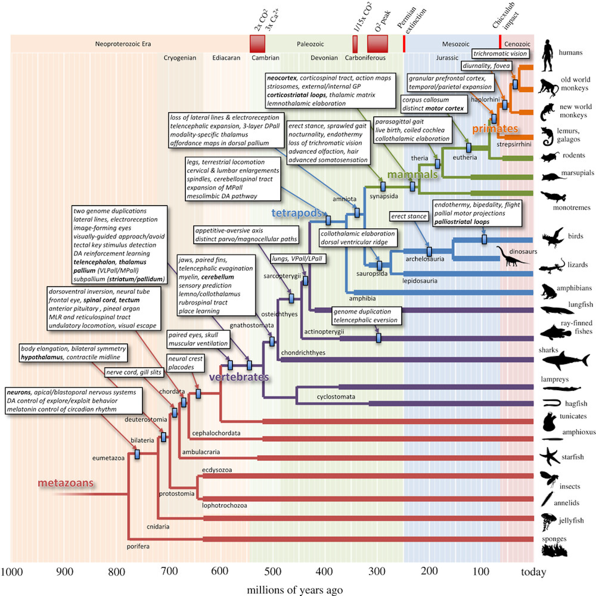

+++
Categories = ["Neuroscience"]
bibfile = "ccnlab.json"
+++

The process of **evolution** is effectively a massively parallel [[search]] algorithm over the developmental process encoded in DNA, to optimize its ability to replicate itself. In the context of limited resources, this results in competition, and the long bloody battle of life on earth is the natural consequence. The result of millions of years of this process is reflected in the way that the mammalian brain is organized to optimize the survival and replication of the species. Relative to other beasts, mammals have larger brains with more elaborated features, and especially the [[neocortex]], which supports pervasive [[bidirectional connectivity]] that enables cognitive abilities that are not possible without this hardware.

The [[Rubicon]] framework is an attempt to [[computational-cognitive-neuroscience#reverse engineer the brain]] to discover the lessons that evolution has discovered for organizing multiple brain areas to drive efficient goal-driven behavior that can organize actions over time in a way that optimizes the overall balance of positive outcomes relative to costs such as effort and risk. The hypothesis is that the parallel search process of evolution cannot be readily replicated through generic error-driven learning mechanisms operating within the "lifespan" of individual models, and must therefore be understood and implemented by appropriate neural systems. 

{id="figure_evol" style="height:60em"}

[[#figure_evol]] shows an amazing figure from [[@^Cisek21]] that documents some of the key changes in brain structure associated with the evolutionary trajectory leading to mammals, primates, and ultimately humans. This provides a big-picture sense of the way in which various features have been added over time. There are two main "strategies" that can be seen in the evolutionary trajectory:

* Elaboration and enlargement of existing structures, making them bigger and more capable by tweaking the effective algorithms at work.

* Adding new structures on top of existing ones, with entirely new neural architectures, such as the neocortex. In this case, the existing systems are typically under modulatory control by the new systems, consistent with the [[subsumption]] architecture ([[@Brooks86]]).

{id="figure_tube" style="height:45em"}
![The tube-based template for the brain (Bauplan), in an amphioxus brain (a) versus a gnathostome (jawed fish), illustrating the processes of elaboration and addition. The dorsal portion of the tube is sensory and the ventral is motor, and the job of the brain is the connect these two. VLPall = ventrolateral pallium (proto neocortex), MPall = medial pallium (proto hippocampus), LTh = lemnothalamus, CTh = collothalamus, Str = striatum, Pd = pallidum (proto globus pallidus, GP), SNr = substantia nigra pars reticulata, MLR = mesencephalic locomotor region, MB = mammillary body, LHA = lateral hypothalamus, PT = pretectum, CBm = cerebellum. From Cisek (2021).](media/fig_evolution_brain_template_cisek_21.png)

[[#figure_tube]] shows examples of both of these processes, in the changes from an _amphioxus_ brain (just above starfish in [[#figure_evol]]) to an early _gnathostome_ jawed fish (of which a shark is a modern-day example). The existing tube-like _bauplan_ that provides a template for the development and structure of all brains ([[@NieuwenhuysPuelles15]]) is preserved and elaborated over the evolutionary trajectory.

Because evolution operates primarily on a developmental program orchestrated by DNA, the developmental trajectory reflects the evolutionary trajectory (i.e., _ontogeny recapitulates phylogeny_), which shapes where all the different brain parts end up, even in mammals (see [[anatomy]]). Thus, the _dorsal_ pathway is primarily sensory, while the _ventral_ is primarily motor. The _medial_ areas develop first as everything radiates out from a central core, and thus tend to have the more evolutionarily ancient systems. Thus, survival-relevant [[emotion]]al and motivational systems driving behavior are generally ventral and medial, while later-developing systems such as the dorsolateral [[prefrtontal cortex]] are sensory and cognitive.

The brain is effectively the linking of the sensory and motor pathways at the anterior end of the tube, with the highest-level brain areas present in the _amphioxus_ equivalent to the [[hypothalamus]], providing basic sensing of nutrient intake driving the basic motor actions of the _five Fs_ ([[@Pribram60]]): feeding (exploit), foraging (explore), fleeing (escape), fighting, and fornication.

In the jawed fish, many additional structures are present, building on top of the hypothalamus (_LHA_) and including the _mammillary body (MB)_ that is critical for [[space|spatial]] processing of body movement. The MB interconnects with the _medial pallium (MPall)_, which is the start of what becomes the [[hippocampus]]. The [[cerebellum]] makes its first appearance here, notably in the dorsal sensory part of the tube, processing _lateral line_ sensory inputs that are the fish-equivalent of proprioception and [[vestibular]] senses, to learn to predict and cancel the effects of the animal's self motion, so that unexplained perturbations are evident, to drive appropriately responsive [[motor]] actions.

The core elements of the [[basal ganglia]] (_Str_ = striatum, _Pd_ = pallidum, _SNr_ = substantia nigra pars reticulata) are present, with the template of _approach_ vs. _escape_ circuits inherited from _amphioxus_ corresponding to the _Go_ vs. _No_ pathways in the BG. The _pallium_ (not to be confused with pallidum) is the start of what later becomes the [[neocortex]] in the telencephelon, with the _ventrolateral pallium (VLPall)_ positioned to provide the outer-loop goal-driven modulation of the BG action system, with direct input from olfactory bulb (OB) chemosenses, and visual input from the optic _tectum_ (progenitor of the [[superior colliculus]] in mammals). See [[@^GrillnerRobertson16]] for a more thorough discussion of the evolutionary history of the BG.

Remarkably, even this evolutionarily ancient brain template in the early jawed fishes from 500 million years ago has much of the same functionality and organization that is present in the mammalian brain, and understanding these simpler brain systems helps us to understand the functionality and organization of the more complex brain systems.

In terms of the evolutionary processes of elaboration vs addition, having this solid functional foundation established allows for a considerable amount of elaboration of the proto-elements into the mammalian versions like the hippocampus, basal ganglia, cerebellum, etc. While the neocortex has roots in the pallium, it represents much more of an addition of new functionality.

One further implication of the evolutionary process is that once the core survival-relevant functionality is handled by the existing neural architecture, new developments have more "freedom" to optimize specific capacities. This is consistent with the distinction between the neocortex vs subcortical systems, which typically remain strongly genetically constrained for specific behaviors, while the neocortex is free to optimize flexible learning abilities.

Thus, many subcortical areas have complex, seemingly arbitrary combinations of functions all intertwined within the same circuits, for example the fastigial nucleus and vermis of the cerebellum, the ventral-medial striatum (nucleus accumbens shell in particular), the central nucleus of the amygdala, and the entire hypothalamus. By contrast, the neocortex has broad areas with relatively coherent learned representations. Basically, it is the difference between the old town and the suburbs.

