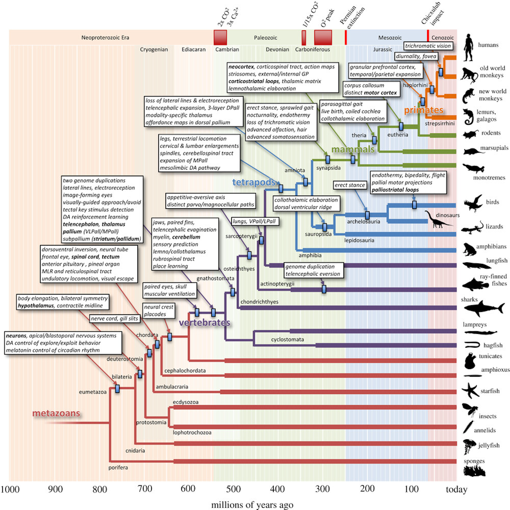

+++
Categories = ["Neuroscience"]
bibfile = "ccnlab.json"
+++

The process of **evolution** is effectively a massively parallel [[search]] algorithm (i.e., a [[genetic algorithm]]) over the developmental process encoded in DNA, to optimize its ability to replicate itself. In the context of limited resources, this results in competition, and the long bloody battle of life on earth is the natural consequence.

The result of millions of years of this process is reflected in the way that the mammalian brain is organized to optimize the survival and replication of the species. Relative to other beasts, mammals have larger brains with more elaborated features, and especially the [[neocortex]], which supports pervasive [[bidirectional connectivity]] that enables cognitive abilities that are not possible without this hardware.

The [[Rubicon]] framework is an attempt to [[computational-cognitive-neuroscience#reverse engineer the brain]] to discover the lessons that evolution has discovered for organizing multiple brain areas to drive efficient goal-driven behavior that can organize actions over time in a way that optimizes the overall balance of positive outcomes relative to costs such as effort and risk. The hypothesis is that the parallel search process of evolution cannot be readily replicated through generic error-driven learning mechanisms operating within the "lifespan" of individual models, and must therefore be understood and implemented by appropriate neural systems. 

{id="figure_evol" style="height:60em"}

[[#figure_evol]] shows an amazing figure from [[@^Cisek21]] that documents some of the key changes in brain structure associated with the evolutionary trajectory leading to mammals, primates, and ultimately humans. This provides a big-picture sense of the way in which various features have been added over time. There are two main "strategies" that can be seen in the evolutionary trajectory:

* Elaboration and enlargement of existing structures, making them bigger and more capable by tweaking the effective algorithms at work.

* Adding new structures on top of existing ones, with entirely new neural architectures, such as the neocortex. In this case, the existing systems are typically under modulatory control by the new systems, consistent with the [[subsumption]] architecture ([[@Brooks86]]).

{id="figure_tube" style="height:45em"}
![The tube-based template for the brain (Bauplan), in an amphioxus brain (a) versus a gnathostome (jawed fish), illustrating the processes of elaboration and addition. The dorsal portion of the tube is sensory and the ventral is motor, and the job of the brain is the connect these two. VLPall = ventrolateral pallium (proto neocortex), MPall = medial pallium (proto hippocampus), LTh = lemnothalamus, CTh = collothalamus, Str = striatum, Pd = pallidum (proto globus pallidus, GP), SNr = substantia nigra pars reticulata, MLR = mesencephalic locomotor region, MB = mammillary body, LHA = lateral hypothalamus, PT = pretectum, CBm = cerebellum. From Cisek (2021).](media/fig_evolution_brain_template_cisek_21.png)

[[#figure_tube]] shows examples of both of these processes, in the changes from an _amphioxus_ brain (just above starfish in [[#figure_evol]]) to an early _gnathostome_ jawed fish (of which a shark is a modern-day example). The existing tube-like _bauplan_ that provides a template for the development and structure of all brains ([[@NieuwenhuysPuelles15]]) is preserved and elaborated over the evolutionary trajectory.

Because evolution operates primarily on a developmental program orchestrated by DNA, the developmental trajectory reflects the evolutionary trajectory (i.e., _ontogeny recapitulates phylogeny_; [[@Gould77]]), which shapes where all the different brain parts end up, even in mammals (see [[anatomy]]). Thus, the _dorsal_ pathway is primarily sensory, while the _ventral_ is primarily motor. The _medial_ areas develop first as everything radiates out from a central core, and thus tend to have the more evolutionarily ancient systems. Thus, survival-relevant [[emotion]]al and motivational systems driving behavior are generally ventral and medial, while later-developing systems such as the dorsolateral [[prefrtontal cortex]] are sensory and cognitive.

The brain is effectively the linking of the sensory and motor pathways at the anterior end of the tube, with the highest-level brain areas present in the _amphioxus_ equivalent to the [[hypothalamus]], providing basic sensing of nutrient intake driving the basic motor actions of the _five Fs_ ([[@Pribram60]]): feeding (exploit), foraging (explore), fleeing (escape), fighting, and fornication.

In the jawed fish, many additional structures are present, building on top of the hypothalamus (_LHA_) and including the _mammillary body (MB)_ that is critical for [[space|spatial]] processing of body movement. The MB interconnects with the _medial pallium (MPall)_, which is the start of what becomes the [[hippocampus]]. The [[cerebellum]] makes its first appearance here, notably in the dorsal sensory part of the tube, processing _lateral line_ sensory inputs that are the fish-equivalent of proprioception and [[vestibular]] senses, to learn to predict and cancel the effects of the animal's self motion, so that unexplained perturbations are evident, to drive appropriately responsive [[motor]] actions.

The core elements of the [[basal ganglia]] (_Str_ = striatum, _Pd_ = pallidum, _SNr_ = substantia nigra pars reticulata) are present, with the template of _approach_ vs. _escape_ circuits inherited from _amphioxus_ corresponding to the _Go_ vs. _No_ pathways in the BG. The _pallium_ (not to be confused with pallidum) is the start of what later becomes the [[neocortex]] in the _telencephelon_, with the _ventrolateral pallium (VLPall)_ positioned to provide the outer-loop goal-driven modulation of the BG action system, with direct input from olfactory bulb (OB) chemosenses, and visual input from the optic _tectum_ (progenitor of the [[superior colliculus]] in mammals). See [[@^GrillnerRobertson16]] for a more thorough discussion of the evolutionary history of the BG.

Remarkably, even this evolutionarily ancient brain template in the early jawed fishes from 500 million years ago has much of the same functionality and organization that is present in the mammalian brain, and understanding these simpler brain systems helps us to understand the functionality and organization of the more complex brain systems.

In terms of the evolutionary processes of elaboration vs addition, having this solid functional foundation established allows for a considerable amount of elaboration of the proto-elements into the mammalian versions like the hippocampus, basal ganglia, cerebellum, etc. While the neocortex has roots in the pallium, it represents much more of an addition of new functionality.

One further implication of the evolutionary process is that once the core survival-relevant functionality is handled by the existing neural architecture, new developments have more "freedom" to optimize specific capacities. This is consistent with the distinction between the neocortex vs subcortical systems, which typically remain strongly genetically constrained for specific behaviors, while the neocortex is free to optimize flexible learning abilities.

Thus, many subcortical areas have complex, seemingly arbitrary combinations of functions all intertwined within the same circuits, for example the fastigial nucleus and vermis of the cerebellum, the ventral-medial striatum (nucleus accumbens shell in particular), the central nucleus of the amygdala, and the entire hypothalamus. By contrast, the neocortex has broad areas with relatively coherent learned representations. Basically, it is the difference between the old town and the suburbs.

## Mechanisms

Evolution is an absurd theory on the face of it: How is it even remotely possible that a beast such as a fish could give birth to something that was not a fish? And even if it did, how could that "freak" ever mate with anything else to propagate its non-fishiness? Two freaky non-fish emerging at the same time, in close enough proximity to propagate this new species? It just doesn't add up. Undoubtedly, the sheer implausibility of the ideas at this basic level contributes to the continued reluctance that people have toward this theory.

{id="figure_cells" style="height:10em"}

{id="figure_lego" style="height:20em"}
![Biology is remarkably like LEGO: the same small set of basic building blocks can be recombined to produce many different animals. This continuity across all animals makes it clearer how evolution can work: you just need to tweak the instructions a bit and you can end up with entirely different animals, as in this 3-in-1 kit that uses the same parts, with different instructions, to make very different animals. In biology, genes are the instruction set, and these instructions are constantly subject to random changes, producing novel "experiments of nature". ](media/fig_lego_animals.png)

The first step toward understanding how evolution can happen is by appreciating that animals are the result of assembling a large number of microscopic building blocks (cells), and at the cellular level, there is really not much difference between a fish and the human ([[#figure_cells]]). Thus, just as you can construct many different macroscopically different things from the same set of LEGO bricks ([[#figure_lego]]), biology can relatively easily construct very different looking kinds of beasts just by tweaking the developmental process. This developmental process is analogous to the process of following the instructions in the LEGO booklet telling you how to assemble the bricks, where the booklet is analogous to the DNA.

The second key step is appreciating that the developmental process is really the primary thing that evolution fiddles with, and by so doing, it can dramatically change the macroscopic appearance with even very small genetic changes. Continuing the LEGO analogy, the instruction booklets often have steps that you repeat N times: if you change the value of N, which is just one number in the long list of instructions, you can easily change the size of the resulting component. Likewise, evolution can relatively easily change how many repeats of a given developmental step are done, to dramatically change the sizes of resulting brain areas or body parts. For example [Joseph Merrick](https://en.wikipedia.org/wiki/Joseph_Merrick) (known as the _Elephant Man_, wikipedia link) had extensive growths that emerged relatively late in the developmental process.

The developmental process is very robust and can flexibly adapt to the instructions, which helps explain why genetic changes from only one parent can still shape the developmental outcome. You don't need coordinated changes in both parents. If these changes are beneficial for survival, they get passed down the generations.

The final major challenge is to understand how dramatic, _qualitative_ change can occur. For example, how did fish ever manage to move to the land, going from using gills to lungs? First, this likely happened in environments like tidal pools where there was a decent chance of getting grounded at high tide. Second, lungs likely developed initially via mechanisms for controlling buoyancy, using trapped air. A fish that could use this trapped air to breathe would have obtained more energy than one that could not. This would have obvious survival benefits in the tidal environment.

A similar kind of process took place for bird feathers, initially developed for temperature regulation, then becoming useful for flight. Stephen J. Gould referred to this process as an _exaptation_ ([[@GouldLewontin79]]), while Darwin referred to it as _preadaptation_ (which sounded a bit too "prescient" for Gould). The key point is that there is a lot of noise in the genetic search process, and things that were a bit useful for one thing could then become very useful for something else.

The remarkable fact is that there really is a _great chain of being_ tracing from you all the way back through billions of years, with each generation fighting for survival and innovating in mostly very small ways, with occasional dramatic breakthroughs. And if you look again at [[#figure_cells]], you can see that, at this level, not that much has really changed in all those years!

## Evolution of neocortex

The _bauplan_ shown in [[#figure_tube]] provides a big-picture understanding of how the many different components of the entire vertebrate brain fit together. How does the [[neocortex]], which is so essential to the powerful cognitive abilities in mammals, fit into this bigger picture, from an evolutionary perspective?

First, there is broad agreement that the unique contribution of the neocortex is the ability to _learn_ novel higher-order sensory-motor representations that provide a "smarter", more abstract, and systematic basis for driving behavior (e.g., [[categorization]]). This significantly extends the adaptability of the organism beyond the genetically-coded feature detectors in the tectum ([[superior colliculus]]).

{id="figure_pallium" style="height:25em"}
![Progressive differentiation of the pallium between _amniotes_ in (b) (i.e., mammals, birds, reptiles) vs the other non-amniotic vertebrates (fishes, amphibians) in (a). There is an initial, basic distinction between representations of more proximal stimuli (approach vs avoid) in the VLPall (ventral-lateral pallium) versus more distal navigationally-relevant stimuli in the MPall (medial pallium). CTh = collothalamus, which is driven by the colliculus, while LTh = lemnothalamus that receives direct retinal input. The VLPall is further differentiated in amniotes into ventral, lateral, and dorsal pallium, with the dorsal (DPall), which receives direct lemnothalamic input, later turning into the neocortex. From [[@Cisek21]].](media/fig_evolution_pallium_cisek_21.png)

[[@^Cisek21]] situates the evolution of the neocortex within a broad literature on the evolutionary differentiation of the _pallium_, from which the neocortex emerges ([[#figure_pallium]]). For example, he argues that there is an evolutionarily ancient distinction between representations of the more proximal world that governs approach and avoid behavior (in the ventral-lateral pallium, _VLPall_), versus representations of the more distal world that is important for navigation, in the medial pallium (_MPall_). He further argues that this broad distinction becomes more complex and differentiated on the way to mammals, birds and reptiles (i.e., _amniotes_, with an amniotic sac) as they adapted to life on land, versus the aquatic species from which this branch evolved.

In particular, as vertebrates moved on land, vision became more capable of driving long-range navigational processing, which supported elaboration of the medial pallium into the structures of the hippocampus and related areas. The ventral-lateral pallium areas also became differentiated, and he argues that neocortex in particular grew out of a dorsal region of the pallium that was important for learning more complex sensory-motor affordances.

This general story can be anchored in developmental and anatomical data that provides some important clues to the evolutionary history. Specifically, there is a ring of more evolutionarily and developmentally ancient _mesocortex_ that surrounds the more recent _neocortex_, and the nature and organization of these mesocortical areas provides a compelling account of the evolutionary trajectory of the mammalian neocortex ([[@PuellesAlonsoGarcia-CaleroEtAl19]]; [[@Cisek21]]; [[@NordPattabiramanViselEtAl15]]; [[@BarbasZikopoulos25]]). This mesocortical ring corresponds in many ways to the classical [[limbic system]] construct, and the "limbic" terminology persists in multiple places.

{id="figure_ring1" style="height:35em"}
![Components of the mesocortical ring of more evolutionarily ancient cortical systems, that anchor the learning of more abstract representations within the _island_ of the neocortex that developes within this ring. The anterior "limbic" areas at the top provide the core goal-driven functionality to approach desired outcomes and avoid negative ones (OC = OFC = orbital frontal cortex; CG = ACC = anterior cingulate cortex; IL = infralimbic; DP = PL = prelimbic; AIV, AID, AIP = anterior insula ventral, dorsal, posterior). On the posterior side, the archicortex comprises the hippocampus (HP) which interconnects with the entorhinal cortex (ECL, ECM for lateral and medial), which in turn interconnect with the retrosplenial cortex (RS) via the posterior portion of the cingulate cortex, which has the core spatial representations used in navigation. The olfactory piriform cortex (PPO, APO) represents an outer ring that connects into the hippocampal system, but also with the insula and associated consumatory representations. From Puelles et al., 2019.](media/fig_evolution_neocortex_ring_puelles_etal_19_fig3.png)

[[#figure_ring1]] shows a simple version of the mesocortical ring structure, based on earlier proposals ([[@Swanson87]]; [[@BayerAltman91]]). Consistent with the core distinction from [[@Cisek21]], we can identify two major functional components, by dividing the ring into _anterior_ vs _posterior_ systems. We interpret the anterior system in terms of the [[Rubicon]] goal-driven framework as supporting all of the higher-level representations needed to organize approach vs. avoid behavior to obtain desired outcomes and avoid negative threats.

Specifically, the orbital frontal cortex (OFC, OC in the figure) represents the value of specific possible outcomes, which are represented more specifically in the lateral limbic cortex areas in the [[insula]] (AIV, AID) and gustatory cortex (GU). The anterior cingulate cortex (ACC, CG in the figure), infralimbic (IL), and prelimbic (PL, DP in the figure) cortex represent the costs of actions, value at a more abstract level, and the overall integrated benefit -- cost utility, respectively. 

The encoding of survival-relevant outcomes in these cortical areas is established via extensive bidirectional connections with relevant subcortical areas, for example between the OFC and the [[amygdala]], such that the OFC can maintain an anticipation of the value-laden outcomes represented in the amygdala. Thus, consistent with other mesocortical areas around the ring, the OFC provides the gateway between the rest of the neocortex and the relevant subcortical systems.

These anterior mesocortical areas constitute the entire [[prefrontal cortex]] (PFC) in the rodent brain (see [[prefrontal cortex#figure_pfc-comp]] on that page), and it is likely that the thalamocortical circuitry in these areas provided the unique ability to sustain active goal-driven plans for longer than in the non-mammalian brains lacking these critical PFC areas.

Furthermore, the ventral pallidum (VP), which is an output nucleus of the [[basal ganglia]] (not to be confused with the ventral _pallium_), provides the key goal-engagement _gating_ dynamics for these PFC areas, according to the [[Rubicon]] model. The evolutionary and developmental trajectories demonstrate a strong interconnection between the basal ganglia and neocortex, with the neocortex providing the increasingly elaborated _state space_ input to the [[reinforcement learning]] mechanisms in the basal ganglia.

Also, this PFC-based thalamocortical circuitry, involving the mediodorsal (MD) nucleus of the [[thalamus]], supports the core mechanisms of [[predictive learning]] that are also supported by the later-developing pulvinar nucleus of the thalamus, which interconnects with higher-order neocortical areas.

Thus, the evolutionary trajectory suggests that this core working memory and predictive learning functionality, supporting more flexible survival-driven approach vs. avoid behavior, was the initial force driving the evolution of the neocortex. Furthermore, consistent with the premise of the [[Rubicon]] framework, this functionality continues to drive adaptive learning throughout the neocortex even as it expanded greatly in size and complexity. In this way, nature discovered the third pillar of adaptive learning in the mammalian brain, going beyond the [[cerebellum]] and [[basal ganglia]], into a more open-ended, actively maintained, [[bidirectional connectivity|bidirectionally connected]] system.

Meanwhile, the posterior half of this mesocortical ring comprises the hippocampus and associated networks, including entorhinal cortex and retrosplenial cortex, which are essential for spatial navigation (see [[space]] and [[hippocampus]]). The anchoring of this part of the ring comes in part from extensive interconnections with the _mammillothalamic system_, which results in the compass-like _head direction_ cells that play an essential role in long-distance spatial navigation. Furthermore, this system drives a strong theta-frequency oscillation (10 hz, 200 ms period) that synchronizes activity within this spatial and episodic memory network.

This posterior mesocortical network includes the posterior cingulate cortex and the single most important spatial representation area in the cortical system, the _retrosplenial cortex_ (RS). These comprise the _medial parietal_ network in the mammalian neocortex, and by analogy with the anterior mesocortical ring, it is likely that this network of spatial navigation areas anchors the learning of the dorsal (parietal) posterior neocortex, which is known to be involved in all manner of spatio-motor processing.

In the typically nocturnal rodent, the most important senses are olfaction and somatosensation, and these inputs along with the spatial and goal-driven mesocortical ring systems account for most of what happens in the rodent neocortex.

In the primate and other diurnal mammals, vision dominates, with the occipital lobe evolving to support the massive computational demands required to process increasingly complex visual pattern and object recognition. Thus, whereas one might think of primary visual cortex (V1) as a "foundational" area of neocortex, it is in fact much more recent in evolutionary history. The temporal lobe then becomes much more elaborated in primates as a system that interconnects visual object recognition with social communication systems, ultimately supporting the extensive language capacity that developed in humans.

Thus, a consideration of the evolutionary trajectory provides an important way of understanding the essential computational functions of neocortex relative to the other brain areas, and the forces that shape learning in this area.

### Anatomical details

{id="figure_structure" style="height:35em"}
![The _structural_ organization of prefrontal cortex areas, with more medial and ventral areas having a simpler agranular structure (i.e., evolutionarily older mesocortex), while more dorsal and lateral areas have a more differentiated and complex eulaminate structure. From [[@^BarbasZikopoulos25]].](media/fig_evolution_neocortex_structural_barbas25.png)

[[@^BarbasZikopoulos25]] provide a comprehensive review of the _structural_ organization of [[prefrontal cortex]] areas, in terms of the progression from _agranular_ (lacking a distinct layer 4) areas in the mesocortical ring to the more differentiated _eulaminate_ areas of neocortex that have all 6 lamina ([[#figure_structure]]). They also highlight differences in cortical interconnectivity that can be understood in terms of the structural properties of sending and receiving areas.

{id="figure_ring2" style="height:35em"}
![The more elaborated version of the mesocortical ring structure, with the hippocampal and associated subfields expanding on the left portion of the figure (DG = dentate gyrus; CA3, CA1 = cornu ammonis regions; Sub = subiculum; EA = entorhinal cortex, PrS, PaS = pre / para subicluar areas), while the original mesocortical ring surrounds the developing neocortex on the right hand side. The olfactory bulb (OB) and associated piriform cortex (Pir) form a distinct third component of the cortical system. From Puelles et al., 2019.](media/fig_evolution_neocortex_ring_puelles_etal_19_fig10.png)

{id="figure_embryo" style="height:45em"}
![The mesocortical ring structure in a human embryo at gestational week 9. From [[@^AltmanBayer15]].](media/fig_evolution_neocortex_devgw9_ring_altmanbayer15.png)

[[#figure_ring2]] shows a more elaborated dual-ring structure (from [[@PuellesAlonsoGarcia-CaleroEtAl19]]) with the hippocampal and associated subfields differentiating from the medial mesocortical ring structures, which then contain the different sensory-coding areas of the neocortex proper, where the full 6-layer structure emerges. [[#figure_embryo]] shows the structure of the mesocortical ring in a human embryo at gestational week 9, demonstrating the principle that _ontogeny recapitulates phylogeny_ (the developmental trajectory recapitulates the evolutionary one).

