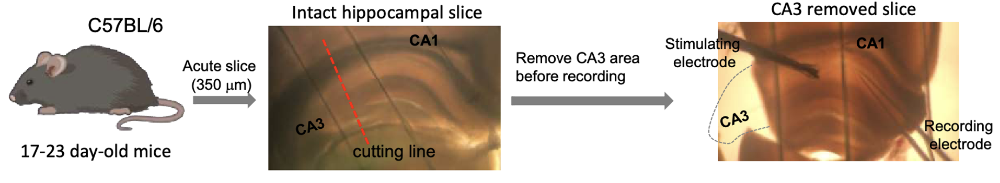

+++
Name = "Jang et al. (2026)"
Title = "Synaptic Plasticity as a Function of the Temporal Derivative"
Authors = "Jinyoung Jang1, Juan Flores1, Randall C. O'Reilly1,2, and Karen Zito1"
Affiliations = "1Center for Neuroscience, University of California Davis, Davis, CA; 2Astera Institute"
Abstract = "A major outstanding question in neuroscience is whether the neocortex somehow uses the same powerful learning algorithm that powers current AI models, which rely on error backpropagation. One hypothesized way this can be accomplished is as a function of the temporal derivative (i.e., differences in neural activity states over time), which can closely approximate the backpropagated error gradient. We tested this hypothesis that the direction of synaptic plasticity is a function of the temporal derivative in synaptic activity over the course of a 200 ms (5 Hz) theta cycle. Using a standard CA1 mouse slice preparation under patch clamp, we drove both pre- and postsynaptic activity across the two 100 ms halves of a 200 ms window at either 25 Hz or 50 Hz, testing all four 2x2 combinations of these firing rates, while measuring the resulting effects on synaptic efficacy (as measured by EPSP amplitude to standard test probes). Consistent with the computational hypothesis, a positive temporal derivative (25 to 50 Hz) resulted in LTP (increased synaptic strength), while a negative temporal derivative (50 to 25 Hz) resulted in LTD. Critically, both no-change conditions (25 to 25 and 50 to 50 Hz) resulted in no net synaptic change, even though the 50 Hz case had the highest overall synaptic activity levels. Possible biochemical mechanisms that could support these results are discussed."
Categories = ["Learning", "Papers"]
bibfile = "ccnlab.json"
+++

## Introduction

Understanding how the neocortex learns is perhaps the single most important step in understanding human intelligence, because our cognitive functions emerge over years of experience-driven learning within this brain structure, which is unique to mammals and is most greatly expanded in primates, especially humans. Current artificial intelligence (AI) systems are based on the powerful error-backpropagation learning algorithm, which has long been recognized as the single most capable learning mechanism in artificial neural networks ([[@RumelhartHintonWilliams86]]; [[@WidrowHoff60]]; [[@Werbos74]]). Thus, this algorithm provides the best computational-level hypothesis for how the neocortex should learn.

There have been a variety of proposals for how error backpropagation could be implemented in the brain ([[@LillicrapSantoroMarrisEtAl20]]). Here, we test the predictions of one of the earliest such proposals, which is based on the idea that the backpropagated error gradient can be approximated by the _temporal derivative_ in neural activity states over time ([[@OReilly96]]). Specifically, in a network with bidirectional connectivity, which enables activation to flow in both bottom-up and top-down directions, changes in neural activity across any subset of neurons within the network will reverberate throughout the rest of the network. If these changes represent the difference between a prediction versus the correct outcome, and they can drive local synaptic plasticity according to the temporal derivative, then the resulting learning approximates error backpropagation.

{id="figure_bidir-err" style="height:25em"}
![How bidirectional activation propagation can communicate error signals within a network, in the case of a predictive learning network generating an initial minus phase prediction, followed by the plus phase with an Actual outcome driving the top-most Prediction layer. There is just one network with three bidirectionally-connected units, as shown at the left; the networks further to the right are snapshots of the activity state of this network at different points in time, which evolves from left to right. The thick colored lines also show the activation level of each of the three neurons over time, both in terms of the line height and the brightness and warmth of the color gradient. Initially, each neuron is inactive (blue). Then, sensory input excites the Input neuron, and a wave of bottom-up excitation propagates upward through the Hidden and Prediction layers. Critically, the Prediction and Hidden neurons mutually excite each other via bidirectional connections, which contributes to each of their activity levels. At the start of the plus phase, the Actual outcome arrives, which contradicts the prediction of "high activity", and directly inhibits the Prediction neuron, which comes to reflect the actual outcome in the plus phase. This decreased excitation from the Prediction neuron thus causes the Hidden neuron to also become less active, which is the key mechanism by which the top-down connections communicate the prediction error. All neurons learn based on the temporal difference between the plus phase state and the end of the minus phase state (where the activity snapshot is), as shown by the error brackets marking the height difference in the activity line plots.](media/fig_generec_bidir_err.png)

[[#figure_bidir-err]] illustrates this in the context of a simple three-layer network, with two distinct _phases_ of neural activity, starting with an initial _prediction_ or _minus_ phase that reflects the impact of a given _input_ pattern presented over the Input layer of simulated neuron-like processing units. Subsequently, the _outcome_ or _plus_ phase of activity arises when the _actual_ outcome (i.e., correct or target) activity pattern is driven onto the Prediction layer. Remarkably, the simple subtraction of these activity states (_plus -- minus_ or _outcome -- prediction_, i.e., the _temporal derivative_ or _temporal difference_) at any neuron anywhere in such a network provides a good approximation to the error gradient that would otherwise be computed by error backpropagation ([[@OReilly96]]).

Thus, the direct biological prediction from this type of error-driven learning is that the direction of synaptic plasticity should be a function of the change in activity (i.e., temporal derivative) across a time window that would encompass this transition between the prediction and outcome phases. Note that despite both being based on changes over time, this neocortical learning mechanism is entirely distinct from the _TD_ (_temporal difference_) reinforcement learning algorithm that describes the behavior of dopamine neurons in the midbrain ([[@SuttonBarto98]]; [[@MontagueDayanSejnowski96]]). In TD, dopamine neurons represent the temporal difference _explicitly_ in their firing rates. By contrast, in neocortical temporal derivative learning the error gradient remains _implicit_ in the changes in neural firing over time, and yet this temporal derivative drives synaptic plasticity locally everywhere. This implicit representation of the error gradient has critical advantages in simplifying neural computation as elaborated in the discussion.

{id="figure_pulv-conns" style="height:15em"}
![Connectivity between the neocortex and the pulvinar nucleus of the thalamus, in the case of primary and secondary visual areas, that is uniquely well suited for driving predictive error-driven learning. The numerous and relatively weaker projections from layer 6 (VI) neurons are well-suited for activating a prediction over the pulvinar, that integrates the signals from multiple cortical areas and neurons to synthesize the prediction, which improves over the course of learning throughout the neocortex and in these final projections into the pulvinar. By contrast, the strong, focal driver inputs from layer 5 (V) intrinsic bursting (5IB) neurons can activate an outcome representation that is essentially an unlearned copy of the activity pattern in lower cortical layers (e.g., V1 trains V2 predictions in this case). The periodic bursting of the 5IB neurons ensures that this outcome activity is only phasically present (i.e., the plus phase), with a complete prediction -- outcome learning cycle occuring within roughly 200 ms (i.e., theta frequency, 5 Hz). Diagram based on [[@^ShermanGuillery06]].](media/fig_pulvinar_connectivity.png)

A further elaboration of this learning algorithm provides a specific hypothesis regarding the duration of this time window, and a biologically-explicit hypothesis regarding the source of the prediction and outcome signals driving this form of learning ([[@OReillyRussinZolfagharEtAl21]]). Specifically, unique features of the thalamocortical circuitry between the neocortex and the pulvinar nucleus of the thalamus should drive an alternating sequence of prediction-then-outcome states ([[#figure_pulv-conns]]), over the course of a 200 ms (5 Hz) theta cycle. This hypothesis is consistent with considerable evidence at multiple levels, as reviewed in [[@^OReillyRussinZolfagharEtAl21]] (e.g., [[@FiebelkornKastner21]]; [[@ShermanGuillery06]]; [[@ShermanUsrey24a]]). Furthermore, this same theta-cycle temporal derivative learning mechanism also applies to learning in area CA1 of the hippocampus ([[@KetzMorkondaOReilly13]]; [[@ZhengLiuNishiyamaEtAl22]]).

{id="figure_protocol" style="height:30em"}
![Stimulation protocol to simulate temporal dynamics over a 200 ms theta cycle, where the first 100 ms represents the prediction, and the second 100 ms represents the outcome. a) Presynaptic activity was driven by direct electrical stimulation of axonal fibers at 25 or 50 Hz, while postsynaptic activity was driven by current clamping at a level that produced the corresponding level of postsynaptic spike rate (25 or 50 Hz). b) Sample trace of postsynaptic membrane potential recorded under patch clamp, under the 50 Hz stable stimulation conditions. c) The theta-cycle dynamics were repeated 10x with 400 ms spacing, to drive a larger overall synaptic plasticity effect. d) The predictions from the temporal-derivative learning rule are that LTP (positive delta-weight or dWt) should occur for positive derivatives (outcome -- prediction > 0), and LTD (negative dWt) should occur for negative derivatives, while stable activity profiles should result in no net dWt. Note that the stable 50 Hz -- 50 Hz case has the highest sustained level of activity, and yet we predict no weight change, while the two opposite-sign cases have the same overall activity level, and yet we predict different directions of weight change. Thus, these predictions are at a significant variance from standard Hebbian-like mechanisms based on total accumulated activity. ](media/fig_ltp_jang_etal_protocol_stim.png)

To test whether synaptic plasticity in the brain might be sensitive to the temporal derivative over a period of roughly 200 ms, we used a standard experimental preparation in mouse-brain slices that includes area CA1 and its afferent axonal fibers that originate in area CA3, which has been removed. Individual CA1 neurons were recorded and stimulated under patch clamp, while the axonal afferents were also stimulated, providing precise experimental control over the level of activity over time at the synaptic inputs to these CA1 neurons. We manipulated the level of activity in the synaptic inputs and the clamped postsynaptic CA1 neuron in a coordinated manner, across the two 100 ms halves of the 200 ms theta cycle ([[#figure_protocol]]).

As shown in the figure, there is a 2x2 matrix of prediction (first half) vs. outcome (second half) activity levels, with all combinations of the 25 Hz and 50 Hz low and high activity levels. The temporal-derivative algorithm predicts that a positive temporal change (i.e., outcome -- prediction > 0) should result in LTP (long-term potentiation or a positive delta-weight (dWt) change), while a negative temporal change should result in LTD (negative dWt). Furthermore, any stable pattern of activity across the theta cycle should result in no net weight change (0 dWt). This is summarized in the following equation:

{id="eq_dwt" title="Temporal derivative learning rule"}
$$
dW = x^+ y^+ - x^- y^-
$$

where $x^+$ is the activity of the sending neuron in the outcome (plus) phase, while $y^-$ is the activity of the receiving neuron in the prediction (minus) phase, and so forth. This equation can be derived from multiple different starting assumptions ([[@AckleyHintonSejnowski85]]; [[@MovellanMcClelland93]]; [[@OReilly96]]), and has been labeled the _Contrastive Hebbian Learning_ (_CHL_) equation, because it is the difference or contrast between two Hebbian $xy$ factors.

The _contrastive_ or temporal derivative aspect of this learning rule is what separates it qualitatively from standard Hebbian learning mechanisms, which generally predict that the direction and magnitude of synaptic plasticity is a function of the overall synaptic activity level, $xy$. Historically, the properties of the NMDA receptor in being sensitive to both pre and postsynaptic activity were quickly recognized to be consistent with the earlier theoretical ideas from [[@^Hebb49]] ([[@DunwiddieLynch78]]; [[@Lisman89]]; [[@BearMalenka94]]), with the intracellular calcium levels in the postsynaptic terminal bouton reflecting this Hebbian synaptic activity coproduct. For example, note that the greatest level of overall synaptic activity is in the 50 Hz stable case, where the temporal derivative mechanism predicts 0 weight change, but a standard Hebbian model would predict the greatest level of positive LTP.

As shown in the results below, we found that the direction of synaptic plasticity under our stimulation protocol was entirely consistent with the predictions from the temporal derivative learning rule, and thus strongly inconsistent with a standard Hebbian learning mechanism. We discuss below how a relatively simple competitive binding dynamic between two chemical pathways that have opposite effects on the sign of synaptic changes can produce the temporal derivative learning property. The essential property is that the potentiation pathway have an overall faster response time constant relative to the depression pathway, which then naturally produces a temporal derivative. 

## Materials and Methods

### Preparation of hippocampal slices for patch-clamp recording.

{id="figure_slice" style="height:25em"}

For hippocampal slice recordings, we used postnatal day 16-18 C57BL/6 mice ([[#figure_slice]]). The mouse brains were removed rapidly after decapitation and then sliced into 320 $\mu m$ thicknesses in ice-cold, oxygenated, artificial cerebrospinal fluid (ACSF in mM: 127 NaCl, 2.5 KCl, 25 Glucose, 25 NaHCO3, 1.2 NaH2P04, 1 MgCl2, 2 CaCl2, pH 7.3) using a vibratome (VT 1000S, Leica Microsystems). The acute mice brain slices were incubated in ACSF for 25-30 min at 32°C and room temperature for 20-30 min during the recovery period.  

Detailed steps for making acute hippocampal slices:

1. On the day of the experiment, prepare 250-300 ml of ice-cold ACSF in a 500 ml Pyrex bottle and place in a freezer for about 20-30 min or until a thin layer of ice on the walls of the bottle and at the surface forms. Agitate vigorously to break the ice into a homogeneous icy solution. Oxygenating the ice-cold ACSF in ice with 95% O2/5% CO2 for at least 15 min before to start.

2. While the ice-cold ACSF is in the freezer, prepare 100-150 ml of ACSF in the slice recovery chamber. Warm up in the heated bath at 32°C while oxygenating with 95% O2/5% CO2 for at least 15 min before to start.

3. Prepare the vibratome by placing ice in the tray surrounding the slicing chamber. Place the ceramic blade (can’t find cat #, it will be in excel order sheet) in the blade holder of the vibratome.

4. Set up the dissection tools (large scissors, scalpel, fine scissors, fine forceps, a single-edge blade, large Petri dish (100 mm), a piece of Whatman paper, glue, agar block and the curved spatula) next of the vibratome.

5. Pour about half (150 ml) of the oxygenated ice-cold ACSF into the Petri dish.

6. Quickly decapitate the mouse using a large scissors. Expose the skull with a large incision through the skin down the midline and cut the auditory conducts on each side. Pull the skin toward the nose of the animal to fully expose the skull.

7. With fine scissors, open the back of the skull by making a cut immediately caudal to the cerebellum and then cut the skull open along the midline from the caudal end working your way up to the olfactory bulbs. Avoid putting pressure on the skull and make sure no damage is made to the brain underneath with the lower scissors tip.

8. Using fine forceps grab the open edge of the skull on one side of the midline, hold firmly and open to the side while steadily holding down the head with the other hand. Then proceed to the other side. Using a curved spatula, and being extremely gentle reach under the brain and gently scoop out the brain.

9. Place the extracted brain in the ice-cold ACSF in Petri dish. Spread just enough glue on the cutting plate.

10. With the single-edge razor blade, remove the unwanted parts of the brain with an angle of approximately 20 degrees. Using the curved spatula pick up the brain. Gently place the bottom of the spatula on a paper towel, to drain the excess of ACSF by capillarity. Place the spatula above the glue and gently transfer the brain on the glue. Place the agar block to support the brain from the slicing.

11. Immediately pour the ice-cold ACSF into the slicing chamber and keep oxygenate with 95% O2/5% CO2. To avoid direct exposure the ceramic blade to ice pieces, use the mesh to keep ice at the corner of the slicing chamber.

12. Lift the chamber toward to the blade, using the vibratome control panel, and adjust the chamber height to the surface of the brain. Start the slicing to obtain 320 μm hippocampal slice.

13. Once the first slice is freed, separate both hemispheres and transfer them into the recovery chamber in the heated bath. Repeat until all slices are collected.

14. Incubate the recovery chamber at 32°C for 25-30 min. Carefully move the recovery chamber from the heated bath to room temperature and wait 20-30 min before start recording. 4-5 hours after slice recovery, do not use the slices for the experiments.

### Electrophysiology

We used the patch clamp systems (Multiclamp 700B, Molecular Devices) to measure membrane potentials of hippocampal CA1 pyramidal neurons. Recording electrodes (3.5-4.5 M) were prepared from borosilicate glass capillaries with a 1.5 mm outer diameter (World Precision Instruments) using a Narishige puller (PC-10). EPSP was recorded in the current-clamp mode at a sampling rate of 10 kHz filtered at 1 kHz under the whole-cell patch-clamp configurations. For whole-cell patch-clamp recordings, the patch pipettes were filled with (in mM) 135 K-gluconate, 5 NaCl, 10 HEPES, 0.6 EGTA, 4 Na-ATP, 0.4 Na-GTP at pH 7.3 adjusted with KOH. For the electrical synaptic stimulation, we used bipolar platinum-iridium microelectrodes (FHC) with ISO-Flex stimulus isolator.

Detailed steps for whole-cell patch-clamp recording:

1. Prepare intracellular solution. Keep intracellular solution on ice throughout the experimental day.

2. Pull glass electrodes with tip resistance of 3.5–4.5 MΩ.

3. Turn on the amplifier (Multiclamp 700B, Molecular Devices), digitizer (Digidata xxxx, Molecular Devices), PC, ISO-Flex stimulus isolator, digital camera system, micromanipulators (MP-285, MPC-200, WPI) and microscope controllers.

4. Start flow of oxygenated ACSF.

5. Using a wide-mouth disposable pipette transfer a brain slice from the recovery chamber to the recording chamber after removing the area CA3 from half of hippocampal slice.

6. Place slice weight over slice, ensuring that anchor wires do not overlay the CA1 region of the hippocampus.

7. Under low magnification (5 or 10× objective) identify CA1 pyramidal neurons. Exchange objective lens to high magnification (40× objective) and identify healthy region of pyramidal cells.

8. Go back to low magnification lens to place a bipolar stimulate electrode. A stimulating electrode was positioned in the stratum radiatum of area CA1 to induce EPSP and apply stimulus protocol. When placing the stimulating electrode, the tip of electrode must be positioned further than 5 mm from the target CA1 pyramidal neuron.

9. After whole cell patch clamp is obtained, apply positive current injections (100-150 pA) to evoke action potentials. Depending on the stimulation protocol, adjust current size to evoke different frequency of action potentials (25hz or 50Hz).

10. In current clamp recording mode, apply electrical stimulation to evoke ~5mV EPSP. Start with lowest stimulation intensity and increase intensity without burning tissues or generate bubbles at the tip of stimulating electrode. Move the stimulating electrode closer to the target CA1 cell if initial attempts fail to evoke ~5mV EPSP, and then repeat testing stimulation intensity. Allow 15-30s waiting time between each probe stimulus.

11. Once the testing is complete, start recording baseline EPSPs (5-6 min). If step 9 and 10 takes longer than 5 min, do not perform the experiment with this cell. Find a different cell and repeat steps 9 and 10. If there are 3–4 failures, change the slice.

12. After baseline EPSPs recording, apply one of the inducing stimulation patterns using same electrical stimulating intensity with positive current injection to the recording cell.

13. Immediately start recording EPSPs after the EDL protocol is completed. While EPSPs are recorded (40-45 min), monitor EPSP amplitude and membrane hyperpolarization by negative current injection (-5-10 pA). If amplitude of membrane hyperpolarization is not stable stop the recording and change the slice. Do not use same slice if the induction protocol is applied.

### Electrophysiology data analysis

Amplitude of EPSPs (mV) were measured as the peak of membrane depolarization from baseline membrane potential, which is a mean of membrane potential (mV) from the first 10s from each trace. It is performed in Clampfit 10.7 (Molecular Devices). Membrane hyperpolarization was also measured as the amplitude of hyperpolarization from baseline membrane potential to monitor the seal and cell health.

### Statistics

Statistical analyses were performed with Excel (Microsoft office). All presented numeric values and graphic representations represent mean ± standard error of the mean, and statistical analyses used two-tailed t-test. P-values < 0.05 were regarded as significant. All statistics were calculated across cells. 

### Determining the stimulation protocol

{id="figure_explore" style="height:55em"}
![Exploration of stimulus parameters. a) and b) compare the spiking rates generated by a consistent current clamp across the 200 ms theta cycle, versus discrete short (3 ms) current pulses. The maximum spiking rate from a consistent current was about 55 Hz, with higher currents producing spike dropout as shown in the upper right plot of panel b. The discrete current pulses could produce up to 100 Hz firing, but these pulses are less representative of the slower current conductances that would typically be observed in the brain. c) shows the effects of a 200 ms vs 400 ms quiet gap between the 200 ms theta window of patterend activity, with 200 ms resulting in visible degradation of spike profile, while 400 ms and above showed no such degradation.](media/fig_ltp_jang_etal_protocol_explore.png)

To determine the final stimulation patterns used in the experiment, we first determined the maximum spike rate that could be produced by a consistent current injection, which was about 55 Hz ([[#figure_explore]]a and b). We also explored the possibility of driving discrete action potentials using individual short duration pulses (3 ms), which could generate firing rates up to around 100Hz. We decided to use the stable long-duration (200 ms) current injection, because that should be more naturalistic compared to so many discrete phasic pulses of current, and 55 Hz was sufficient to support a 25 Hz and 50 Hz low vs. high spiking rate in the postsynaptic neurons.

We then determined the gap between 200 ms theta windows that resulted in no obvious degradation across 10 repetitions. As shown in [[#figure_explore]]c, a gap of 200 ms resulted in degradation of spikes, while a gap of 400 ms did not, so we selected the 400 ms gap. We did not observe any strong qualitative changes in spiking profiles above 400 ms.

## Results

{id="figure_results" style="height:35em"}
![Results, which are consistent with the predictions of the temporal derivative learning mechanism. a) The progression of probe EPSP amplitudes surrounding the stimulation protocol at time 0, showing that the increasing temporal derivative (25 to 50 Hz for both the pre and postsynaptic neurons, in orange) resulted in LTP, while the decreasing temporal derivative (50 to 25 Hz, in blue) resulted in LTD. Both flat profiles (constant 25 Hz or 50 Hz) resulted in no net synaptic efficacy change. b) Summary data for the increase and decrease conditions at different time points, with statistically significant results highlighted with asterisks (** = P < .01, *** = P < .001). c) Summary data for the two flat conditions.](media/fig_ltp_jang_etal_results.png)

[[#figure_results]] shows the results from all four temporal derivative conditions shown in [[#figure_protocol]], plotting the EPSP amplitude surrounding the induction stimulation protocol occuring at time 0. The condition where both pre and postsynaptic neurons were driven for 100 ms at 25 Hz and then increased to 50 Hz for the remaining 100 ms resulted in LTP (normalized EPSP at 30-35 min = 1.42 ± 0.15, n=12, orange circles and bars in the figure). Conversely, the decreasing temporal derivative protocol (50 to 25Hz) resulted in LTD (normalized EPSP at 30-35 min = 0.73 ± 0.10, n=18, blue circles and bars in the figure). Finally, both of the flat protocols (constant 25 Hz or 50 Hz) resulted in no net change in EPSP amplitudes, and there were no differences between 25 Hz (normalized EPSP at 30-35 min = 1.12 ± 0.15, n=12, light gray circles and bars) and 50 Hz (normalized EPSP at 30-35 min = 1.09 ± 0.08, n=11, dark gray circles and bars).

This pattern of results is fully consistent with the predictions of the temporal derivative learning mechanism ([[#eq_dwt]]), and strongly _inconsistent_ with existing Hebbian-like learning rules, which would have predicted that the constant 50 Hz case should exhibit the most LTP, while constant 25 Hz should be the weakest or result in LTD. The idea that the same overall level of spiking, just distributed differently across the 200 ms theta window in the 25-to-50 and 50-to-25 cases, could produce opposite patterns of LTP and LTD (respectively) is entirely beyond the scope of standard Hebbian frameworks.

## Discussion

We tested the hypothesis that the direction of synaptic plasticity should be a function of the change in synaptic activity over time, the _temporal derivative_, which would be consistent with the ability to perform an approximation to the computationally-powerful error backpropagation learning algorithm. We drove both pre- and postsynaptic activity for all four combinations of 25 Hz and 50 Hz across two sequential 100 ms windows, and measured the resulting changes in synaptic efficacy on test probes. We found that an increasing change in activity, from 25 to 50 Hz, resulted in LTP (increased synaptic efficacy), while a decreasing change from 50 to 25 Hz resulted in LTD (decreased synaptic efficacy). Meanwhile, both flat activity profiles, at either a stable 25 or 50 Hz, resulted in no net synaptic efficacy changes.

This pattern of synaptic efficacy changes is entirely consistent with the predictions of the temporal derivative-based approximation to error backpropagation known as _GeneRec_ ([[@OReilly96]]), which is a generalization of the _Recirculation_ algorithm ([[@HintonMcClelland88]]). This result provides critical empirical support for the hypothesis that the neocortex learns via error backpropagation, leveraging the well-established bidirectional excitatory connectivity that is uniquely present in this brain area ([[@VanEssenMaunsell83]]; [[@MarkovErcsey-RavaszLamyEtAl13]]). This bidirectional connectivity allows activity changes in any part of the neocortex to propagate widely, thereby accomplishing the same effect as error backpropagation.

Furthermore, the unique properties of the thalamocortical connectivity between the neocortex and the higher-order thalamic nuclei (pulvinar and mediodorsal) provide a mechanism for reliably driving alternating phases of prediction and outcome activity states ([[@OReillyRussinZolfagharEtAl21]]), which is an essential requirement for temporal-derivative based error backpropagation learning. Thus, the available neurobiological data at multiple levels of analysis is overall consistent with the requirements for this computationally-powerful form of learning.

### Comparison with Hebbian learning

The predominant computational-level interpretation of neocortical learning in the literature has generally focused on various forms of Hebbian learning, based on the well-established data demonstrating a relationship between the level of postsynaptic calcium, entering via NMDA receptors, and the direction and magnitude of synaptic plasticity ([[@Lisman89]]; [[@BearMalenka94]]). Specifically, low levels of calcium result in LTD, while higher levels result in LTP. This is generally consistent with the BCM ([[@BienenstockCooperMunro82]]) version of a Hebbian learning algorithm.

More recently, spike-timing dependent plasticity (STDP) ([[@BiPoo98]]) has been a primary focus of computational models (e.g., [[@KheradpishehGanjtabeshThorpeEtAl18]]; [[@DiehlCook15]]). However, it is now clear that the simple computationally-compelling form of STDP originally described, which required a very particular stimulation protocol with individual pairs of spikes separated by 1 s intervals, is not generally applicable to more realistic patterns of neural activity ([[@DebanneInglebert23]]). Indeed the same BCM-like pattern emerges with more realistic, denser activity patterns ([[@ShouvalWangWittenberg10]]).

The critical computational advantage of error backpropagation over these Hebbian learning mechanisms is that it is mathematically designed to coordinate the learning across all of the neurons in the network, to minimize a distal error signal. By contrast, Hebbian learning only has a local, heuristic function in terms of extracting statistical regularities of co-activation ([[@Oja82]]; [[@RumelhartZipser85]]; [[@IntratorCooper92]]). Therefore, there is no reason to believe that Hebbian learning can effectively train deep layered networks like those present in the neocortex, whereas this is precisely the case where error backpropagation excels. Thus, the present results provide an important potential way forward in reconciling the computational-level demands of neocortical learning with the underlying neural mechanisms.

Furthermore, the present results may provide an explanation for some otherwise relatively difficult-to-understand features of the experimental literature on LTP and LTD. In particular, the levels of synaptic activity required to generate LTP experimentally have tended to be physiologically excessive, while LTD has generally been relatively difficult to reliably obtain ([[@BearAbraham96]]). These existing stimulation paradigms have not systematically induced the kinds of temporal changes over a 200 ms window that we found to be critical for driving the direction of synaptic plasticity. Thus, perhaps with further exploration of the kind of temporal dynamics explored in this paper, more experimentally-reliable forms of synaptic plasticity may be obtained, which would be beneficial for purely pragmatic reasons as well.

### Temporal derivative plasticity via competing kinases

How could the results we obtained arise from the known underlying biochemical processes operating at the synapse? Mathematically, the temporal derivative can be computed as the difference between _fast_ minus _slow_ integrals of a common driving input signal. Intuitively, the fast integral more closely reflects the more recent outcome state, while the slow integral still retains more of the trace from the earlier prediction state. See [[temporal derivative]] on [compcogneuro.org](https://compcogneuro.org) for an interactive demonstration of this principle.

Neurochemically, the difference between LTP versus LTD is determined in part by a competition between two different _kinases_, _CaMKII_ (calcium calmodulin kinase II) and _DAPK1_ (death-associated protein kinase 1), both of which are driven by calcium-activated calmodulin (CaM) (([[@GoodellZaegelCoultrapEtAl17]]; [[@GoodellTullisBayer21]]; [[@CookBuonaratiCoultrapEtAl21]]; [[@TullisBayer23]]; [[@BayerGiese25]]). If CaMKII had a faster overall integration of the common CaM driver, and DAPK1 a slower such integration, then this would implement the necessary temporal derivative mechanism.

Thus, this difference in overall integration rate stands as a prediction from this overall framework, and more generally there are many major remaining unanswered questions about the underlying neurochemical processes underlying the form of synaptic plasticity that we report here, and their sensitivity to various possible differences in neural activity signals that have yet to be explored.

### Cortical dynamics versus predictive coding

The error-driven learning supported by the corticothalamic prediction vs. outcome mechanism ([[#figure_pulv-conns]]; [[@OReillyRussinZolfagharEtAl21]]) represents an alternative to the widely-discussed Bayesian predictive coding framework (e.g., [[@RaoBallard99]]; [[@Friston09]]). The temporal derivative basis for this alternative greatly simplifies the cortical dynamics necessary to support predictive learning, which aligns better with the available data.

The Bayesian model requires that a sub-population of neurons explicitly represent the _prediction error,_ by subtracting a top-down prediction from the bottom-up actual outcome. Thus, different populations of neurons must be somehow segregated so that they can represent fundamentally distinct information. Furthermore, all three of these different signals (prediction, outcome, error) should in principle be communicated across layers, in different directions, requiring strongly segregated pathways.

By contrast, in the temporal derivative model, the entire network is always _coherent_ and _synergistic_ at any given point in time: all layers and neurons are fundamentally cooperating to represent a consistent interpretation of the _current_ state of the world. This current state just alternates over time between representing the prediction versus the outcome. If the outcome matches the prediction, then there is no change, which would typically be the situation in a mature, well-trained system: a stable and accurate representation of the world. However, earlier in developmental learning, and in relatively novel or challenging situations in the mature system, unexpected outcomes can drive learning to improve the accuracy of the prediction states.

This form of learning thus allows for all levels in the network to work together to drive parallel _constraint satisfaction_ processing, integrating top-down and bottom-up constraints, to drive coherent interpretations of the current state ([[@HopfieldTank85]]; [[@OReillyWyatteHerdEtAl13]]). This represents a powerful form of [[search]] through representation space, operating as a kind of inner-loop optimization within the outer-loop of error backpropagation search through synaptic weight space to improve the predictive accuracy of the system. Computational models reported in [[@^OReillyRussinZolfagharEtAl21]] and extensively on [compcogneuro.org](https://compcogneuro.org) demonstrate the efficacy of this form of learning and processing, using biologically-realistic spiking neurons.

The available neural evidence is consistent with the coherent, synergistic, redundant encoding of information across all levels of the cortex, with no significant evidence of the kind of structural segregation required by the Bayesian model ([[@WalshMcGovernClarkEtAl20]]; [[@HeilbronChait18]]). The primary positive evidence that has been found, a suppression of neural activity for expected outcomes relative to unexpected ones, is compatible with the alternative temporal derivative model in conjunction with well-established neural adaptation / accommodation mechanisms ([[@KokLange15]]; see [[@OReillyRussinZolfagharEtAl21]] for detailed discussion).

Thus, the temporal derivative framework supports the widely-accepted idea that the neocortex learns by generating top-down predictions of what will happen next, in a way that appears to be more compatible with available neural evidence at multiple levels of analysis.

### Conclusion

In conclusion, the results presented here represent an important first step in testing the possibility that neocortical learning implements the computationally powerful error backpropagation learning mechanism, based on synaptic plasticity that is driven by a temporal derivative. This form of learning is consistent with a wide range of existing neuroscience data, and would benefit from further experimental investigation to more directly explore this possible answer to one of the most important outstanding questions in neuroscience.

