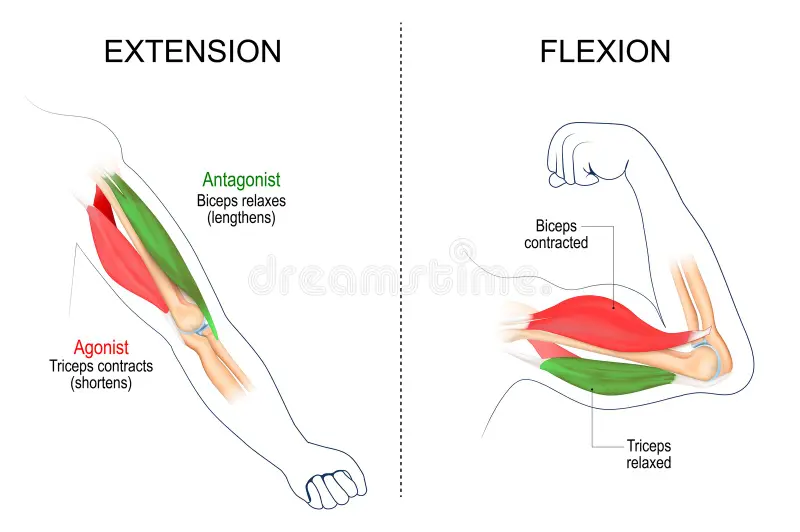
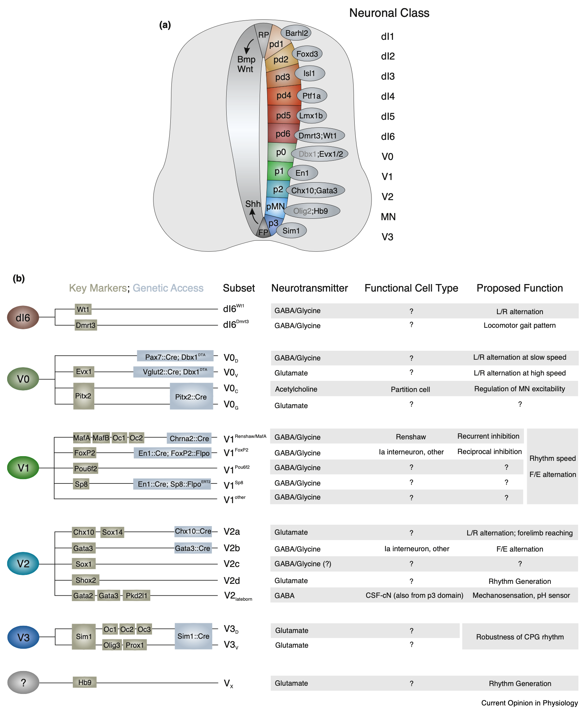
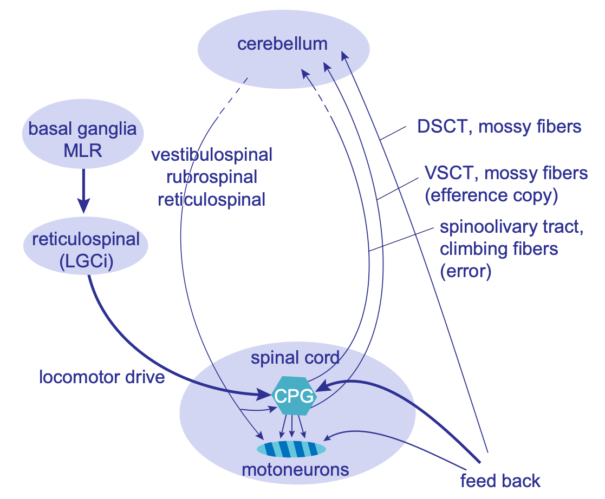

+++
Categories = ["Neuroscience", "Cognition"]
bibfile = "ccnlab.json"
+++

The **motor** system in the brain involves many different areas, and in many ways, the entire brain exists in service of producing motor output ([[#figure_overview]]). For example, Daniel Wolpert has made the point that the sea squirt eats its own brain once it no longer needs to move around. More specific discussion of various aspects of motor control can be found in [[reinforcement learning]], [[basal ganglia]], [[cerebellum]], [[space]], and the [[Rubicon]] framework. This page provides a high-level overview of the challenges and solutions for motor control, and some details about the underlying physiology of muscles and how the spinal cord and brainstem provide a systematic basis for motor control.

{id="figure_overview" style="height:35em"}
![Anatomical organization of the motor system in the lamprey (one of the evolutionarily most ancient vertebrates) and the primate. CPG (central pattern generator) circuits among interneurons in the spinal cord provide a low-dimensional, adaptive (via local proprioceptive and somatosensory feedback) repertoire of _muscle synergies_ that higher levels in the brainstem, cerebellum, basal ganglia, and cerebral cortex control via desceding pathways. The "lamprey core" systems are sufficient for survival, as shown in extensive studies with decorticate cats and other species. From Grillner & El Manira, 2020.](media/fig_motor_primate_lamprey_grillner_20.png)

## Dimensionality reduction, coordination, and muscle synergies

As in all aspects of neural function, the central problem in motor control is managing the [[curse of dimensionality]]: there are exponentially many possible combinations of muscle activations over time. How does the brain reduce this huge space down to the relatively small subset of muscle activations necessary to perform the actions needed for an animal's survival?

This is another instance of the fundamental [[search]] problem, and in the case of the motor system, [[evolution]] has done a lot of the work by building in complex **muscle synergies** into the spinal cord and brainstem, where networks of **interneurons** (excitatory and inhibitory) activate **spatiotemporal patterns** of muscle activation. From this lower-dimensional _repertoire_ of elements (i.e., a [[linear algebra#basis space]]), complex patterns of motor behavior are constructed ([[@Bernstein67]]; [[@Bernstein96]]; [[@TreschSaltielBizzi99]]; [[@dAvellaSaltielBizzi03]]; [[@TingMcKay07]]; [[@BizziCheungdAvellaEtAl08]]; [[@TreschJarc09]]; [[@LatashLevinScholzEtAl10]]; [[@TingChielTrumbowerEtAl15]]; [[@OverduindAvellaRohEtAl15]]; [[@TakeiConfaisTomatsuEtAl17]]; [[@BrutonODwyer18]]; [[@Latash20]]; [[@BrambillaRussodAvellaEtAl23]]).

Another critical problem that is solved by these muscle synergies is the **coordination** across many different muscles that is required to accomplish any given motor action. The contraction of any given muscle creates a variety of physical consequences for other muscles, including altering the basic center of gravity of the entire organism. Thus, any given action must take all of these consequences into account, and ensure that all of the individual muscle contractions are indeed synergistic, and not working at cross purposes.

A variety of different terms have been used in the literature to refer to these synergies, including **reflexes** ([[@Sherrington10]]), **central pattern generators** (CPGs, [[@GrillnerElManira20]]; [[@GrillnerZangger79]]), and _force fields_ ([[@GiszterMussa-IvaldiBizzi93]]). There are somewhat different connotations of these terms, especially for the CPGs, which apply for example to the complex circuits that drive locomotor behavior, involving sustained, rhythmic, patterned behavior that can extend over long periods of time. More generally, these synergies can be referred to as _modules_ ([[@BizziCheungdAvellaEtAl08]]), _primitives_, building blocks, or components of motor actions.

{id="figure_synergies" style="height:30em"}
![Three muscle synergies extracted from frog kicking behavior. a) Activation of different muscles (vertical axis) over time (horizontal axis), accomplishing given overall motor action (moment arms, aligned by corresponding column order of the synergies): _HE_ hip extension; _HF_ hip flexion; _KE_ knee extension; _KF_ knee flexion; _AE_ ankle extension; _AF_ ankle flexion. b) Activation strengths over time for each synergy component ($C_{1-3}$) needed to reconstruct 6 different overall motor actions. These patterns differ primarily in magnitude, not temporal pattern, and indeed the temporal pattern appears to match that of the synergies themselves, suggesting that a more static control signal could accomplish largely the same outcome. From d'Avella et al., 2003](media/fig_muscle_synergies_davella_etal_03.png)

As a concrete example, a detailed analysis of spinal-level muscle synergies in the frog leg system revealed a set of 4 synergies that could be combined with different activation strengths to explain a wide range of overall motor response patterns ([[@TreschSaltielBizzi99]]). A subsequent analysis allowing for contributions from the entire brain in intact frogs showed how the timing and activation modulation of 3 different spatiotemporal muscle synergies ([[#figure_synergies]]) can explain this same space of motor responses ([[@dAvellaSaltielBizzi03]]). 

Thus, the final motor behavior pattern depends on the integrated contributions of multiple levels of control, with the spinal muscle synergies implemented by interneurons providing the lowest level, and higher levels progressively adding their own direct synergies as well as broader coordination across the basic spinal elements ([[@GrillnerElManira20]]). For example, an analysis of correlated motor units in hand movement showed _last order_ (i.e., just upstream of the muscle activation) inputs from the pontomedullary reticular formation, the magnocellular red nucleus, and primary motor cortex (M1), in addition to the basic spinal cord interneurons ([[@XuMawaseSchieber24]]).

The genetically-coded nature of these muscle synergies is evident across many studies showing that the same synergies are found in each of the individual animals studied (e.g., [[@dAvellaSaltielBizzi03]]; [[@BizziCheungdAvellaEtAl08]]) and they arise early in development and persist into adulthood ([[@YangLoganGiszter19]]), even in humans, where the core patterns in locomotion have strong similarities to those in other species ([[@DominiciIvanenkoCappelliniEtAl11]]). Also, although general-purpose learning mechanisms typically develop low-dimensional basis spaces that resemble muscle synergies ([[@ChaiHayashibe20]]; [[@TreschJarc09]]; [[@Scott04]]; [[@TodorovJordan02]]), the direct evidence of spinal implementation and strong genetic evidence support the evolutionary basis for these in animals.

### Sensory feedback control

The other critical need for dimensionality reduction in the motor system arises from interactions between an animal and its environment, which is also highly variable and thus represents a major additional source of variance and combinatorial explosion. There is considerable evidence that the muscle synergies implemented by spinal cord interneurons incorporate direct feedback control mechanisms, that automatically compensate for environmental perturbations ([[@WimalasenaPandarinathAuYong25]]; [[@ShinoharaAmbeKimEtAl25]]; [[@ConwayHultbornKiehn87]]; [[@AngelGuertinJimenezEtAl96]]; [[@AlvarezFyffe07]]; [[@BizziCheungdAvellaEtAl08]]; [[@SantuzAkayMayerEtAl19]]). One estimate put the force contribution of these feedback signals at 35% ([[@SteinMisiaszekPearson00]]; [[@CoteMurrayKnikou18]]).

Unfortunately, the ability to understand these feedback control mechanisms has been impaired by the difficulty in categorizing and mapping the connectivity of the spinal interneurons that process these feedback signals ([[@SenguptaBagnall23]]; [[@McCrea92]]; [[@CoteMurrayKnikou18]]). Furthermore, extant circuit-based models only relatively recently began to include such mechanisms ([[@ShinoharaAmbeKimEtAl25]] -- see [[#figure_spinal-cpg]]; [[@DannerShevtsovaFrigonEtAl17]]). Nevertheless, more abstract state-space analyses of large populations of spinal interneurons have the potential to reveal the presence and dynamical implications of these feedback control mechanisms ([[@WimalasenaPandarinathAuYong25]]).

The rather underdeveloped understanding of feedback control in motor systems contrasts with the theoretical clarity of the mathematically-based hierarchical control framework known as **perceptual control theory (PCT)** ([[@Powers73]]; [[@Powers73a]]; [[@Cools85]]; [[@Yin14a]]; [[@BarterYin21]]; [[@ParkerWillettTysonEtAl20]]). A central premise of this framework is that _control should operate on sensory signals_, because these sensory signals tell you about the _relevant_ state of the system.

As a simple example, a heating / cooling system (HVAC) should be driven by a target _temperature_ (sensory variable), not a target amount of heat or cooling output ("motor" variable), because the amount of heat or cooling needed obviously depends on the _environment_. Older cars for example used to only provide control over the HVAC output, relying on the user to make the connection with the desired sensory variables, while more modern cars now have thermostatic control driven by a target temperature, which greatly simplifies the control task. 

In short, there are many different combinations of environmental and motor parameters that could be used to accomplish a given action outcome, so exerting control at the level of these motor parameters is underdetermined and inefficient, relative to controlling a sensory variable that is _directly_ connected to the desired outcome.

Empirical demonstrations of PCT show the complete lack of awareness that people have about the actual motor actions they are performing when the motor system is perturbed ([[@ParkerWillettTysonEtAl20]]). In any case, given the presence of motor synergies at the spinal level, it is already the case that motor control is divorced from individual muscle or joint-based signals (although primate and especially human motor cortex has the ability to provide more fine-grained muscle-level control, as reviewed below).

### Posture and equilibrium-point control

The PCT framework is consistent with the principle of **equilibrium-point** motor control, which postulates that descending motor control signals specify a _target length_ for each muscle, rather than dynamical variables such as force ([[@Feldman86]]; [[@FeldmanLevin09]]; [[@GribbleOstrySanguinetiEtAl98]]).

One of the compelling advantages of the equilibrium-point model is that it provides a unified framework for understanding the relationship between **posture** (sitting, standing, etc) and active motor actions. Posture in this context is just a fixed configuration of muscle lengths and joint angles, and action is just the updating of these postural parameters: once the target length is changed, automatic feedback muscle forces would be engaged to transition the system to the new target length. Thus, _action is just a change in posture_ under this framework.

Maintaining a given posture requires persistent ongoing muscle activation. According to the equilibrium-point model, instead of descending control systems having to maintain corresponding active control inputs, it would make more sense for such systems to establish a desired postural configuration, and allow spinal-level circuits driven by relevant feedback mechanisms to maintain this target configuration.

However, once we appreciate that the muscle synergies present in the spinal cord actually do incorporate sensory feedback mechanisms (including muscle length as signalled by the muscle _spindle_ fibers), then the boundaries between this framework and the equilibrium-point model start to dissolve. Nevertheless, the critical importance of these sensory feedback signals for the muscle synergies is likely not as widely recognized as it should be, given the central importance it has for simplifying descending control and improving the robustness and adaptability of muscle synergies.

Consistent with the spirit of the equilibrium-point framework, there is evidence of multiple different postural control "reflexes" (synergies) in the spinal cord, which are responsive to proprioceptive feedback signals ([[@TingMcKay07]]; [[@DeliaginaZeleninBeloozerovaEtAl07]]; [[@EliasWatanabeKohn14]]; [[@BinghamChoiTing11]]). For example, [[@^BrambillaRussodAvellaEtAl23]] found evidence for a small set of tonically-active postural synergies. However, these postural synergies were largely distinct from those involved in different phasic actions, which is contrary to the idea that all action is just changes in posture.

Another central point of the equilibrium-point framework is that there is a potential conflict between maintaining a given posture and activating a given motor action (which would disrupt the posture). In the muscle synergy framework, this can be seen as an instance of the broader challenge of selecting among all the possible muscle synergy factors to activate at a given point in time. The direct involvement of sensory feedback in these low-level synergies allows them to adapt to the presence of other simultaneously-active synergies, but the more adaptive coordination of these synergies likely involves higher levels of control, as discussed next.

### Levels of control

The lowest-level spinal synergies receive descending control inputs from motor nuclei in the brainstem, the cerebellum, basal ganglia, and neocortex. How can we understand the specific contributions of these higher levels of control? 

First, there is an important distinction between purely _spatial_ synergies (i.e., the static pattern of muscles activated), versus those that also involve a temporal component. This distinction could logically be made at the level of the synergies themselves (i.e., the nature of the muscle activations a given synergy generates), and at the level of the input control signals that drive these synergies to produce overall actions. In the example shown in [[#figure_synergies]], it appears that the control signals could be essentially static, while all the temporal dynamics are absorbed within the synergies themselves, although the model was not constrained in this way (and thus there are temporal components to both).

The central role of local sensory feedback control from proprioceptive and other somatosensory inputs in the spinal synergy networks provides a natural basis for the temporal dynamics to arise within these synergies, thereby allowing the control signals to be simpler tonic activation inputs. Furthermore, in the case of CPG-like synergies associated with locomotion and other rhythmic behaviors, clearly the spinal primitives contribute a significant temporal component.

However, the idea that the spinal primitives have a significant temporal component is not necessarily applied in existing analyses, which have instead assumed that the primitive spinal synergies are purely spatial, while higher levels of control add a temporal component. For example, this was observed in an analysis of muscle synergies from motor cortex in macaque monkeys, where the spatiotemporal patterns could be constructed from combinations of more basic spatial patterns activated over time ([[@OverduindAvellaRohEtAl15]]). Likewise, [[@^BergerMasciulloMolinariEtAl20]] showed that the cerebellum adds temporal factors on top of basic spatial primitives.

Nevertheless, it is possible to adopt both of these principles at the same time (i.e., temporal dynamics within the primitives, and additional temporal structure imposed by higher levels of control), although doing so introduces confounds for the standard analytic approaches of extracting the muscle synergies from high-dimensional EMG (electromyography signals recorded from the muscles) or other such data.

{id="figure_brainstem" style="height:40em"}

At a broad level, the contributions of each additional level of control are as follows ([[@GrillnerElManira20]]; [[@ArberCosta22]]; [[@ZaaimiDeanBaker18]]):

* Brainstem nuclei integrate broader sensory inputs to drive more complex, survival-relevant behaviors as combinations of spinal synergies, for example control of locomotor activity ([[#figure_brainstem]]) and reaching for food ([[@EspositoCapelliArber14]]; [[@CapelliPivettaSoledadEspositoEtAl17]]; [[@ZeleninOrlovskyDeliagina07]]; [[@ZaaimiDeanBaker18]]).

* The [[cerebellum]] provides direct tuning of the spinal synergies themselves ([[@UdoMatsukawaKameiEtAl80]]; [[@GrillnerElManira20]]; [[#figure_cerebellum-tuning]]), as well as the ability to learn different coordinated spatiotemporal patterns across multiple spinal synergies ([[@BergerGentnerEdmundsEtAl13]]), with these functions taking place in different pathways through the cerebellum (vestibulospinal, rubrospinal, and reticulospinal).

* The _dorsolateral_ (motor) region of the [[basal ganglia]] provides dynamic modulation of ongoing motor actions based on [[dopamine]]-driven [[reinforcement learning]] mechanisms, to optimize the shaping and selection of actions that lead to reward and avoid negative outcomes ([[@GrillnerRobertsonKotaleski20]]; [[@ParkCoddingtonDudman20]]; [[@ArberCosta22]]; [[@MarkowitzGillisBeronEtAl18]]).

* In mammals, and especially in primates, the frontal [[neocortex]] provides more fine-grained spatiotemporal modulation of spinal primitives ([[@OverduindAvellaRohEtAl15]]; [[@AflaloGraziano06]]), and even the ability to directly control individual motor units in a way that is otherwise not possible outside of the primate. This is presumably the basis for the ability to develop novel, highly-skilled motor programs for tool use in primates and especially humans ([[@MarshallGlaserTrautmannEtAl22]]; [[@StrickDumRathelot21]]). 

At a more abstract computational level of analysis, the [[subsumption]] architecture articulated by [[@^Brooks86]] provides an influential framework for how these stacks of higher-level control might function. Each additional level adds new "higher-order" functionality, while _building_ on top of the existing lower-level functionality. The lower-level systems remain intact, and the system can always fall back on them, but when a higher-level system needs to be engaged, it can selectively inhibit competing lower-level systems in order to take control. The overall behavior is envisioned as an [[emergent]] dynamic arising from the parallel interactions between a large number of distributed control systems across different levels.

The PCT framework also envisions a hierarchical system of controllers, but it specifically posits that higher-level control systems function by setting the control parameters of lower-level systems. This is distinct from the inhibition of lower-levels. These different forms of hierarchical control are not mutually exclusive, so both can happen, consistent with available evidence. They do however differ from more monolithic forms of motor control, such as the notion of a _world model_ controller (see [[reinforcement learning]] for further discussion). 

In the remaining sections, we cover the basic properties of the skeletal motor system, starting with muscles and moving up the levels of control from there, from the spinal cord to the brainstem, cerebellum, basal ganglia, and neocortex.

## Muscles

{id="figure_muscle" style="height:30em"}

Skeletal muscles are organized into [[opponent]] pairs ([[#figure_muscle]]), with the contraction of the **extensor** extending the limb outward (_extension_), while the contraction of the **flexor** contracts the limb inward (_flexion_).

Muscles only exert force through contraction, which is driven by the release of [[acetylcholine]] from motor neurons, causing _actin_ and _myosin_ fibers to contract. Thus, to actually move a limb, the opponent muscles on each side must be coordinated so that one side contracts and the other side relaxes (which occurs naturally if the muscle is not activated). Furthermore, each overall muscle (e.g., the bicep) is composed of individual **motor units** that vary in size, each of which has its own motor neuron.

These different motor units are generally activated according to the _size principle_ ([[@Henneman85]]), where the descending motor control signals first recruit small units, which exert less force, followed by increasingly larger units as the firing rate and number of afferent inputs activated increases ([[@LucaErim94]]). This is because smaller units have a lower threshold, and they also fire at higher rates than larger units. This size principle also optimizes fatigue effects.

The size principle enables a single _common-drive_ unidimensional command input to project to all motor units for a given overall muscle, such that this one input can naturally drive increasing contraction force with increasing neural activity. This is another way in which the motor system reduces the effective dimensionality of the control problem.

### Hill-type muscle model

[[@Hill38]], [[@RitchieWilkie58]]; [[@Zajac89]]

## Spinal cord

{id="figure_spinal-pathways" style="height:35em"}
![Major pathways in the spinal cord. The ascending sensory pathways originate from neurons in the dorsal horn grey matter (spindle fiber muscle length and golgi tendon stretch proprioception, touch, pain), while the ventral horn contains motor neurons that receive descending motor inputs, and also send ascending efferent copy signals. The intermediate grey matter contains viceral sensory and motor neurons, and throughout there are interneurons that are actually the primary targets of most of the descending control inputs. Adapted from [Wikimedia Commons](https://commons.wikimedia.org/wiki/File:Spinal_cord_tracts_-_English.svg).](media/fig_spinal_cord_pathways.png)

{id="figure_spinal-interneurons" style="height:45em"}

The spinal cord is far from a passive motor output system, as discussed above with respect to the _muscle synergies_ that are implemented at the lowest level directly by the extensive neural networks of the spinal cord. These neural networks involve primary sensory and motor neurons and many different subtypes of interneurons with different patterns of connectivity and neurotransmitters ([[#figure_spinal-interneurons]] from [[@Bikoff19]]; see also [[@SenguptaBagnall23]]). 

The inputs and outputs of this system are organized into different tracts of long-range axonal fibers as shown in [[#figure_spinal-pathways]] (see also [[@TanFaullCurtis23]]; [[@WatsonKayalioglu09]]), with the **dorsal horn** grey matter having the cell bodies of sensory neurons that respond to a range of somatic inputs, which are conveyed through the ascending pathways up into many areas of the brain, including finally the [[thalamus]] and somatosensory [[neocortex]]. These somatosensory signals include:

* Touch, vibration, pressure, and tension signals from _mechanoreceptors_ in the skin and subcutaneous areas.
* Pain and temperature from _nociception_ receptors.
* Proprioception signals via _muscle spindle_ fibers that respond to changes in the length of a muscle (via type Ia sensory neurons) and overall muscle length (type II neurons), and _Golgi tendon receptors_ that respond to the stretch or load on a limb (type Ib neurons).

The **ventral horn** grey matter contains primary motor neurons that directly drive contraction of muscles, while the **intermediate** grey matter area (at certain levels of the spinal cord) contains sensory and motor viceral neurons.

The extensive networks of interneurons directly receive descending motor command inputs and local (and more distal) sensory inputs, to implement the muscle synergies that produce the low-dimensional vocabulary of motor actions. The direct incorporation of the sensory signals (especially the muscle spindle length signals) allows these muscle synergy components to be robust and adaptive, simplifying the job of the descending motor control inputs.

Whereas these interneurons were previously categorized into a few specific classes ([[@McCrea92]]; [[@Hultborn06]]; [[@CoteMurrayKnikou18]]), a more modern strategy based on developmental neuron birth order and genetic labeling has allowed a more reliable understanding of the complex nature of these spinal networks, as shown in [[#figure_spinal-interneurons]] ([[@Bikoff19]]; [[@SenguptaBagnall23]]). Critically, sensory inputs project to multiple different such interneurons, and each interneuron can receive multiple different types of inputs, so unlike the historical accounts, everything is much more complex and difficult to categorize ([[@Jankowska22]]; [[@CoteMurrayKnikou18]]). 

{id="figure_spinal-cpg" style="height:45em"}
![Detailed circuit-based model of spinal central pattern generator (CPG) circuitry that can accurately simulate many aspects of hind-limb locomotion in the spinal cat. The interneurons are labeled functionally, with the suffix -E for extensor and -F for flexor: RG = rhythm generating; PF = pattern formation; IN = inhibitory interneurons. The _velocity, length_ neurons in orange are the proprioceptive (spindle fiber) neurons that provide critical sensory feedback into the motor neurons (restricted to flexors) and there is also critical efferent copy feedback from force-generating motor neurons. Note that the descending _supraspinal drive_ inputs go into the top-level RG interneurons, not the motorneurons. From Shinohara et al., 2025.](media/fig_spinal_cord_cpg_shinohara_etal_25.png)

A recent example of the sophistication and complexity of these spinal circuits is shown in [[#figure_spinal-cpg]] from [[@^ShinoharaAmbeKimEtAl25]] (see [[@DannerShevtsovaFrigonEtAl17]] for a review of related models and [[@AoiOhashiBambaEtAl19]] for a human bipedal example), which can simulate many aspects of hindlimb locomotion behavior, including when the foot lands in a "hole" where there is no support. This robust adaptive behavior results from the direct incorporation of proprioceptive length and velocity signals from muscle spindle fibers, along with cutaneous touch inputs, into the overall circuit. The connectivity was optimized to minimize overall energy consumption and to adapt to uneven surfaces, and then automatically generalized from there to this lack-of-support situation. 

Critically, these robust adaptive behaviors require bilateral coordination across hemispheres, because if one foot goes unsupported, the load must be taken up by the other foot, until a secure footing is obtained. This model can predict detailed patterns of movement and neural firing signals in corresponding experimental preparations, providing strongly validated understanding of how these circuits function.

Interestingly, these circuits also have the property that they modulate the speed of locomotion as a function of the firing rate of descending input control signals, making the job of the higher brain areas much simpler compared to the prospect of having to learn how to perform all of this complex coordinated motor behavior.

A more abstract analytic approach to understanding these CPG dynamics used state-space methods to characterize the dynamics across the entire population of spinal interneurons involved in locomotion ([[@WimalasenaPandarinathAuYong25]]). This approach forgoes the ability to account for the detailed behavior of individual identified interneurons, but allows the full population dynamics to be incorporated.

### Primates and humans have more control

There is considerable evidence that primates, and especially humans, have a much greater ability to directly control individual muscles, beyond what is exposed by the muscle synergies and CPG circuits implemented by the spinal cord and brainstem networks ([[@GrillnerElManira20]]; [[@Grillner81]]). For example, [[@^MarshallGlaserTrautmannEtAl22]] showed evidence of more flexible recruitment of motor units that goes beyond the rigid constraints of the size principle as discussed above. There are also a larger number of secondary motor areas in primates that have more focal, specialized projections to specific limbs ([[@StrickDumRathelot21]]).

Interestingly, despite the idea that the extra degrees of freedom associated with this increased level of fine-grained control, there is a reliable relationship between brain size and age of first locomotion that humans and other primates still obey ([[@GarwiczChristenssonPsouni09]]).

The development of motor control in humans was hypothesized by [[@^Bernstein96]] to follow a trajectory from relying on more rigid, evolutionarily-encoded motor programs, to gradually allowing more flexible, higher-dimensional control from the neocortex to be learned. Evidence is consistent with this hypothesis ([[@HinnekensBarbu-RothDoEtAl23]]; [[@DominiciIvanenkoCappelliniEtAl11]]).

## Higher level details

The residual signals provide control knobs for higher levels of control! Key example of VOR vs. saccades etc!  Saccade is an error signal from perspective of VOR. Subsumption / override and neural mechanisms supporting that [[@Brooks86]].

output of lower level is input to next higher level -- higher level learns to predict the residuals in lower level, using broader / higher-level context that explains the perturbations.

Actual motor control signals come from BG and cortex, using sensory signals from cerebellum.

Key Powers et al point: you can do all of motor control in sensory space!

What does cerebellum need to handle this?

### Cerebellum

{id="figure_cerebellum-tuning" style="height:30em"}

### Basal ganglia 

### Frontal cortex

Unlike most of the rest of the brain, the [[neocortex]] is thought to gain almost all of its functionality through learning taking place during an animal's lifetime. This poses an important challenge for the motor system: how can the motor cortical areas learn to "speak the language" of the spinal cord, to provide meaningful motor control signals?

TODO: S1 is driver for M1 predictive learning via "pulvinar"!

Our hypothesis is that the same mechanisms used in [[predictive learning]] of sensory and other representations in the cortex, supported by the pulvinar and MD nuclei in the [[thalamus]], could also be at work on the motor side in frontal cortex areas. As reviewed in the thalamus page, the VL (ventrolateral) nucleus receives strong focal driver inputs from the deep cerebellar nuclei (DCN), which in turn receives extensive ascending projections from the spinal motor pathways.

There are natural delays between the time when the frontal cortex drives a descending motor command and the time when the efferent copy signals from these ascending pathways reflect the actual low-level motor commands that were actually generated (with significant contributions and shaping by a number of subcortical areas including the BG, cerebellum, and midbrain & brainstem lower motor areas). This delay provides the [[temporal derivative]] dynamics needed to drive predictive learning, where the motor cortex is effectively learning to predict what the motor system will do in response to the commands it sends down.

{id="figure_big-loop" style="height:30em"}

This hypothesis is consistent with the "big loop" of descending and ascending motor signals shown in [[#figure_big-loop]] from [[@ArberCosta22]].

### Motor cortex coding

Population coding of cortical neurons: [[@AflaloGraziano06a]] show that final hand posture accounts for most of the variance, but other factors such as speed, curvature of space, distance and force were also coded. This postural aspect, otherwise known as a _spatial synergy_ ([[@OverduindAvellaRohEtAl15]]), provides a simple model of muscle control where, regardless of the starting muscle configuration, the control signal specifies a _final configuration_ (i.e., pattern of total contraction) across all of the relevant muscles.

Where more complex sequences of motor actions are required, a temporal sequence of postural configurations is specified -- a sequence of "poses" -- otherwise known as a _spatiotemporal synergy_ ([[@OverduindAvellaRohEtAl15]])

[[@^MeyerSmithWright82]] synthesize psychophysical literature on speed and accuracy of motor movements, to develop a symmetric impulse control model that specifies the force and duration parameters as curves with an initial acceleration phase for the first half, followed by a symmetric deceleration phase in the second half. Both the force and time parameters of these curves can be controlled by people. There is evidence that ballistic movements are made below around 260 ms, with multiple iterations of visually-corrected movement updates happening after that, time permitting. See also [[@MeyerSmithKornblumEtAl90]].

Different neural populations execute same command in motor cortex ([[@AthalyeKhannaGowdaEtAl23]]; [[@YewbreyMantziaraKornysheva23]]) -- more task-specific encoding that might enable multi-task learning..

