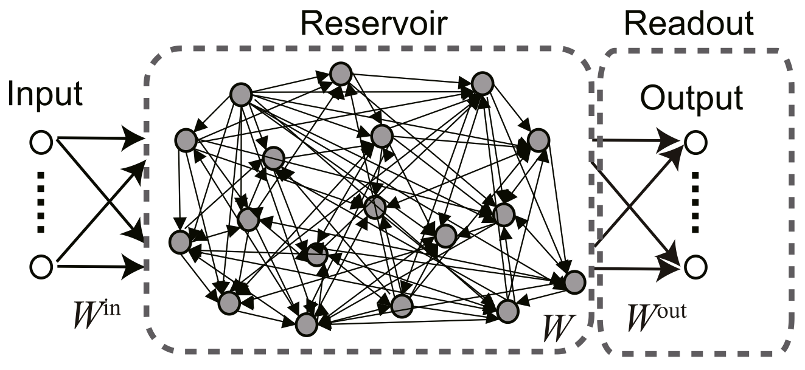

+++
Categories = ["Computation"]
bibfile = "ccnlab.json"
+++

**Reservoir computing** refers to a family of different algorithms that combine a dynamic network that evolves its state in complex ways over time (the "reservoir") with a simple layer of output neurons that learn to map this temporally evolving state into relevant target outputs ([[#figure_reservoir]]; [[@MaassNatschlagerMarkram02]]; [[@JaegerHaas04]]; [[@VerstraetenSchrauwenDHaeneEtAl07]]; [[@TanakaYamaneHerouxEtAl19]]).

{id="figure_reservoir" style="height:30em"}

The reservoir network is typically initialized with random synaptic weights, and must have [[bidirectional connectivity]] (i.e., recurrence) which allows the activation state to reverberate over time, such that new input signals are automatically mixed in together with activity traces reflecting the prior inputs. This provides a temporally integrated, high-dimensional signal that naturally provides a useful basis space for extracting relevant spatiotemporal patterns of relevance, as determined by the target signals that train the output units.

Mathematically, successful reservoir network configurations are those that lie just at the edge of _criticality_, which exhibit more _chaotic_ behavior ([[@Langton90]]). This can be assessed in terms of the **Lyapunov exponent** of the system, which is effectively the magnitude of the largest [[linear-algebra#eigenvectors|eigenvector]] of the network. This should be just below 1 to remain at the edge of criticality. An eigenvalue of greater than one means that the system will exhibit exponential growth in its activity over time, while a value much lower than 1 corresponds to a strongly damped system where activity dies out quickly.

