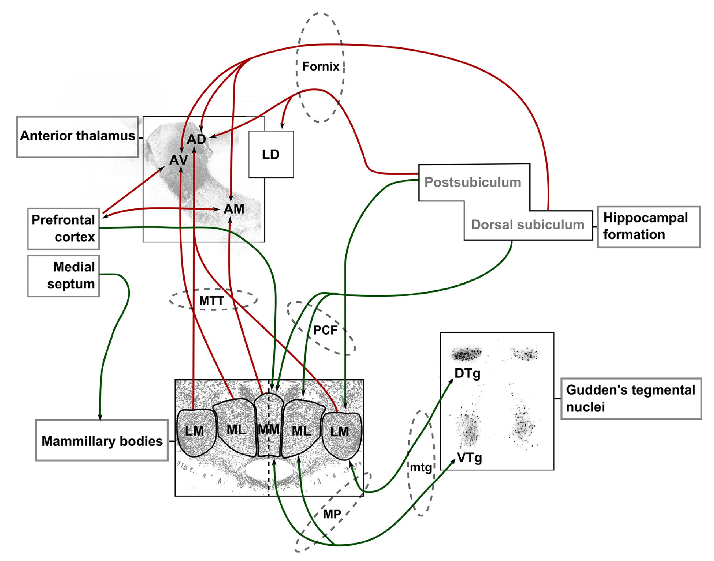

+++
Categories = ["Neuroscience", "Cognition"]
bibfile = "ccnlab.json"
+++

The brain's representation of **space** is established by a system of interconnected brain areas that do not belong to only one well-defined anatomical system. There are multiple different ways in which spatial information is represented across and within these different areas, consistent with the principles of [[distributed representations]].

Across different species, different aspects of space are emphasized, with the rodent having a particularly well-documented set of **navigational** spatial representations that support the ability to locomote around in larger environments. The primate adds a well-developed **ocular** spatial system based on flexible eye and head **saccade** movements that are used for visual search in complex environments such as a jungle full of many different kinds of opportunities and threats.

**Motion** (the first derivative of position) is a big part of spatial processing across all of these scales, with **vestibular** signals providing a sensory representation of head and body movements. Motion also implies **time** in order to compute velocity and acceleration, and several key elements of the spatial pathways have been implicated representing time in various ways.

The relationship between space and memory is also important, because many of the areas involved in constructing representations of space are tightly interconnected with (and part of) the [[hippocampus]] system, which is critical for [[episodic memory]]. Time and memory are obviously strongly interrelated, even at a fast timescale due to the strong influence of the theta rhythm on hippocampal function, which is generated and broadcast by key elements of the spatial system.

At a phenomenological level, some of the most amazing examples of animal behavior are based on impressive navigational abilities, from the birds and fish that migrate thousands of miles every year, to the smaller scale but no less impressive intelligent route finding of animals around their home territory (see [[@GrievesJeffery17]] for many examples).

## Spatial reference frames

* **Allocentric** is relative to the external environment.

* **Egocentric** is in relation to your own body. There are many variations of this, including **eye-centered**, **head-centered**, and **trunk-centered**.

## Path integration

Path integration (and _dead reckoning_) are two foundational elements of spatial processing, reflecting the ability to keep track of where you are based on incremental changes in position along different direction vectors. They represent the essential integration of space and time needed to compute velocity vectors, which helps us to understand the nature of the underlying neural systems.

<!--- TODO: can't find a good fig -->

As shown in figure X, if you walk for 20 seconds while traveling in a northerly direction at a rate of 10 cm per second, then turn right by 45 degrees and proceed for another 20 seconds at the same rate, you should be able to figure out where you will end up. As you can see, these computations involve knowing the angle of motion relative to some kind of allocentric reference frame (e.g., "north"), and the speed of motion.

Both of these quantities can be computed by incrementally updating an internal compass-like heading direction and speed estimate based on sensory cues from the vestibular system, which detects acceleration (i.e., the second derivative of position) of the rotational and linear forms.

In order to perform such an integration, you need some kind of representation of the amount of time over which the acceleration has occurred. Indeed, the importance of accurate timekeeping represented a major technical challenge for early ocean explorers. It appears that the theta rhythm, which is generated in the same system that drives this path integration process, provides the fundamental timing signal for this integration process.

## The mammillothalamic system

{id="figure_mmt" style="height:50em"}

The mammillothalamic system ([[#figure_mmt]]) is a network of areas centered on the anterior nuclei of the [[thalamus]] that anchor the path integration process, starting with two basic signals that are generated in midbrain areas known as Gudden's tegmental nuclei, specifically the DTN (dorsal tegmental nucleus) and VTN (ventral tegmental nucleus). Most of the neurons in the DTN encode head velocity information based on vestibular inputs, while those in the VTN exhibit phasic bursting at the theta timescale (200 ms, 10 hz) generated by a set of cellular mechanisms.

Both the DTN and VTN send inhibitory projections to their mammillary body targets, e.g., DTN inhibits the lateral nucleus of the mammillary bodies (LMN). The LMN is where head direction cells first originate, through a recurrent system via the anterodorsal (AD) thalamic nucleus which projects to the dorsal presubiculum (also known as the postsubiculum), which then projects back to the LMN (figure).

Predictive learning system with AD playing the role of pulvinar receiving driving inputs from the LMN, postsubiculum is cortex, and inhibitory velocity signals do what??

