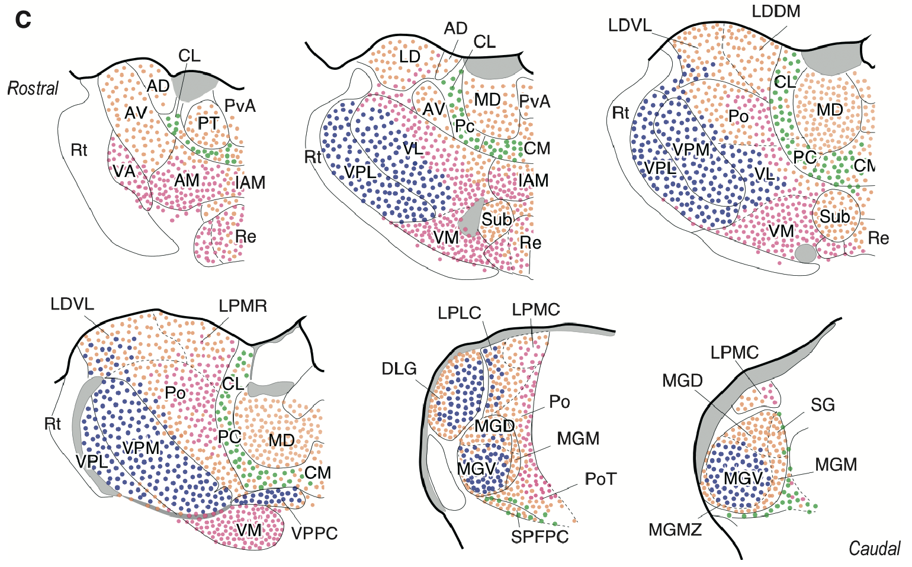
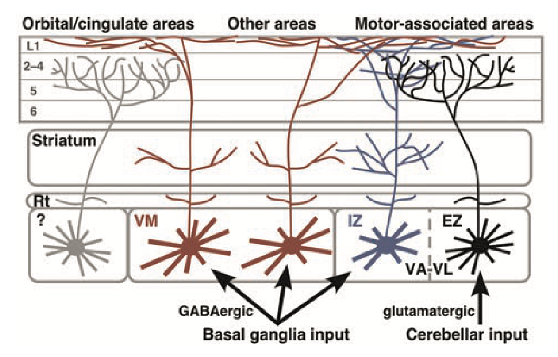
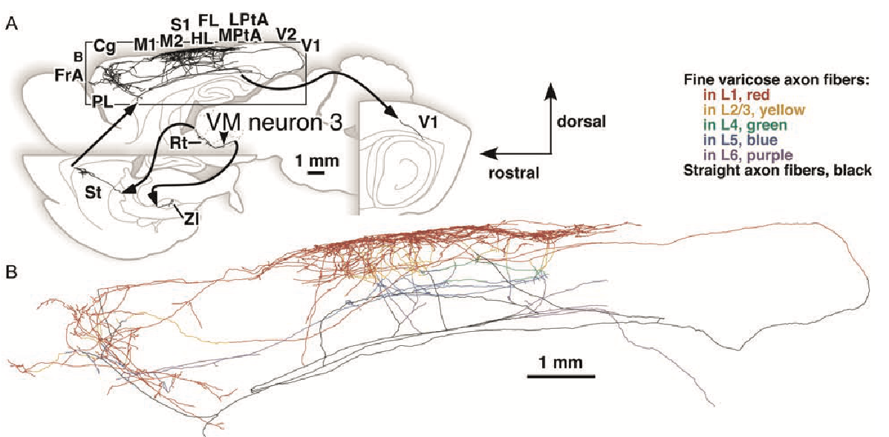

+++
Categories = ["Neuroscience"]
bibfile = "ccnlab.json"
+++

The **thalamus** plays essential roles in multiple different brain circuits, and is thus discussed mostly in the context of those other circuits. This page provides a big-picture organizational and functional view of the thalamus, with pointers to those other pages. Understanding the functions of the thalamus provides a powerful unifying and bridging tool for understanding neural function more broadly, because once you understand how one domain works, the same concepts can be extended to other domains.

From an [[evolution|evolutionary]], comparative perspective, the thalamus consistently provides interconnectivity between primary sensory areas and the _pallium_, which is the outer-most region of the brain, i.e., the _telecephelon_. In mammals, the [[neocortex]] is a major component of the pallium, while other vertibrates have smaller, simpler cortex-like structures in their pallium that play the same functional role as the neocortex ([[@Butler08]]). The functions highlighted below are specific to mammals.

* In posterior [[neocortex]], the _pulvinar_ nucleus of the thalamus supports [[predictive learning]] by alternatively representing a top-down prediction and a bottom-up outcome. Similar connectivity is present in the _mediodorsal (MD)_ nucleus that interconnects with [[prefrontal cortex]], suggesting a similar predictive learning role. Likewise, areas of [[motor]] thalamus and anterior thalamic areas connected to the systems processing [[space]] can support this form of learning.

* There are multiple different thalamic nuclei including the MD that are interconnected with frontal [[neocortex]], particularly [[prefrontal cortex]] (PFC) and the [[basal ganglia]] (BG), which play critical roles in goal-driven behavior and [[motor]] control as captured in the [[Rubicon]] model.

* The intralaminar (IL) nuclei provide an extensive feedback pathway for the basal ganglia.

* The paraventricular thalamic nuclei interconnect with the goal-driven PFC, hippocampus and associated [[emotion]] processing subcortical areas, and provide overall modulation of goal-driving processing.

## Thalamic circuitry

{id="figure_pulv-conns" style="height:15em"}
![Connectivity between the neocortex and the pulvinar nucleus of the thalamus, in the case of primary and secondary visual areas. Visual input from the retina provides driver inputs to the lateral geniculate nucleus (LGN) of the thalamus, which then sends glutamatergic excitatory projections primarily into layer 4 of primary visual cortex (V1). The pulvinar thalamic nucleus receives strong driver inputs from deep layer 5b neurons in V1, which can have as few as one driver synapse per thalamic relay neuron (TRN). There are numerous and relatively weaker projections from layer 6 (VI) neurons in secondary visual cortex (V2). Diagram based on Sherman & Guillery (2006).](media/fig_pulvinar_connectivity.png)

[[#figure_pulv-conns]], based on [[@ShermanGuillery06]], shows the thalamic connectivity for primary and secondary visual cortex in the mammalian brain. The main features of this connectivity are common across most thalamic areas.

There is only one predominant type of thalamic neuron in the different thalamic nuclei, the _thalamic relay neuron_ (TRN). The _thalamic reticular nucleus_ (TRN), which is an outer shell wrapping around the body of the thalamus, is the one exception, having GABAergic [[inhibition|inhibitory]] neurons, which we discuss below. TRNs release excitatory glutamate neurotransmitter into the [[neocortex]], and receive two qualitatively distinct types of inputs:

* **Drivers** are strong inputs, often relatively few in number (as few as a single input). They can have large extended _glomeruli_ with multiple synaptic connections and even a "dedicated" inhibitory intgerneuron encapsulated in a single anatomical structure. These can originate from subcortical areas (e.g., retinal input to the LGN for vision) or cortical areas (e.g., the deep layer 5b IB intrinsic bursting neurons that are drivers in the [[predictive learning]] performed by the pulvinar). Some thalamic areas have no identified driver inputs, and are typically those that receive extensive inhibitory inputs from the basal ganglia output pathways.

    The nature of the driver inputs is one of the most important clues to thalamic (and cortical) function. For example, cortical drivers from intrinsic bursting neurons provide the temporal dynamics needed to support predictive learning via the [[temporal derivative]] mechanism, whereas subcortical sensory drivers do not appear to have this property. However, subcortical drivers in the motor system naturally have the requisite delays, as discussed in the [[motor#Frontal cortex learning via subcortical efferent copy signals|motor]] page.

* **Non-drivers** are the rest of the inputs, which are like most other synaptic connections in the brain. [[@ShermanGuillery06]] and many others label these as _modulatory_ inputs, but that is perhaps too strong of a functional assumption, given their proposed function in the context of [[predictive learning]]. For example, there is ample evidence that these inputs can drive sustained firing of TRNs, as reviewed in [[@OReillyRussinZolfagharEtAl21]].

The TRNs notably lack any local excitatory interconnectivity, and only have a form of pooled inhibition mediated by the TRN reticular neurons. Therefore, they are uniquely suited for providing a faithful representation of the inputs they receive, serving as a kind of _projection screen_ that does not impose significant distortion of its own.

Although the relatively inert nature of the thalamic circuitry has led to its characterization as a _relay_ system, the presence of two distinctive types of inputs suggests a more powerful kind of function could be be supported. The [[predictive learning]] framework for example shows how the distinctive temporal aspects of the driver inputs to the pulvinar supports a [[temporal derivative]] computation that effectively computes an error gradient between the driver and non-driver inputs, across time.

The nature of the connectivity from TRNs into the cortex provides another important insight into the function of the thalamus. There are two primary dimensions along which these projections vary, which were originally captured by the **core** vs. **matrix** categories of [[@^Jones98]], but which are more accurately categorized as dimensions ([[@ClascaRubio-GarridoJabaudon12]]; [[@ShermanUsrey24]]):

* Laminar targets: the classical _core_ type projects mainly to the middle layers of the cortex, primarily layer 4 (e.g., as shown in [[#figure_pulv-conns]]), while the classical _matrix_ type projects to layers 1 and 5, but avoids the middle layers. However, there are actually different proportions of these connections across different thalamic neurons, rather than sharply defined categories.

    Functionally, projections into the middle layers provides direct input information into the cortex, as in the prototypical sensory input into primary sensory areas. Projections into layers 1 and 5 can drive two main functions: regulation of overall cortical activity levels via the VIP inhibitory interneurons in layer 1 (this was the original interpretation of the matrix type), and maintenance of sustained activity (primarily in [[prefrontal cortex]]) via bidirectional excitatory loops through layer 5b PT (pyramidal tract) neurons, which also have extensive dendritic tufts in layer 1.

* Area focus: the classical _core_ type projects to only one cortical area, typically in a relatively circumscribed, _focal_ manner, while the classical _matrix_ type projects in a broader, diffuse to multiple different areas, consistent with a more modulatory function.

{id="figure_map-phillips" style="height:30em"}
![Map of thalamic areas in the rodent according to gene expression patterns, which identifies 3+1 major clusters. Blue are primary sensory and other areas that receive strong subcortical driver inputs. Red are higher-order areas that either receive cortical drivers or no drivers. Orange are the intralaminar and paraventricular nuclei that have more specialized connectivity with the basal ganglia and other subcortical areas. The reunions nucleus, which interconnects the prefrontal cortex with the hippocampus, has its own unique status. From Phillips et al., 2019.](media/fig_thalamus_types_phillips_etal_19.png)

[[#figure_map-phillips]] shows a map of different thalamic areas in rodents, which provides a broad set of 3+1 categories based on patterns of gene expression, which is useful for informing our understanding of function across different thalamic areas. This data does not provide more fine-grained distinctions in terms of patterns of connectivity, but they do generally correspond to different types of driver inputs, as we'll see below.

{id="figure_types-calasca" style="height:30em"}
![Different types of thalamic projections into the cortex, varying in the laminar targets and the area focus, according to Clasca et al., 2012. The C-type is the classical first-order sensory core-type, projecting to the middle lamina in a focal manner, while the M-type (multiareal) is the classical matrix type projecting to layer 1 and 5, across multiple areas. The M-type (focal) combines features from classical core and matrix types, with projections that target middle layers in addition to layer 1, with more focal area-wise connectivity. Meanwhile the IL (intralaminar) pattern (i.e., PF = parafascicular thalamus) is specific to neurons in these nuclei, targeting only deep layers and also extensively the striatum.](media/fig_thalamus_types_clasca_etal_12.png)

[[#figure_types-calasca]] shows an extension of the classical core and matrix categories by [[@^ClascaRubio-GarridoJabaudon12]], with two distinct M-types, one of which corresponds to the classical matrix type, while the M-type (focal) combines features of core and matrix. There is also the unique projection pattern of the intralaminar (IL) nuclei, which includes the PF (parafasicular) and CM (centromedian) nuclei, which play a critical role in the function of the basal ganglia (see [[basal ganglia#Parafascicular feedback loops]]), and have extensive connectivity into the striatum along with projections into the deep cortical layers.

Instead of retaining a core-vs-matrix categorical approach, we prefer to use functional, feature-based terminology in describing the connectivity profiles of neurons in different thalamic areas. A given TRN cell will in general have multiple of these properties.

+ **Input:** focal projections into the middle layers, driving informational input to a cortical areas.

* **Maintenance:** focal projections to layers 1 and 5, supporting active maintenance in layer 5b PT neurons.

+ **Modulatory:** diffuse projections to layers 1 and 5. This is not exclusive to classical arousal-modulating matrix-type neurons, as basal-ganglia modulated motor areas including VA and VM have this pattern, to provide more dynamic, fine-grained modulation of motor cortical areas.

* **Single:** projects to a single area.

* **Multi:** projects to multiple areas. Note that this can be orthogonal to the focal vs. diffuse nature of the projection, for example MDm (mediodorsal medial) has focal but multi-area projections.

## Functional organization of the thalamus

{id="figure_map-clasca" style="height:30em"}

{id="figure_map-rovo" style="height:50em"}

[[#figure_map-clasca]] provides a map of the rodent thalamus using the [[@^ClascaRubio-GarridoJabaudon12]] categories, and [[#figure_map-rovo]] provides a map of the macaque monkey thalamus, labeling the type of driver synapse present in each area ([[@RovoUlbertAcsady12]]). These are functionally interpretable as follows:

* **Subcortical** drivers: Strong = large vGLUT2 (green).
* **Cortical** drivers: Strong = large vGLUT1 (red), Weaker = small vGLUT1 (pink).
* **None** (white). These typically receive inhibitory inputs from the basal ganglia.
* Other combinations are discussed below where applicable.

By putting these two maps together (and keeping in mind the data in [[#figure_map-phillips]]), we can identify the general functionality of different thalamic areas.

It is critical to recognize that although each thalamic nucleus has a predominant type of TRN connectivity pattern that we identify it with, there is almost always some diversity, such that for example classical matrix-type neurons are intermixed within the classical core-type that predominate in the LGN ([[@ShermanUsrey24]]). Functionally, these matrix-type neurons can cover a lot of territory with their broad connectivity patterns, so fewer are required to do the job. In general, we assume that modulation of overall excitability and arousal levels in the cortex via such neurons is an additional job performed by most thalamic areas, but dedicated areas that perform only this function are unnecessary.

* **Primary sensory** (Driver: Subcortical; Projection: Input, Single): **LGN** (lateral geniculate nucleus, vision, V1); **MGNv** (medial ventral GN; auditory, A1); **MGNm** (medial medial GN; vestibular and others); **VPL**, **VPM** (ventral posteriolateral, lateral, medial; somatosensory, S1). These are most of the green areas in the driver figure, with the exception of VL and AV, having large, strong glutamatergic drivers from subcortical sources (e.g., the retina for LGN).

* **Primary motor** (Driver: Subcortical; Projection: Input, Single): **VL** (ventral lateral). This is a primary, first-order type of thalamic area, which instead of being sensory, is primary motor (M1). The strong excitatory subcortical drivers onto these neurons arise from ascending spinal pathways that converge onto the deep [[cerebellum|cerebellar]] nuclei (DCN) and then project from there into the VL. These neurons likely provide training signals to primary motor cortex, in the form of efferent copy signals reflecting what the spinal motor system actually did, versus the commands that were sent down to it. Anatomically, VL is adjacent to the somatosensory VPL, VPM nuclei which project topographically to primary somatosensory cortex, just across the central sulcus from M1. See below for further discussion of the [[#motor thalamus]] areas.

* **Primary space and time** (Driver: Subcortical; Projection: Input, Multiple): **AV** (anteroventral) and **AD** (anterodorsal). Like the VL, this is an interesting case of a subcortically-driven, input-projecting area that is not a standard sensory input. These areas receive driver inputs from the mammillary bodies (medial to AV and lateral to AD), which convey important [[space|spatial]] and [[time|timing]] signals, that are then projected into the (pre-post) subiculum and retrosplenial cortex, which are the primary spatial representation areas of the cortex. The lateral mammillary bodies projecting to the AD nucleus are the primary source of _head direction_ cells, that integrate vestibular and motor signals to keep track of which way the head (and body more generally) is facing in an _allocentric_ (world-based) coordinate system. The medial mammillary bodies projecting to the AV convey the [[theta rhythm]] signals generated in the _ventral tegmental nucleus (VTN)_, which also drive neurons in the medial septum, to coordinate processing throughout the medial temporal lobe and [[hippocampus]].

<!---  TODO: more about nature of projections etc. -->

* **Secondary perceptual** (Driver: Cortical; Projection: Input, Modulatory, Single & Multi): **Pulvinar** is the main nucleus of this type, with topographic projections into all of the higher-order sensory areas. The driver map shows these areas in red and pink, where the red areas have strong glutamatergic drivers, but unlike primary areas, these come from the layer 5b cortical drivers, not subcortical drivers. The pulvinar as such is not labeled as such in the rodent, but the lateral posterior (**LP**) is thought to be a homologous area based on connectivity ([[@LeowZhouSullivanEtAl22]]), and it has the same focal connectivity (LPMC, LPMR). The yellow areas in the driver map represents areas of pulvinar that receive both cortical and subcortical inputs, specifically from the superior colliculus, which is known to project into the pulvinar.

* **Secondary motor** (Driver: None; Projection: Modulatory, Maintenance, Input, Multi & Single): **VA**, **VM**, **VAM**, **VAL** (ventral anterior, medial and lateral) are all colored white in the driver figure, because they have no strong drivers. Instead, they receive convergent input from a range of different subcortical sources, along with extensive inhibition from the basal ganglia output nuclei (SNr, GPi). These are all of the red dot areas in the connectivity figure, representing the main population of M-type multiareal neurons. Based on this pattern of connectivity, these are likely to have very broad modulatory effects on the corresponding higher-order motor areas, allowing the BG to modulate overall excitability in these motor cortex areas via disinhibitory gating of the BG output pathways. See [[#motor thalamus]] below for further discussion.

<!--- * Secondary spatial (? ?): **AM** (anteromedial). ?? -->

* **Secondary PFC, goal-gating** (Driver: None; Projection: Input, Maintenance, Modulatory, Multi): **MDm** (mediodorsal, medial). Based on the detailed examination of MD connectivity by [[@^KuramotoPanFurutaEtAl17]], and the white driver color of the most medial areas of MD, this subregion of MD does not have any strong drivers, and largely receives inhibitory projections from the BG output nuclei and especially from the ventral pallidum (VP). According to the [[Rubicon]] model and the extensive data reviewed in [[prefrontal cortex]], this MDm area drives disinhibitory gating of distributed goal representations across multiple PFC areas. [[@^KuramotoPanFurutaEtAl17]] report that each MDm neuron interconnects with multiple areas, and most terminate in central layers 3,4 not layer 1. This represents a distinct type of connectivity, that could be labeled C-type (multiareal).

* **Secondary PFC, predictive learning and goal updating** (Driver: Cortical; Projection: Input, Maintenance, Single): **MDc**, **MDl** (mediodorsal central, lateral). These areas of MD are effectively like the pulvinar for higher-order sensory areas, in terms of receiving strong cortical driver inputs (red), while having M-type focal connectivity patterns. Based on the strong theoretical and empirical basis for pulvinar supporting predictive learning, this same function is likely supported for the goal-driven areas of OFC and PL PFC that these MD areas project to.

<!--- TODO: do these areas receive inhibition from bg? Tom thinks so.. look in Kuramoto -->

* **Intralaminar** (**IL**: **PF**, **CM**, etc) (Driver: None; Projection: IL-type to striatum, cortical deep layers). These nuclei provide extensive feedback to the [[basal ganglia]] and also to deep layers of the motor neocortex, and play critical specialized roles in BG function and learning.

<!--- * LD: ??  spatial right? -->

[[@GiguereGoldman-Rakic88]] is primate study showing patchy organization in primates.

## Motor thalamus

{id="figure_prjn-kuramoto" style="height:30em"}

{id="figure_nrn3-kuramoto" style="height:30em"}

[[#figure_prjn-kuramoto]] from [[@KuramotoOhnoFurutaEtAl15]]..

## MD thalamus

## Anterior thalamic areas

