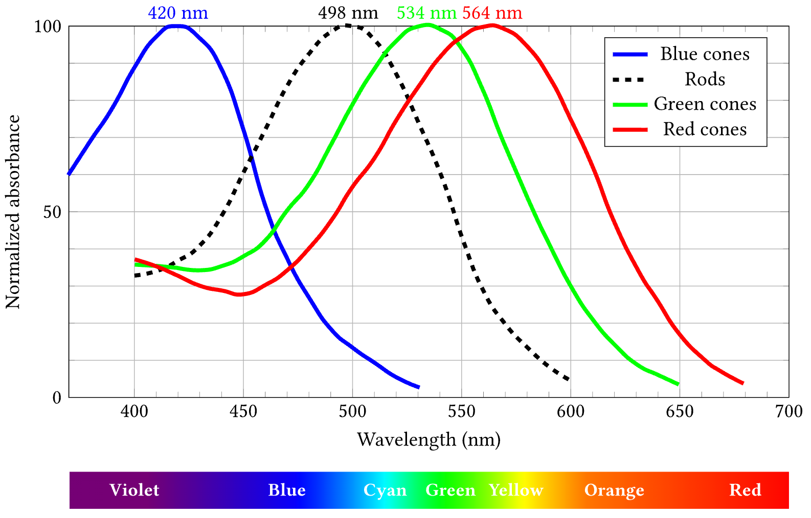

+++
Categories = ["Neuroscience"]
bibfile = "ccnlab.json"
+++

**Vision** is the dominant sensory modality for primates and especially humans. However, it is relatively under-developed in rodents and most other species, where [[olfaction]] (smell) is the dominant sense. A nocturnal vs diurnal lifestyle also makes a big difference for the effectiveness of vision in rodents, with rats and mice being nocturnal ([[@KrubitzerCampiCooke11]]). In primates, vision is particularly useful for providing immediate and detailed access to properties of the _distal_ world, and as such is the dominant basis for planning and controlling [[motor]] actions.

In most non-primate species, the [[#motion]] signals computed from visual inputs are of primary importance, for alerting to potential predators, and driving inputs to the [[cerebellum]] along with the [[vestibular]] system to represent the sensory consequences of actions. This convergence of vestibular and motion inputs drives the _head direction_ system through a set of midbrain and thalamic pathways that anchor representations of [[space]] in the [[parietal]] cortex, which is essential for [[navigation]] and [[episodic memory]] in the [[hippocampus]].

The parietal pathways in rodents and primates are qualitatively similar, and correspondingly, their navigational abilities are comparable in many ways ([[@GrievesJeffery17]]). Indeed, these spatial and navigational aspects of vision are common across many non-mammalian vertebrates, supporting a wide range of truly remarkable navigational abilities ([[@GrievesJeffery17]]). 

The ability to recognize objects in a spatially invariant manner (i.e., [[#object recognition]]) requires a _hierarchically-organized sequence_ of relatively large cortical areas that progressively extract more stable and more complex features from the low-level _retinotopic_ input signals. This occurs in the pathways from the primary visual **occipital lobe** to the **temporal lobe** in the [[neocortex]] of primate, and represents a major investment in neural hardware in the primate brain. By contrast, visual cortex in the rodent is relatively flat and heterogeneous ([[@KrubitzerCampiCooke11]]), such that rats can respond to patterns, but lack the ability to stably represent objects as such.

## Retina

Visual processing obviously starts in the **retina** of the eyes, which contains the **photoreceptors** that transduce light into electrical signals that end up driving the spiking output of **retinal ganglion** neurons that project widely to different parts of the brain, including a major projection to the [[thalamus]] which then goes on to the [[neocortex]]. 

The retina is far from a passive transduction system, however: it performs a large number of essential _signal processing_ functions according to complex circuits engineered through [[evolution]] to extract the most relevant features of the visual input for subsequent processing in other areas. At a computational level, the retina primarily performs **compression**, **contrast enhancement**, and [[#motion]] extraction, so that the output signal is maximally _efficient_ and _informative_.

## Motion

Motion processing is robustly computed in the retina of most animals, with the **starburst amacrine cells (SAC)** playing a critical role in detecting directionally sensitive signals in the retina ([[@Wei18]]; [[@MorrieFeller18]]; [[@BrombasKalita-deCroftCooper-WilliamsEtAl17]]; [[@JainMurphy-BaumdeRosenrollEtAl20]]; [[@GreeneKimSeung16]]). These cells have radially symmetric dendritic arbors, and exhibit center-out motion sensitivity (centrifugal fields), such that visual signals propagating from the center RF outward maximally activate the neuron. The maximal activating stimulus would thus be an annular looming-like stimulus, e.g., zooming into a ring-shaped stimulus centered around the central RF point.

Similar to the radially-symmetric DoG cells, radially-symmetric detectors like this can also be combined to produce overall directionally specific detectors, by offsetting the preferred and null regions of different SAC inputs.

The distal dendritic branches receive inputs from bipolar cells with different temporal dynamics, and have independent integration dynamics within each distal branch. Thus, the overall response for a SAC cell is the spatial integration of independent motion signals for smaller sub-regions. [[@^WuKimDaceyEtAl23]] identify 2 main theories of SAC function in the literature: _morphological_ based on dendritic integration properties (e.g., [[@EncisoRempeDmitrievEtAl10]]; [[@TukkerTaylorSmith04]]), and the _space-time_ mechanism from [[@^KimGreeneZlateskiEtAl14]]:

> Motion outward from the soma will activate the proximal BCs followed by the distal BCs. If the stimulus speed is appropriate for the time lag, signals from both BC groups will reach the SAC dendrite simultaneously, summing to produce a large depolarization. For motion inward towards the soma, BC signals will reach the SAC dendrite asynchronously, causing only small depolarizations. Therefore the dendrite will ‘prefer’ outward motion, as observed experimentally.

These are not mutually incompatible, and there is no definitive consensus at this point about how it works exactly. In our [[Axon]] models, we use a different, highly robust motion mechanism that produces reliable and accurate motion direction and speed (i.e., velocity) signals, which is also compatible with properties of the SAC neurons. This mechanism is based on the [[temporal derivative]] principle, computed in terms of the difference between a _fast -- slow_ temporal integration process, as described below.

This temporal derivative mechanism has the advantage of potentially explaining motion artifacts based on _static_ contrast patterns, leveraged by the "snake" like motion illusions ([[@ConwayKitaokaYazdanbakhshEtAl05]]), which depends on eye movements [[@Otero-MillanMacknikMartinez-Conde12]]), and have been documented even in fruit flies ([[@AgrochaoTanakaSalazar-GatzimasEtAl20]]). The fruit fly system also involves different rates of fast and slow decay and inhibition vs. excitation, consistent with the proposed mechanism.

### Temporal derivative mechanism

The key idea behind the _fast -- slow_ temporal derivative is that more recent changes are reflected in the fast process, while older changes are in the slow one. In particular, the motion mechanism depends on two different rates of _decay_.

```
  O o-o O
+||-   -||+
 O       O 
```

In the above diagram, the receiving neurons at the top receive balanced fast excitatory + connections and slow inhibitory connections, with the same net synaptic strength. Two receiving neurons from spatially adjacent locations mutually inhibit each other. When there is no motion, the excitation and inhibition cancel out.

When visual input is moving from the right to the left, the right neuron experiences a net inhibitory signal because the slower inhibition persists longer than the fast excitation, while the opposite is true of the left neuron. The opposite pattern holds for motion in the opposite direction. Thus, the relative balance between these paired neurons provides a readout of the motion direction. 

Critically, when there is a uniform onset of a novel input, both neurons receive the same initial excitatory transient, which then is balanced by the slower inhibition. Their mutual inhibition cancels this out. The circuit also needs to multiply by the min activity of any input, so that it doesn't just respond to edges where there is nothing and then something. This however does contribute to the static contrast motion illusions.

To ensure zero responding for static elements, it is critical that the temporal integration has a quick (immediate) rise and the difference is in the decay times, so anything that is still is always equalized at the same values. Thus, motion is registered in the immediate trail of a moving element, where the fast trace decays away faster than the slow one. It is therefore always a net inhibitory signal, with the direction of motion experiencing less inhibition than the other.

The ability to capture not only direction but also speed at a fine-grained level is critical, and is a major limitation of the space-time mechanism, which requires different spacing to capture different speeds. In the temporal derivative version, speed correlates directly with the length of the _fast -- slow_ trace, because a more quickly moving object leaves a longer trace. Thus, speed is naturally and accurately computed by the simple summation of these differences, which the dendritic arbor of the SAC is well-configured to do. This speed value needs to be normalized by the instantaneous size of the visual input to be properly calibrated, so that differences in raw visual filter activity are controlled for.

## Color

{id="figure_cone_rod" style="height:35em"}


The ability to perceive color depends on the presence of photoreceptors in the retina that are sensitive to different wavelengths of light. In humans, we have three **cones** that are maximally sensitive to long (L = Red), medium (M = Green) and short (S = Blue) wavelengths ([[#figure_cone_rod]]; [[@BowmakerDartnall80]]). In addition most vertebrates have **rod** receptors that have a blue-green color tuning, but are much more sensitive to low light and moving (short duration) stimuli.

### Color opponency

To provide an even more compact representation of color, the visual system computes two **opponent** color contrasts, Red -- Green (i.e., L -- M) and Blue -- Yellow (i.e., S - (LM), where Yellow is represented as a combination of red and green) ([[@Conway01]]; [[@Gegenfurtner03]]; [[@SolomonLennie07]]; [[@FieldGauthierSherEtAl10]]; [[@ShapleyHawken11]]; [[@ZhangBarhomiSerre12]]; [[@YangGaoLiEtAl13]])

* Double-opponent are most common, and define an edge in color space (e.g., R-G edge) by having offset opposing lobes of a gabor (e.g., one lobe is R+G- and the other lobe is G+R-) – this gives the usual zero response for uniform illumination, but a nice contrast response. We should probably turn on color responses in general in our V1 pathway, esp if it is just RG and BY instead of all those other guys. Can also have the color just be summarized in the PI polarity independent pathway.

* Single-opponent which are similar-sized gaussians with opponent R-G and B-Y tuning. These are much fewer, and more concentrated in these CO-blob regions, that go to the “thin” V2 stripes. But the divisions are not perfect..

### Computational color

To more accurately represent how humans perceive color as inputs to vision models, we can take advantage of decades of detailed psychophysics research that has developed progressively more accurate perceptual models. These models allow a standard RGB image to be transformed into the corresponding _LMS_ (long, medium, short) responses of the three different cone types ([[@MoroneyFairchildHuntEtAl02]]; [Wikipedia](https://en.wikipedia.org/wiki/LMS_color_space)).

We use the HPE (_Hunt-Pointer-Estevez_) version of the LMS transforms, which start by converting sRGB (s = standard) images into the [XYZ](https://en.wikipedia.org/wiki/CIE_1931_color_space) color space, and from there, using different weights to produce L, M, S outputs.


